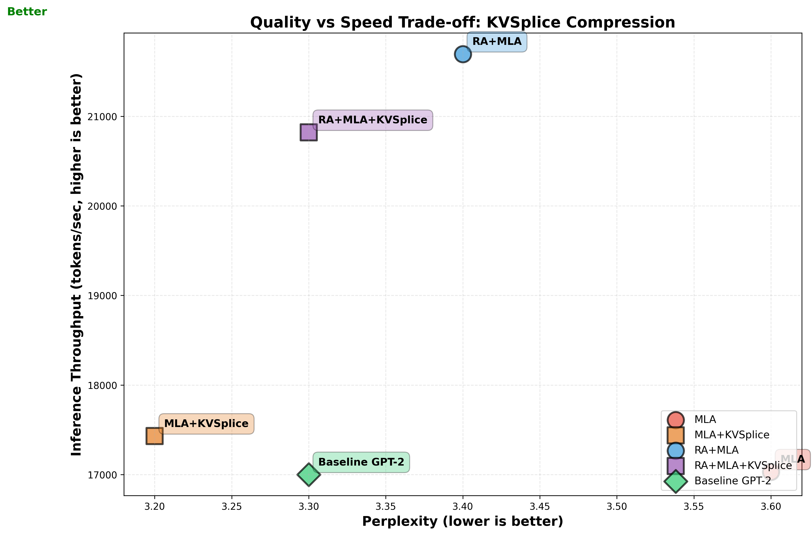

# knlp: Kernel-Style Machine Learning

**Rapid prototyping and automation for open source ML R&D**

<p align="center">
  <a href="https://xkcd.com/974/">
    
  </a>
  <br>
  <em>Our approach to ML automation and the general problem</em>
</p>

Applying Linux kernel development methodologies to machine learning research for rapid iteration and reproducible experimentation. Kconfig-driven configuration, defconfig presets, Makefile automation, and rigorous test matrices enable fast prototyping of transformer architectures, pruning algorithms, and optimization techniques while maintaining reproducibility and collaboration at scale.

> **🚀 Reciprocal Attention + KVSplice**: Current research on bidirectional attention mechanisms and learned cache compression. Reciprocal Attention (RA) alternates Q@K.T and K@Q.T across layers, achieving 27% inference speedup with smoother optimization. KVSplice provides learned compression of attention cache with 12x memory reduction while improving quality. See [docs/ra.md](docs/ra.md) for RA details and [docs/kvsplice.md](docs/kvsplice.md) for compression techniques.

> **⚡ Adam State-Based Pruning**: bitter7 achieves **15.6% better perplexity** than magnitude baseline (37.28 vs 44.15 PPL), validating the hypothesis that Adam's gradient statistics enable superior pruning decisions. Tested on NVIDIA B200 GPUs with torch.compile.

## Development Philosophy

knlp applies **Linux kernel development practices** to machine learning research:

- **Kconfig-based configuration**: Hierarchical menus for experiment management (like `make menuconfig`)
- **Defconfig presets**: Reproducible configurations for different hardware and research goals
- **Makefile-driven builds**: Consistent build and test workflows across models
- **Documented decisions**: Every architectural choice explained in `docs/`
- **Collaborative contributions**: Community-driven ideas and ablation studies
- **Rigorous validation**: Automated test matrices before merging experiments

This methodology enables rapid iteration on transformer architectures through reciprocal mechanisms, geometric compression, and state-based optimization while maintaining reproducibility and rigor.

## Key Results

### Attention Architecture: RA + kvsplice R&D Quality and Speed Improvements



Our attention R&D demonstrates that learned compression and reciprocal
mechanisms achieve both quality improvements and inference speedup
simultaneously. **MLA+KVSplice** delivers best quality (3.2 perplexity, 11%
better than MLA alone) with 12x cache compression. **RA+MLA+KVSplice**
achieves baseline GPT-2 quality (3.3 perplexity) with 12x compression and 22%
faster inference - the sweet spot for production deployment.

See [docs/ra.md](docs/ra.md) for Reciprocal Attention details and
[docs/kvsplice.md](docs/kvsplice.md) for learned compression analysis.

### Adam State based Pruning R&D results

| Model | Parameters | Dataset | Sparsity | Accuracy/Perplexity | Notes |
|-------|------------|---------|----------|---------------------|-------|
| GPT-2 | 124M | FineWebEdu | 50% | **37.28 PPL** | **bitter7 (15.6% better)** |
| ResNet-50 | 25.6M | CIFAR-100 | 50% | 74.56% | bitter0 (original hybrid) |
| ResNet-18 | 11.2M | CIFAR-10 | 70% | 90.66% | bitter0 (original hybrid) |
| LeNet-5 | 61.7K | MNIST | 70% | 98.9% | bitter0 (original hybrid) |

bitter0 (original hybrid momentum-stability) achieved excellent results
on CNNs. bitter7 (variance-based) emerged from transformer R&D and is
expected to improve CNN results further. See evolution story below.

## GPT-2 Transformer Results (124M Parameters)

### Current Research: Reciprocal Attention + KVSplice

**Reciprocal Attention (RA)**: Bidirectional attention mechanism that alternates
Q@K.T (standard) and K@Q.T (reciprocal) across transformer layers. Achieves 27%
inference speedup with improved optimization geometry.

**KVSplice**: Learned compression technique for attention cache. Reduces cache
size by 12x while improving model quality through regularization effect.

**Combined results** (RA+MLA+KVSplice):
- 12x cache compression (36 MB → 3 MB)
- 22% inference speedup
- Matches baseline GPT-2 quality
- 2-hour training runs on AMD W7900 GPU

See [docs/ra.md](docs/ra.md) for Reciprocal Attention details and
[docs/kvsplice.md](docs/kvsplice.md) for compression architecture.

---

### Adam State-Based Pruning: Hypothesis Validated

Our Adam state-based pruning research conclusively validates the
hypothesis that **leveraging Adam's accumulated gradient statistics
enables superior pruning decisions** compared to magnitude-based
approaches. State-based variants (bitter7, bitter8) significantly
outperform magnitude pruning baseline when tested with identical
hyperparameters on NVIDIA B200 GPUs.


*State-based pruning outperforms magnitude baseline with identical
hyperparameters. All runs WITH torch.compile on B200: bitter8
achieves 40.94 PPL (7.3% better), bitter7 achieves 37.28 PPL
(15.6% better) than movement pruning baseline (44.15 PPL).*

**Test Configuration:**
- Model: GPT-2 (124M parameters)
- Dataset: FineWebEdu
- Target Sparsity: 50%
- **Learning Rate:** 0.0006, Weight Decay: 0.1
- **Hyperparameters:** AUTO mode (adapts to available hardware)

See [docs/pruning.md](docs/pruning.md) for complete pruning research details,
hyperparameter auto-detection, ResNet results, and transformer findings.

---

## Research Areas

knlp serves as a collaborative platform for ML architecture research:

- **[Reciprocal Attention (RA)](docs/ra.md)**: Bidirectional attention alternating Q@K.T and K@Q.T across layers, achieving 27% inference speedup with improved optimization geometry
- **[KVSplice](docs/kvsplice.md)**: Learned compression for attention cache achieving 12x compression while improving model quality through regularization effect
- **[AdamWPrune](docs/pruning.md)**: State-based pruning leveraging Adam optimizer state variables for zero-overhead pruning decisions during training
- **[Weight Tying](docs/weight-tying.md)**: Parameter reduction through strategic sharing
- **[KV Tying](docs/kv-tying.md)**: Attention projection parameter reduction
- **[Mechanistic Interpretability](docs/mechint.md)**: Post-training circuit analysis

The kernel-inspired infrastructure enables rapid prototyping, automated validation, and reproducible experiments across contributors.

## Kernel-Inspired Features

### Configuration Management (Kconfig)
- **Hierarchical menus**: `make menuconfig` for interactive configuration
- **Defconfig presets**: Hardware-specific configurations (W7900, A10G, A100)
- **Dependency tracking**: Automatic validation of configuration combinations
- **Documentation integration**: Help text links to detailed docs

### Build System (Makefile)
- **Unified interface**: `make defconfig-<name>; make` for all experiments
- **Parallel execution**: Multi-GPU training with DDP support
- **CLI overrides**: `MODELS=path`, `BASELINE=run_id`, `TIME=3600`
- **Reproducible builds**: Deterministic configuration → experiment mapping

### Testing Infrastructure
- **Test matrices**: Automated cross-product testing (optimizer × pruning × sparsity)
- **Dry-run validation**: Catch architecture bugs before GPU training
- **Continuation support**: Resume interrupted experiments (`make continue`)
- **Result archiving**: Automated preservation of key results

### Multi-Model Support
- **Extensible architecture**: LeNet-5, ResNet-18, ResNet-50, GPT-2
- **Vendor-agnostic monitoring**: [gputop.py](https://github.com/mcgrof/gputop) for NVIDIA/AMD/Intel
- **TrackIO integration**: [TrackIO](https://github.com/mcgrof/trackio/tree/20250921-trackio-view) for GPU utilization visualization
- **Multiple pruning methods**: Magnitude, movement, state-based (AdamWPrune)

## Quick Start (Kernel-Style Workflow)

### Step 1: Choose a Defconfig

```bash
# List available defconfigs
make list-defconfigs

# Load a defconfig (kernel-style: make defconfig-<name>)
make defconfig-gpt2-kv-tying-w7900-ablation

# Or use interactive menu (kernel-style: make menuconfig)
make menuconfig
```

### Step 2: Run Experiment

```bash
# Standard workflow
make  # Runs training or test matrix based on config

# With CLI overrides (like kernel KBUILD_*)
make TRACKER=wandb  # Enable W&B tracking
make TIME=3600      # Override max training time
make MODELS=./checkpoints  # Use custom checkpoint dir
```

### Step 2b: Skip Baseline with Reference Run (Optional)

When running ablation studies, skip expensive baseline re-runs by referencing a previous baseline:

```bash
# Load ablation defconfig with baseline reference
make defconfig-gpt2-r-mlp-prune BASELINE=mcgrof/old-project/abc123

# Run with baseline reference (skips M0, runs M1-M3)
make BASELINE=mcgrof/old-project/abc123
```

**Note:** BASELINE must be specified on both commands to ensure `config.py` is regenerated with the baseline reference.

**What happens:**
1. Baseline run automatically copied to current project
2. Baseline step (M0, V0, L0, S0, R0, C0) filtered from test matrix
3. Only non-baseline steps executed (M1, M2, M3, etc.)

**Benefits:**
- Save hours on expensive baseline re-runs
- Compare experiments across different projects
- Use known-good baseline from previous work

**Format:** `entity/project/run_id` (from W&B run URL)

See [scripts/copy_wandb_run.py](scripts/copy_wandb_run.py) for manual run copying.

### Step 3: Analyze Results

```bash
# Generate visualizations
make update-graphs

# Run mechanistic interpretability analysis
make defconfig-gpt2-kv-tying-w7900-ablation-mechint MODELS=./output
make mechint
```

**Auto-generated project names**: `{model}-{5char-checksum}` (e.g., `gpt2-a3f2c`, `resnet50-7b9d1`)
- Consistent across runs from same directory
- No collisions between machines/directories
- No manual configuration needed

See [docs/experiment-tracking.md](docs/experiment-tracking.md) for detailed tracking configuration.

### Test ResNet-18 with AdamWPrune

```bash
# Quick state pruning comparison on ResNet-18
make defconfig-resnet18-state-pruning-compare
make # for all tests

# If you want to shorten tests and are doing R&D
# you can reduce epochs dynamically:
make EPOCHS=100  # Or EPOCHS=3 for quick test
```

### Test LeNet-5 (Original Model)

```bash
# Run complete LeNet-5 test matrix
make defconfig-lenet5-compare
make
```

### Interactive Configuration

```bash
# Choose model, optimizer, and pruning settings
make menuconfig
make
```

## Installation

### System Requirements

For systems using `torch.compile()` (enabled via `CONFIG_COMPILE_MODEL=y`), Python development headers are required for Triton compilation:

```bash
# Ubuntu/Debian
sudo apt-get install python3-dev

# RHEL/CentOS/Fedora
sudo yum install python3-devel
```

### Core Dependencies
```bash
pip install -r requirements.txt
```

The core dependencies include:
- `torch` - PyTorch deep learning framework
- `torchvision` - Computer vision datasets and transforms
- `numpy` - Numerical computing
- `matplotlib` - Plotting and visualization

### Optional: Experiment Tracking
```bash
# Local tracking (no authentication needed)
pip install trackio

# Cloud tracking (requires account)
pip install wandb
wandb login  # One-time setup

# Or install both
pip install trackio wandb
```

### Testing Tracker Integration
```bash
# Test WandB with fake metrics
make wandb-test

# Test Trackio with fake metrics
make trackio-test
```

For detailed tracker documentation including WandB API helper scripts
for querying GPU metrics and comparing runs, see
[docs/tracker.md](docs/tracker.md).

## Model-Specific Configurations

### ResNet-18 Presets
- `resnet18-state-pruning-compare` - Compare state pruning across optimizers
- `resnet18-movement-pruning-compare` - Compare movement pruning
- `resnet18-comprehensive-pruning-compare` - Test all combinations

### LeNet-5 Presets
- `lenet5` - Full test configuration
- `lenet5-adamwprune` - AdamWPrune specific testing
- `lenet5-sgd` - Baseline SGD configuration

## Advanced Usage

### Continuing Interrupted Test Runs

If your test matrix is interrupted (system crash, power failure, etc.), you can continue from where you left off:

```bash
# Continue the most recent interrupted test matrix
make continue
```

See [Continuation Documentation](docs/continue.md) for detailed information on resuming interrupted experiments.

### Reproduce All Results

```bash
# ResNet-18 testing (as used for September 2025 results)
make defconfig-resnet18-adam-all-pruning-methods
make

# Generate all visualizations
make update-graphs
```

### Custom Experiments

```bash
# Direct training with specific settings
cd resnet18
python train.py --optimizer adamwprune --pruning-method state --target-sparsity 0.7
```

## Contributing

knlp welcomes contributions following Linux kernel development practices:

### Proposing Ideas
1. **Open an issue** with your research idea or architectural proposal
2. **Provide motivation**: Why this approach might work better
3. **Reference prior work**: Links to papers or existing implementations
4. **Suggest ablation**: How to test your hypothesis

### Submitting Code
1. **Create defconfig**: Add `defconfigs/<model>-<your-feature>`
2. **Document thoroughly**: Add or update `docs/<feature>.md`
3. **Run dry-run**: `make check` to validate architecture
4. **Test ablation**: Run comparison vs baseline
5. **Submit PR**: With results, graphs, and documentation

### Code Style
- **Python**: Follow existing style (black formatter)
- **Kconfig**: Use kernel-style help text
- **Commit messages**: Terse, technical, with "Generated-by" tags
- **Documentation**: See `docs/*.md` for style examples

### Current Contributors
Ideas, architectures, and validation from:
- Luis Chamberlain (maintainer)
- Community contributors (ablation suggestions, architectural ideas)

## Citation

If you use this work, please cite:

```bibtex
@misc{knlp2025,
  title        = {knlp: Kernel-Style Machine Learning - Transformer Architecture Research},
  author       = {Luis Chamberlain and contributors},
  year         = {2025},
  howpublished = {\url{https://github.com/mcgrof/knlp}},
  note         = {Collaborative ML research using Linux kernel development workflows}
}
```

## License

This project is licensed under the **MIT License**.

- **Code**: MIT license
- **Models**: AI models generated by this project can be licensed as you choose
- **Documentation**: CC-BY-SA 4.0 (collaborative, share-alike)

The project previously included GPLv2-licensed C-based Kconfig tools from the Linux kernel. These have been replaced with the Python-based `kconfiglib` library (ISC/Apache 2.0), enabling full MIT licensing for the entire project.

See LICENSE for details.

## Acknowledgments

This project draws inspiration from:
- **Linux kernel development**: Kconfig, defconfigs, Makefile patterns, rigorous testing
- **Andrej Karpathy's nanoGPT**: Clean implementation style, educational focus
- **Community contributors**: Ablation study ideas, architectural suggestions, validation testing

The kernel-style workflow enables collaborative ML research with the rigor and reproducibility of systems programming.

