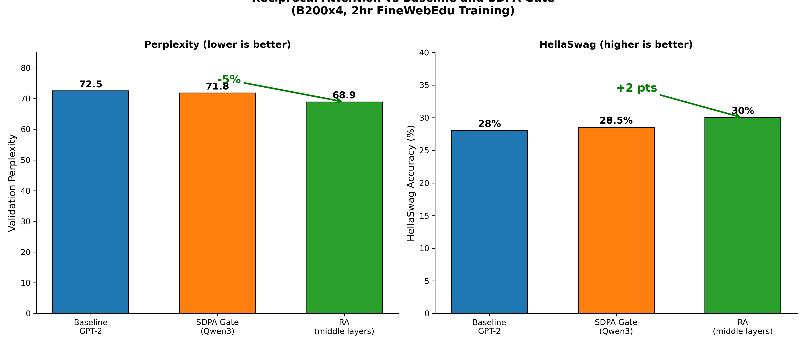

# knlp: Kernel-Style Machine Learning

**Rapid prototyping and automation for open source ML R&D**

<p align="center">
  <a href="https://xkcd.com/974/">
    
  </a>
  <br>
  <em>Our approach to ML automation and the general problem</em>
</p>

Applying Linux kernel development methodologies to machine learning research for rapid iteration and reproducible experimentation. Kconfig-driven configuration, defconfig presets, Makefile automation, and rigorous test matrices enable fast prototyping of transformer architectures, pruning algorithms, and optimization techniques while maintaining reproducibility and collaboration at scale.

> **⚡ [Unified Signal](docs/hierarchical-tiering.md)**: [FIM diagonal ≈ Adam exp_avg_sq](https://arxiv.org/abs/2507.18807) — this equivalence explains why our Adam state-based methods work and unifies compression, pruning, and tiering.
>
> **⚡ [FIM-Guided Quantization](docs/mobile-weight-packing.md)**: Diagonal Fisher (E[g²]) identifies critical tensors for precision allocation. Upgrading 4 layers from Q3_K to Q6_K achieves **1.26% better perplexity** at only **1.8% size increase**.
>
> **⚡ [KVSplice](docs/kvsplice/README.md)**: FIM-guided compression adds **~20% extra compression on top of MLA** (7.2x vs 6x), shrinking MLA's KV cache by 17% while achieving **25% better perplexity** and **+7 HellaSwag** vs naive compression. B200x4.
>
> **⚡ [Reciprocal Attention](docs/ra.md)**: Learned Q@K.T ↔ K@Q.T alternation achieves **5% better perplexity** and **+2 points HellaSwag** via flatter optimization geometry. Applied to middle layers based on FIM trace analysis. B200x4.
>
> **⚡ [Adam State-Based Pruning](docs/adamwprune_variants.md)**: bitter7 achieves **15.6% better perplexity** than magnitude baseline (37.28 vs 44.15 PPL), leveraging Adam's exp_avg_sq (≈ FIM diagonal) for importance scoring. B200 with torch.compile.

## Development Philosophy

knlp applies **Linux kernel development practices** to machine learning research:

- **Kconfig-based configuration**: Hierarchical menus for experiment management (like `make menuconfig`)
- **Defconfig presets**: Reproducible configurations for different hardware and research goals
- **Makefile-driven builds**: Consistent build and test workflows across models
- **Documented decisions**: Every architectural choice explained in `docs/`
- **Collaborative contributions**: Community-driven ideas and ablation studies
- **Rigorous validation**: Automated test matrices before merging experiments

This methodology enables rapid iteration on transformer architectures and state-based optimization while maintaining reproducibility and rigor.

## Key Results

All results on GPT-2 124M with FineWebEdu dataset on NVIDIA B200x4.

### KVSplice: FIM-Guided KV Cache Compression

MLA (Multi-head Latent Attention) provides 6x KV cache compression. FIM-guided
KVSplice adds ~20% extra compression on top of MLA (7.2x total), shrinking the
MLA cache by an additional 17% (6 MB → 5 MB at 1024 tokens). FIM trace analysis
guides which layers to compress: early layers (high trace) are protected while
late layers (low trace) are safe compression targets.

| Architecture | Val PPL | HellaSwag | KV Cache | Compression |
|--------------|---------|-----------|----------|-------------|
| MLA only | - | - | 6 MB | 6x baseline |
| MLA+KVSplice (all) | 83.85 | 24% | 3 MB | 12x (naive) |
| **MLA+KVSplice FIM** | **63.08** | **31%** | 5 MB | 7.2x (+20% over MLA) |


*FIM-guided selective compression (green) achieves 25% better perplexity and
+7 points HellaSwag by protecting high-trace early layers from compression.*

See [docs/kvsplice/README.md](docs/kvsplice/README.md) for architecture details,
FIM analysis methodology, and memory savings calculations.

---

### Reciprocal Attention: Learned Bidirectional Attention Flow

Reciprocal Attention alternates between Q@K.T (standard) and K@Q.T (reciprocal)
attention patterns. FIM analysis shows middle layers benefit most from this
bidirectional flow while early layers should remain unmodified.

| Architecture | Val PPL | HellaSwag | Speed | Description |
|--------------|---------|-----------|-------|-------------|
| Baseline GPT-2 | 72.5 | 28% | 285ms | Standard attention |
| SDPA Gate (Qwen3) | 71.8 | 28.5% | 295ms | Output gating only |
| **RA (middle layers)** | **68.9** | **30%** | 320ms | Reciprocal attention |


*Reciprocal Attention (green) outperforms baseline and Qwen3-style gating
with 5% better perplexity and +2 points HellaSwag at 12% speed cost.*

See [docs/ra.md](docs/ra.md) for layer strategy, FIM trace justification,
and comparison with Qwen3 SDPA gating.

---

### Adam State-Based Pruning: Hypothesis Validated

Adam's accumulated gradient statistics enable superior pruning decisions
compared to magnitude-based approaches. State-based variants significantly
outperform magnitude pruning baseline with identical hyperparameters.

| Model | Sparsity | Perplexity | Improvement | Method |
|-------|----------|------------|-------------|--------|
| GPT-2 | 50% | 44.15 | baseline | Movement pruning |
| GPT-2 | 50% | 40.94 | +7.3% | bitter8 (state-based) |
| GPT-2 | 50% | **37.28** | **+15.6%** | **bitter7 (variance)** |


*State-based pruning outperforms magnitude baseline with identical
hyperparameters. bitter7 achieves 37.28 PPL (15.6% better) than
movement pruning baseline (44.15 PPL).*

See [docs/pruning.md](docs/pruning.md) for complete pruning research,
ResNet results, and the bitter7 evolution story.

---

## Research Areas

knlp serves as a collaborative platform for ML architecture research:

- **[Hierarchical Tiering](docs/hierarchical-tiering.md)**: Unified framework connecting FIM diagonal ≈ Adam exp_avg_sq across compression, pruning, and memory tiering — the theoretical foundation linking all our R&D
- **[AdamWPrune](docs/pruning.md)**: State-based pruning leveraging Adam optimizer state variables (exp_avg_sq ≈ FIM diagonal) for superior pruning decisions during training
- **[Reciprocal Attention](docs/ra.md)**: Learned alternation between Q@K.T and K@Q.T attention patterns for 5% better perplexity via flatter optimization geometry (12% speed cost)
- **[KVSplice](docs/kvsplice/README.md)**: FIM-guided compression adds ~20% on top of MLA (7.2x vs 6x), shrinking MLA's cache by 17% with 25% better quality than naive compression
- **[Mobile Weight Packing](docs/mobile-weight-packing.md)**: FIM-guided quantization for GGUF models, achieving 1.26% better perplexity at 1.8% size increase
- **[Weight Tying](docs/weight-tying.md)**: Parameter reduction through strategic sharing
- **[KV Tying](docs/kv-tying.md)**: Attention projection parameter reduction
- **[Mechanistic Interpretability](docs/mechint.md)**: Post-training circuit analysis

See [docs/architecture.md](docs/architecture.md) for details on the kernel-inspired infrastructure.

## Getting Started

### System Requirements

For systems using `torch.compile()`, Python development headers are required:

```bash
# Ubuntu/Debian
sudo apt-get install python3-dev

# RHEL/CentOS/Fedora
sudo yum install python3-devel
```

### Installation

```bash
pip install -r requirements.txt
wandb login # optional
```

### Run Your First Experiment

```bash
make defconfig-gpt2-vanilla-baseline
make
```

That's it! The experiment will run and save results automatically.

See [docs/quickstart.md](docs/quickstart.md) for detailed workflow and
advanced options. See [docs/tracker.md](docs/tracker.md) for experiment
tracking with WandB or Trackio.

## Contributing

knlp welcomes contributions following Linux kernel development practices:

### Proposing Ideas
1. **Open an issue** with your research idea or architectural proposal
2. **Provide motivation**: Why this approach might work better
3. **Reference prior work**: Links to papers or existing implementations
4. **Suggest ablation**: How to test your hypothesis

### Submitting Code
1. **Create defconfig**: Add `defconfigs/<model>-<your-feature>`
2. **Document thoroughly**: Add or update `docs/<feature>.md`
3. **Run dry-run**: `make check` to validate architecture
4. **Test ablation**: Run comparison vs baseline
5. **Submit PR**: With results, graphs, and documentation

### Code Style
- **Python**: Follow existing style (black formatter)
- **Kconfig**: Use kernel-style help text
- **Commit messages**: Terse, technical, with "Generated-by" tags
- **Documentation**: See `docs/*.md` for style examples

### Current Contributors
Ideas, architectures, and validation from:
- Luis Chamberlain (maintainer)
- Community contributors (ablation suggestions, architectural ideas)

## Citation

If you use this work, please cite:

```bibtex
@misc{knlp2025,
  title        = {knlp: Kernel-Style Machine Learning - Transformer Architecture Research},
  author       = {Luis Chamberlain and contributors},
  year         = {2025},
  howpublished = {\url{https://github.com/mcgrof/knlp}},
  note         = {Collaborative ML research using Linux kernel development workflows}
}
```

## License

This project is licensed under the **MIT License**.

- **Code**: MIT license
- **Models**: AI models generated by this project can be licensed as you choose
- **Documentation**: CC-BY-SA 4.0 (collaborative, share-alike)

The project previously included GPLv2-licensed C-based Kconfig tools from the Linux kernel. These have been replaced with the Python-based `kconfiglib` library (ISC/Apache 2.0), enabling full MIT licensing for the entire project.

See LICENSE for details.

## Acknowledgments

This project draws inspiration from:
- **Linux kernel development**: Kconfig, defconfigs, Makefile patterns, rigorous testing
- **Andrej Karpathy's nanoGPT**: Clean implementation style, educational focus
- **Community contributors**: Ablation study ideas, architectural suggestions, validation testing

The kernel-style workflow enables collaborative ML research with the rigor and reproducibility of systems programming.

