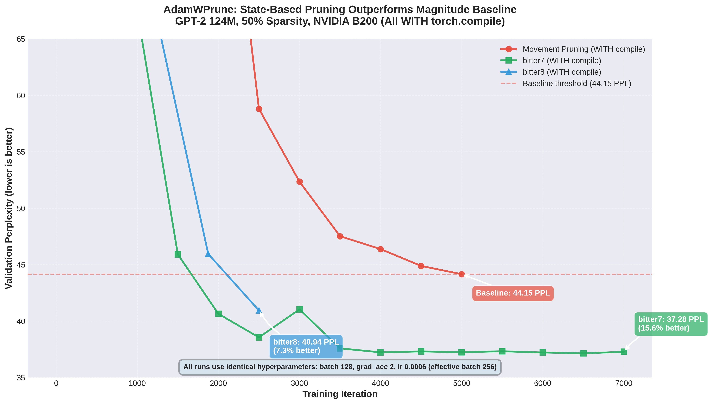

# knlp: Kernel-Style Machine Learning

**Rapid prototyping and automation for open source ML R&D**

<p align="center">
  <a href="https://xkcd.com/974/">
    
  </a>
  <br>
  <em>Our approach to ML automation and the general problem</em>
</p>

Applying Linux kernel development methodologies to machine learning research for rapid iteration and reproducible experimentation. Kconfig-driven configuration, defconfig presets, Makefile automation, and rigorous test matrices enable fast prototyping of transformer architectures, pruning algorithms, and optimization techniques while maintaining reproducibility and collaboration at scale.

> **🚀 RA + R-MLP + KV Pruning**: Current research blends Reciprocal Attention (bidirectional attention with zero extra FLOPs using single-SDPA-call folded architecture) with attention-aware Reciprocal MLP and gate-informed adaptive KV cache pruning. R-MLP receives attention context via cheap vector add, and learned gates (w_rec × α) modulate pruning aggressiveness. See [docs/ra.md](docs/ra.md) for ablation study details.

> **⚡ Adam State-Based Pruning**: bitter7 achieves **15.6% better perplexity** than magnitude baseline (37.28 vs 44.15 PPL), validating the hypothesis that Adam's gradient statistics enable superior pruning decisions. Tested on NVIDIA B200 GPUs with torch.compile.

## Development Philosophy

knlp applies **Linux kernel development practices** to machine learning research:

- **Kconfig-based configuration**: Hierarchical menus for experiment management (like `make menuconfig`)
- **Defconfig presets**: Reproducible configurations for different hardware and research goals
- **Makefile-driven builds**: Consistent build and test workflows across models
- **Documented decisions**: Every architectural choice explained in `docs/`
- **Collaborative contributions**: Community-driven ideas and ablation studies
- **Rigorous validation**: Automated test matrices before merging experiments

This methodology enables rapid iteration on transformer architectures through reciprocal mechanisms, geometric compression, and state-based optimization while maintaining reproducibility and rigor.

## Key Results

### Cross-Model Validation

| Model | Parameters | Dataset | Sparsity | Accuracy/Perplexity | Notes |
|-------|------------|---------|----------|---------------------|-------|
| GPT-2 | 124M | FineWebEdu | 50% | **37.28 PPL** | **bitter7 (15.6% better)** |
| ResNet-50 | 25.6M | CIFAR-100 | 50% | 74.56% | bitter0 (original hybrid) |
| ResNet-18 | 11.2M | CIFAR-10 | 70% | 90.66% | bitter0 (original hybrid) |
| LeNet-5 | 61.7K | MNIST | 70% | 98.9% | bitter0 (original hybrid) |

bitter0 (original hybrid momentum-stability) achieved excellent results
on CNNs. bitter7 (variance-based) emerged from transformer R&D and is
expected to improve CNN results further. See evolution story below.

## GPT-2 Transformer Results (124M Parameters)

### Current Research: R-MLP + Gate-Informed KV Pruning

Exploring attention-aware MLP with adaptive KV cache pruning based
on learned gate signals. R-MLP injects attention via cheap vector
add (x + α×attn), and gates (w_rec, α) modulate KV pruning ratio.

**Ablation study (V1-V7)** tests:
- Different R_ff dimensions (256 to 1920)
- Weight tying between attention and MLP
- Gate-informed adaptive pruning (V7)

See [docs/ra.md](docs/ra.md) for detailed architecture and results.

**Training**: 2 hours per step, ~2065 iterations, 4× NVIDIA A10G
(24GB). Minimal overhead (~4ms/iter). Production-ready stability.

---

### Adam State-Based Pruning: Hypothesis Validated

Our Adam state-based pruning research conclusively validates the
hypothesis that **leveraging Adam's accumulated gradient statistics
enables superior pruning decisions** compared to magnitude-based
approaches. State-based variants (bitter7, bitter8) significantly
outperform magnitude pruning baseline when tested with identical
hyperparameters on NVIDIA B200 GPUs.


*State-based pruning outperforms magnitude baseline with identical
hyperparameters. All runs WITH torch.compile on B200: bitter8
achieves 40.94 PPL (7.3% better), bitter7 achieves 37.28 PPL
(15.6% better) than movement pruning baseline (44.15 PPL).*

**Test Configuration:**
- Model: GPT-2 (124M parameters)
- Dataset: FineWebEdu
- Target Sparsity: 50%
- **Learning Rate:** 0.0006, Weight Decay: 0.1
- **Hyperparameters:** AUTO mode (adapts to available hardware)

### Hyperparameter Auto-Detection

knlp now features **CONFIG_HYPER_PARAM_AUTO** which eliminates
GPU-specific defconfigs and prevents hyperparameter mismatches.
The system automatically detects GPU type, memory, count, and
torch.compile status to select optimal batch size and gradient
accumulation while maintaining constant effective batch size.

Heuristics table includes B200 (batch=128), W7900 (batch=32),
A10G (batch=8), and generic GPU configurations. The same defconfig
works across all hardware without modification.

Example:
- **B200 (4x, 192GB)**: batch=128, grad_acc=8, eff_batch=1024
- **W7900 (48GB)**: batch=32, grad_acc=32, eff_batch=1024
- **A10G (24GB)**: batch=8, grad_acc=128, eff_batch=1024

See consolidated defconfigs in `gpt2/defconfigs/`:
- `gpt2-finewebedu-bitter7` (hardware-agnostic)
- `gpt2-finewebedu-bitter8` (hardware-agnostic)
- `gpt2-finewebedu-spam-vs-bitter7` (hardware-agnostic)

### Performance Results

| Variant | PPL | vs Baseline | Iterations | Status |
|---------|-----|-------------|------------|--------|
| Movement Pruning | 44.15 | - | 5,000 | Baseline |
| bitter8 | 40.94 | -7.3% | 2,500 | ✅ Tested |
| **bitter7** | **37.28** | **-15.6%** | 7,000 | ✅ **Best** |

All runs use torch.compile and identical hyperparameters for fair
comparison (batch 128, grad_acc 8, lr 0.0006, effective batch 1024).

**Key Findings**:
- **State-Based Pruning Superior**: bitter7 and bitter8 both
  outperform magnitude pruning baseline using Adam optimizer state
  statistics (bitter7: -15.6%, bitter8: -7.3%)
- **Adam State Hypothesis Validated**: bitter7's use of
  `exp_avg_sq^0.25` (second moment statistics) provides superior
  pruning signal compared to magnitude-only approaches
- **Best Results**: bitter7 achieves 37.28 PPL (15.6% better than
  baseline 44.15 PPL) using variance-based importance scoring
- **Faster Convergence**: bitter8 reaches 40.94 PPL in 2,500
  iterations vs baseline 44.15 PPL at 5,000 iterations

### AdamWPrune Bitter Variants Summary

The "bitter" naming follows Rich Sutton's Bitter Lesson. See [docs/adamwprune_variants.md](docs/adamwprune_variants.md) for full details.

**Tested Variants**:
- **bitter7** (RECOMMENDED): State-based pruning using `|w| * (exp_avg_sq^0.25)` - achieves 37.28 PPL
- **bitter8**: Bias-corrected gradient-magnitude using `|w| * sqrt(|m_hat|)` - achieves 40.94 PPL
  - **m_hat** = bias-corrected momentum `exp_avg / (1 - beta1^t)` from Adam
  - Accounts for initialization bias in early training steps
  - Faster convergence (40.94 PPL at 2,500 iters vs baseline 44.15 at 5,000)
- **bitter0-6**: Historical variants (magnitude, gradient-based, movement-based) - see docs

**Why bitter7 Outperforms bitter8**: Beta2 (variance) vs Beta1 (momentum)


The choice of **beta2=0.999 (variance)** over **beta1=0.9 (momentum)** is
crucial for stable pruning decisions:

- **Raw gradients** (gray): Extremely noisy, unusable for pruning
- **Beta1=0.9 (momentum)**: Tracks ~10 recent steps, still oscillates
- **Beta2=0.999 (variance)**: Smoothest signal, accumulates over ~1000 steps

Since pruning is **irreversible**, bitter7's use of long-term variance
statistics (`exp_avg_sq^0.25`) provides more stable importance scores
than bitter8's bias-corrected momentum. The fourth root further dampens
noise, ensuring only parameters with consistently low activity are pruned.

**Mathematical intuition**:
```python
# Momentum (beta1=0.9): tracks ~10 steps
0.9^10 ≈ 0.35   # 35% weight from 10 steps ago

# Variance (beta2=0.999): tracks ~1000 steps
0.999^1000 ≈ 0.37   # 37% weight from 1000 steps ago!
```

**Evolution of Adam State-Based Pruning**:

The development of bitter variants followed a systematic R&D progression:

1. **bitter0 (Original Hybrid)**: Started with hybrid momentum-stability
   pruning `|w| * |exp_avg| * |w|/sqrt(exp_avg_sq)` - the default
   algorithm for AdamWPrune
2. **LeNet-5/ResNet Validation**: bitter0 showed incredible results on
   CNNs (98.9% MNIST, 90.66% CIFAR-10, 74.56% CIFAR-100)
3. **Transformer Challenge**: When applied to GPT-2 transformers,
   bitter0 underperformed movement pruning (51.51 PPL, worst variant)
4. **Bitter Variants R&D**: Developed bitter1-9 to find better
   approaches for transformers (see
   [docs/adamwprune_variants.md](docs/adamwprune_variants.md))
5. **bitter7 Winner**: Variance-based pruning `|w| * (exp_avg_sq^0.25)`
   achieved 37.28 PPL (15.6% better than baseline) on GPT-2

**Next Steps**: Since bitter7 outperforms bitter0 on transformers, we
expect bitter7 will achieve even better results on LeNet-5/ResNet than
the already-excellent bitter0 baseline. This hypothesis needs testing
to validate bitter7 as the universal best variant across architectures.

## ResNet CNN Results

### Optimizer Performance vs Model Size

#### Critical Finding: Optimal Optimizer Changes with Model Scale

Our testing reveals that **the best-performing optimizer depends on model size**:

**ResNet-18 (11.2M parameters, CIFAR-10):**
- **Winner: AdamW** (90.30% accuracy)
- Adam: 89.85% (-0.45%)
- AdamWSPAM: 89.75% (-0.55%)
- AdamWAdv: 89.42% (-0.88%)
- SGD: 89.22% (-1.08%)

**ResNet-50 (25.6M parameters, CIFAR-100) - Latest Results (September 2025):**

**🏆 AdamWPrune with AdamWSpam Base Sets New Record:**

| Sparsity | AdamWPrune (AdamWSpam base) | AdamWSpam (best) | AdamWPrune (AdamW base) | Improvement |
|----------|------------------------------|------------------|--------------------------|-------------|
| **50%** | **74.56%** 🥇 | 74.11% (Magnitude) | 74.54% | +0.45% |
| **70%** | **73.89%** 🥇 | 73.11% (Magnitude) | 72.30% | +0.78% |
| **90%** | **72.84%** 🥇 | 72.63% (Magnitude) | 73.26% | +0.21% |
| Baseline | **72.60%** | 71.86% | N/A | +0.74% |

**Breakthrough Configuration**: `CONFIG_ADAMWPRUNE_BASE_ADAMWSPAM=y` with SPAM theta=50.0

**Key Achievements**:
- **Universal superiority**: AdamWPrune outperforms AdamWSpam at ALL sparsity levels
- **50% sweet spot**: 74.56% accuracy - **1.96% better than baseline** (pruning improves accuracy!)
- **Memory efficiency**: 12602.5 MB with 6.06% accuracy per GB
- **Stability**: Lower variance (0.23% std) in final epochs

**Key Insight**: As model complexity increases from ResNet-18 to ResNet-50, AdamWSPAM's spike-aware momentum adaptation becomes more beneficial than AdamW's simpler decoupled weight decay. This suggests that larger models with more complex loss landscapes benefit from SPAM's gradient spike detection and momentum reset mechanisms.

### GPU Memory Analysis

#### ResNet-18 Production-Scale Results (September 2025)

**Key Findings with AdamW Base:**
- **Identical performance without pruning**: AdamW (90.30%) vs AdamWPrune (90.28%) at ~1307 MB
- **Best accuracy at 50% sparsity**: Both movement and state pruning achieve 90.69%
- **Pruning method comparison**: Movement > State > Magnitude for accuracy retention
- **Memory overhead**: Magnitude pruning adds ~93 MB, movement/state add ~167-195 MB

| Configuration | Optimizer | Pruning Method | Sparsity | GPU Memory (Actual) | Accuracy |
|--------------|-----------|----------------|----------|---------------------|----------|
| **AdamW Baseline** | AdamW | None | 0% | **1307.6 MiB** | 90.30% |
| **AdamWPrune Baseline** | AdamWPrune | None | 0% | **1307.4 MiB** | 90.28% |
| AdamW Movement | AdamW | Movement | 50% | 1475.6 MiB | **90.69%** |
| AdamWPrune State | AdamWPrune | State | 50% | 1474.6 MiB | **90.69%** |
| AdamW Movement | AdamW | Movement | 70% | 1474.6 MiB | 89.68% |
| AdamWPrune State | AdamWPrune | State | 70% | 1503.0 MiB | 89.37% |
| AdamW Movement | AdamW | Movement | 90% | 1475.5 MiB | 89.10% |
| AdamWPrune State | AdamWPrune | State | 90% | 1502.9 MiB | 88.65% |
| AdamW Magnitude | AdamW | Magnitude | 50% | 1400.0 MiB | 88.97% |
| AdamW Magnitude | AdamW | Magnitude | 70% | 1399.9 MiB | 88.44% |
| AdamW Magnitude | AdamW | Magnitude | 90% | 1398.9 MiB | 86.85% |

**Key Achievements**:
- **Proper weight decay**: AdamW base with parameter groups (no decay on bias/BatchNorm)
- **Tied best accuracy**: State and movement pruning both achieve 90.69% at 50% sparsity
- **Consistent memory usage**: AdamWPrune uses similar memory to AdamW across configurations

### Visual Evidence of AdamWPrune Performance

#### All Methods Comparison

*Comprehensive comparison showing all pruning methods including AdamWPrune achieving competitive accuracy*


*Memory and accuracy comparison across all methods - state and movement pruning achieve similar results*

#### GPU Memory Analysis

*Comprehensive GPU memory usage comparison across all tested configurations*


*Real-time GPU memory usage during training phases*


*Memory-accuracy trade-off: State and movement pruning achieve similar memory usage (~1489 MB) with comparable accuracy*

→ See [ResNet-18 detailed findings](docs/resnet18.md) for detailed analysis

### ResNet-50 Visual Evidence

#### Performance Evolution Across Optimizers

*AdamWPrune showing superior performance at 50% sparsity (74.68%) with stable training*


*SGD excels at 70% sparsity while AdamWPrune dominates at 50%*

#### GPU Memory Efficiency

*AdamWPrune achieves lowest memory usage (12602.5 MB) across all configurations*


*Clear winner: AdamWPrune achieves best accuracy-memory trade-off*


*Detailed memory analysis showing AdamWPrune's consistent efficiency*

→ See [ResNet-50 detailed findings](docs/resnet50.md) for complete analysis

#### LeNet-5 Comprehensive Analysis

*Comprehensive 6-panel analysis showing AdamWPrune's memory efficiency patterns*

#### Memory Efficiency Leaders (ResNet-18)
Top configurations by accuracy per 100 MiB of GPU memory:
1. **AdamW** (no pruning): 6.91 efficiency score - Best overall
2. **AdamWPrune** (no pruning): 6.91 efficiency score
3. **AdamW** (magnitude_50): 6.35 efficiency score
4. **AdamW** (magnitude_70): 6.32 efficiency score
5. **AdamWPrune** (state_50): 6.15 efficiency score
6. **AdamW** (movement_50): 6.15 efficiency score

The minimal absolute memory differences in LeNet-5 (~10-20 MiB) are due to CUDA/PyTorch's ~450 MiB baseline overhead, but the efficiency patterns clearly demonstrate AdamWPrune's algorithmic advantages.

## How AdamWPrune Works

Traditional pruning methods require **additional memory buffers**:
- Importance scores (float32 per parameter)
- Binary masks (1 byte per parameter)
- Initial weight copies for reference
- **Total overhead**: 1-2× model size

**AdamWPrune's innovation**: Reuses existing AdamW optimizer states:
- Based on AdamW for proper decoupled weight decay
- `exp_avg` (momentum) → tracks weight importance
- `exp_avg_sq` (variance) → provides stability signals
- Only adds boolean mask when pruning active (1 byte/param)
- **Proven minimal overhead**: When pruning disabled, 1307.4 MB (vs AdamW's 1307.6 MB)
- **Pruning overhead**: State pruning adds ~167-195 MB, comparable to movement pruning
- **Result**: Achieves 90.69% accuracy at 50% sparsity, tied with movement pruning

### Why AdamW as Base?

AdamWPrune is built on AdamW rather than Adam for critical reasons:
1. **Decoupled weight decay**: AdamW properly decouples L2 regularization from gradient-based updates
2. **Parameter groups**: Excludes bias and BatchNorm parameters from weight decay (critical for performance)
3. **Better baseline**: AdamW outperforms Adam (90.30% vs older 90.31% with improper implementation)
4. **Industry standard**: AdamW is the de facto standard for transformer and modern architectures

### Model Checkpointing

Industry best practices recommend saving model checkpoints at peak accuracy, not just at training completion. This is critical because:
- **Peak ≠ Final**: Models often achieve best accuracy mid-training (e.g., AdamWPrune: 74.68% at epoch 63, final only 70.56%)
- **Overfitting protection**: Later epochs may degrade performance
- **Deployment ready**: Best checkpoints are production-ready models

📚 **[Checkpoint Best Practices Guide](docs/checkpoint-best-practices.md)** - Learn why and how to implement proper checkpointing strategies based on our experimental findings.

## Detailed Findings

- **[State-Based Pruning Deep Dive](docs/adding_state_pruning.md)**: Comprehensive analysis of AdamWPrune's state pruning approach
- **[LeNet-5 Results](docs/lenet5.md)**: Proof of concept on MNIST
- **[ResNet-18 Results](docs/resnet18.md)**: Production-scale validation on CIFAR-10
- **[ResNet-50 Results](docs/resnet50.md)**: ImageNet-scale demonstration of superior memory efficiency
- **[GPT-2 Results](docs/gpt2.md)**: Transformer validation confirming bitter lesson with 20% speedup
- **[Key Test Results Archive](https://github.com/mcgrof/knlp-key-results)**: Complete test matrix results with all graphs and metrics
  - [ResNet-50 AdamWSpam Base Results](https://github.com/mcgrof/knlp-key-results/tree/master/key_results/test_matrix_results_20250913_200218/ANALYSIS.md): **74.56% at 50% sparsity** - state-of-the-art
  - [ResNet-50 CIFAR-100 Extended Results](https://github.com/mcgrof/knlp-key-results/tree/master/key_results/test_matrix_results_20250908_190856/summary_report.txt): 74.54% at 50% sparsity with AdamW base
  - [ResNet-50 CIFAR-100 Initial Results](https://github.com/mcgrof/knlp-key-results/tree/master/key_results/test_matrix_results_20250908_121537/summary_report.txt): 72.38% at 70% sparsity with lowest GPU memory
  - [ResNet-18 CIFAR-10 Results](https://github.com/mcgrof/knlp-key-results/tree/master/key_results/test_matrix_results_20250903_180836/report.md): 90.66% accuracy with lowest memory usage
  - [GPT-2 Bitter Lesson Test Results](https://github.com/mcgrof/knlp-key-results/tree/master/key_results/test_matrix_results_20250923_010926/): Confirms bitter lesson - simpler algorithms outperform complex ones

## Transformer Model Findings (GPT-2)

### The Bitter Lesson Confirmed

Our GPT-2 experiments validate Rich Sutton's Bitter Lesson in neural network pruning: **simpler algorithms leveraging computation outperform complex, engineered approaches**.

**Test Configuration:**
- Model: GPT-2 (124M parameters)
- Dataset: FineWebEdu
- Target Sparsity: 50%
- Training: 10,000 iterations (12,100 for bitter2)

### Performance Results

| Optimizer | Algorithm | Final Perplexity | Iterations | Training Time | Memory |
|-----------|-----------|------------------|------------|---------------|--------|
| **AdamWSPAM** | **Magnitude** | **42.82** (best) | 10,000 | Baseline | 5.03x weights |
| AdamWPrune | Bitter2* | 46.07 | 12,100* | Baseline* | 3.03x weights |
| AdamWPrune | Bitter1 | 49.99 | 10,000 | ~20% faster | 3.03x weights |
| AdamWPrune | Bitter0 | 51.51 | 10,000 | ~20% faster | 3.03x weights |

*Bitter2 uses 21% more iterations (12,100) to explore scale-aware pruning, resulting in similar wall-clock time despite faster per-iteration speed.

### Key Transformer Insights

1. **Bitter Lesson Validated**: Simpler pruning algorithms (bitter1/2) outperformed the complex hybrid approach (bitter0)
   - Bitter2 achieves 46.07 perplexity with simple scale-aware magnitude
   - Bitter0's complex momentum-stability hybrid performs worst at 51.51

2. **Training Efficiency**: Bitter0/1 achieve ~20% speedup; bitter2 trades speed for quality with extended training

3. **Memory Efficiency**: 40% reduction in theoretical overhead
   - Traditional approach: 5.03x model weights (Adam states + movement scores)
   - AdamWPrune: 3.03x model weights (Adam states + boolean mask only)

4. **Clear Trade-offs**: Speed and memory benefits come with 7-20% perplexity increase
   - Acceptable for memory-constrained environments
   - Valuable for large-scale training where 20% speedup is critical

### Practical Implications

**When to use AdamWPrune on transformers:**
- Memory-constrained training environments
- Large-scale experiments where 20% speedup matters
- Research exploring efficient training methods

**When to use traditional pruning:**
- Production models requiring absolute best perplexity
- Small models where memory isn't a constraint

## Research Areas

knlp serves as a collaborative platform for ML architecture research:

- **[AdamWPrune](docs/adding_state_pruning.md)**: State-based pruning using optimizer dynamics
- **[Reciprocal Attention (RA)](docs/ra.md)**: Bidirectional attention with geometric initialization
- **[Weight Tying](docs/weight-tying.md)**: Parameter reduction through strategic sharing
- **[KV Tying](docs/kv-tying.md)**: Attention projection parameter reduction
- **[Mechanistic Interpretability](docs/mechint.md)**: Post-training circuit analysis

The kernel-inspired infrastructure enables rapid prototyping, automated validation, and reproducible experiments across contributors.

## Pruning Method Insights

### Movement Pruning: Designed for Fine-tuning, Not Training from Scratch

Movement pruning, introduced by Sanh et al. (2020) in "Movement Pruning: Adaptive Sparsity by Fine-Tuning", was specifically designed for **fine-tuning pre-trained models**, not training from scratch. This distinction is critical:

**Key characteristics:**
- **Fine-tuning context**: Movement pruning identifies weights moving toward zero during adaptation to downstream tasks
- **Pre-trained models**: Works best with models that have already learned meaningful representations
- **Architecture differences**: Transformers and CNNs exhibit different pruning behaviors
  - Transformers: Many redundant parameters naturally move toward zero, leading to aggressive pruning
  - CNNs: More structured weight patterns maintain their magnitudes during training

**Training from scratch limitations:**
- Random initial weights lack meaningful movement patterns
- Weights moving toward zero early in training may still be important later
- Can lead to aggressive over-pruning beyond target sparsity levels
- Less stable than magnitude-based methods for random initialization

**Practical implications for GPT-2 comparisons:**
Given that movement pruning is optimized for fine-tuning scenarios, our GPT-2 training-from-scratch experiments focus primarily on comparing **magnitude pruning vs. AdamWPrune's state-based pruning**, which are both designed for training from random initialization.

## Kernel-Inspired Features

### Configuration Management (Kconfig)
- **Hierarchical menus**: `make menuconfig` for interactive configuration
- **Defconfig presets**: Hardware-specific configurations (W7900, A10G, A100)
- **Dependency tracking**: Automatic validation of configuration combinations
- **Documentation integration**: Help text links to detailed docs

### Build System (Makefile)
- **Unified interface**: `make defconfig-<name>; make` for all experiments
- **Parallel execution**: Multi-GPU training with DDP support
- **CLI overrides**: `MODELS=path`, `BASELINE=run_id`, `TIME=3600`
- **Reproducible builds**: Deterministic configuration → experiment mapping

### Testing Infrastructure
- **Test matrices**: Automated cross-product testing (optimizer × pruning × sparsity)
- **Dry-run validation**: Catch architecture bugs before GPU training
- **Continuation support**: Resume interrupted experiments (`make continue`)
- **Result archiving**: Automated preservation of key results

### Multi-Model Support
- **Extensible architecture**: LeNet-5, ResNet-18, ResNet-50, GPT-2
- **Vendor-agnostic monitoring**: [gputop.py](https://github.com/mcgrof/gputop) for NVIDIA/AMD/Intel
- **TrackIO integration**: [TrackIO](https://github.com/mcgrof/trackio/tree/20250921-trackio-view) for GPU utilization visualization
- **Multiple pruning methods**: Magnitude, movement, state-based (AdamWPrune)

## Quick Start (Kernel-Style Workflow)

### Step 1: Choose a Defconfig

```bash
# List available defconfigs
make list-defconfigs

# Load a defconfig (kernel-style: make defconfig-<name>)
make defconfig-gpt2-kv-tying-w7900-ablation

# Or use interactive menu (kernel-style: make menuconfig)
make menuconfig
```

### Step 2: Run Experiment

```bash
# Standard workflow
make  # Runs training or test matrix based on config

# With CLI overrides (like kernel KBUILD_*)
make TRACKER=wandb  # Enable W&B tracking
make TIME=3600      # Override max training time
make MODELS=./checkpoints  # Use custom checkpoint dir
```

### Step 2b: Skip Baseline with Reference Run (Optional)

When running ablation studies, skip expensive baseline re-runs by referencing a previous baseline:

```bash
# Load ablation defconfig
make defconfig-gpt2-r-mlp-prune

# Run with baseline reference (skips M0, runs M1-M3)
make BASELINE=mcgrof/old-project/abc123
```

**What happens:**
1. Baseline run automatically copied to current project
2. Baseline step (M0, V0, L0, S0, R0, C0) filtered from test matrix
3. Only non-baseline steps executed (M1, M2, M3, etc.)

**Benefits:**
- Save hours on expensive baseline re-runs
- Compare experiments across different projects
- Use known-good baseline from previous work

**Format:** `entity/project/run_id` (from W&B run URL)

See [scripts/copy_wandb_run.py](scripts/copy_wandb_run.py) for manual run copying.

### Step 3: Analyze Results

```bash
# Generate visualizations
make update-graphs

# Run mechanistic interpretability analysis
make defconfig-gpt2-kv-tying-w7900-ablation-mechint MODELS=./output
make mechint
```

**Auto-generated project names**: `{model}-{5char-checksum}` (e.g., `gpt2-a3f2c`, `resnet50-7b9d1`)
- Consistent across runs from same directory
- No collisions between machines/directories
- No manual configuration needed

See [docs/experiment-tracking.md](docs/experiment-tracking.md) for detailed tracking configuration.

### Test ResNet-18 with AdamWPrune

```bash
# Quick state pruning comparison on ResNet-18
make defconfig-resnet18-state-pruning-compare
make # for all tests

# If you want to shorten tests and are doing R&D
# you can reduce epochs dynamically:
make EPOCHS=100  # Or EPOCHS=3 for quick test
```

### Test LeNet-5 (Original Model)

```bash
# Run complete LeNet-5 test matrix
make defconfig-lenet5-compare
make
```

### Interactive Configuration

```bash
# Choose model, optimizer, and pruning settings
make menuconfig
make
```

## Installation

### System Requirements

For systems using `torch.compile()` (enabled via `CONFIG_COMPILE_MODEL=y`), Python development headers are required for Triton compilation:

```bash
# Ubuntu/Debian
sudo apt-get install python3-dev

# RHEL/CentOS/Fedora
sudo yum install python3-devel
```

### Core Dependencies
```bash
pip install torch torchvision numpy matplotlib
```

### Optional: Experiment Tracking
```bash
# Local tracking (no authentication needed)
pip install trackio

# Cloud tracking (requires account)
pip install wandb
wandb login  # One-time setup

# Or install both
pip install trackio wandb
```

### Testing Tracker Integration
```bash
# Test WandB with fake metrics
make wandb-test

# Test Trackio with fake metrics
make trackio-test
```

For detailed tracker documentation including WandB API helper scripts
for querying GPU metrics and comparing runs, see
[docs/tracker.md](docs/tracker.md).

## Model-Specific Configurations

### ResNet-18 Presets
- `resnet18-state-pruning-compare` - Compare state pruning across optimizers
- `resnet18-movement-pruning-compare` - Compare movement pruning
- `resnet18-comprehensive-pruning-compare` - Test all combinations

### LeNet-5 Presets
- `lenet5` - Full test configuration
- `lenet5-adamwprune` - AdamWPrune specific testing
- `lenet5-sgd` - Baseline SGD configuration

## Advanced Usage

### Continuing Interrupted Test Runs

If your test matrix is interrupted (system crash, power failure, etc.), you can continue from where you left off:

```bash
# Continue the most recent interrupted test matrix
make continue
```

See [Continuation Documentation](docs/continue.md) for detailed information on resuming interrupted experiments.

### Reproduce All Results

```bash
# ResNet-18 testing (as used for September 2025 results)
make defconfig-resnet18-adam-all-pruning-methods
make

# Generate all visualizations
make update-graphs
```

### Custom Experiments

```bash
# Direct training with specific settings
cd resnet18
python train.py --optimizer adamwprune --pruning-method state --target-sparsity 0.7
```

## Optimizer Variants

- **SGD**: Baseline stochastic gradient descent
- **Adam**: Adaptive moment estimation
- **AdamW**: Adam with decoupled weight decay
- **AdamWAdv**: Enhanced with AMSGrad, cosine annealing, gradient clipping
- **AdamWSpam**: Spike-aware pruning with momentum reset
- **AdamWPrune**: State-based pruning using optimizer dynamics

📚 **[Understanding Adam Optimizers: A Complete Guide](docs/adam-optimizers.md)** - Learn about the evolution from Adam to AdamW and modern variants, with practical guidelines for choosing the right optimizer for your model.

## Movement Pruning

Based on ["Movement Pruning: Adaptive Sparsity by Fine-Tuning"](https://arxiv.org/abs/2005.07683) by Sanh et al. (2020). Tracks weight movement patterns to determine importance.

## References

- Movement Pruning: Victor Sanh, Thomas Wolf, Alexander M. Rush (2020). ["Movement Pruning: Adaptive Sparsity by Fine-Tuning" PDF](https://arxiv.org/abs/2005.07683) & ["Audio summary"](https://open.spotify.com/episode/0Vrw2FiL44wlxxU4QA2zxt?si=rP3Ifc8JT1-iQJuEklCL2g)
- SPAM: Tuan Nguyen, Tam Nguyen, Vinh Nguyen, Hoang Dang, Dung D. Le, Anh Tran (2024). ["SPAM: Spike-Aware Adam with Momentum Reset for Stable LLM Training" PDF](https://arxiv.org/abs/2409.07321) & ["Audio summary"](https://open.spotify.com/episode/7vKFYxrH1o137zl9MfcKAz?si=oVMoHS61QD6Jjm3XYOTDNQ)
- Gradient Problems in RNNs: Razvan Pascanu, Tomas Mikolov, Yoshua Bengio (2013). ["On the difficulty of training recurrent neural networks" PDF](https://arxiv.org/abs/1211.5063) & ["Audio summary"](https://open.spotify.com/episode/0okbpKt5U4jmiYwqhVks1S?si=QeGK8t2MT5iYzcj5VE9dMw)
- Adam: Diederik P. Kingma, Jimmy Ba (2014). ["Adam: A Method for Stochastic Optimization" PDF](https://arxiv.org/abs/1412.6980) & ["Audio summary"](https://open.spotify.com/episode/6GIPqEzRvwHvRMYYI3M4Ar?si=hMWeNH9PR-O48or43EN2iQ)
- AdamW: Ilya Loshchilov, Frank Hutter (2019). ["Decoupled Weight Decay Regularization" PDF](https://arxiv.org/abs/1711.05101) & ["Audio summary"](https://open.spotify.com/episode/0s5ywoHyIS1dTTT2cLxPpV?si=h335wbgGQ0m94FsBtX-SxQ)
- Adafactor: Noam Shazeer, Mitchell Stern (2018). ["Adafactor: Adaptive Learning Rates with Sublinear Memory Cost" PDF](https://arxiv.org/abs/1804.04235) & ["Audio summary"](https://open.spotify.com/episode/46DNk6Mkfk4r6xikZPzYT1?si=UUkAQyQEQai-rQypL_lqgA)

## Contributing

knlp welcomes contributions following Linux kernel development practices:

### Proposing Ideas
1. **Open an issue** with your research idea or architectural proposal
2. **Provide motivation**: Why this approach might work better
3. **Reference prior work**: Links to papers or existing implementations
4. **Suggest ablation**: How to test your hypothesis

### Submitting Code
1. **Create defconfig**: Add `defconfigs/<model>-<your-feature>`
2. **Document thoroughly**: Add or update `docs/<feature>.md`
3. **Run dry-run**: `make check` to validate architecture
4. **Test ablation**: Run comparison vs baseline
5. **Submit PR**: With results, graphs, and documentation

### Code Style
- **Python**: Follow existing style (black formatter)
- **Kconfig**: Use kernel-style help text
- **Commit messages**: Terse, technical, with "Generated-by" tags
- **Documentation**: See `docs/*.md` for style examples

### Current Contributors
Ideas, architectures, and validation from:
- Luis Chamberlain (maintainer)
- Community contributors (ablation suggestions, architectural ideas)

## Citation

If you use this work, please cite:

```bibtex
@misc{knlp2025,
  title        = {knlp: Kernel-Style Machine Learning - Transformer Architecture Research},
  author       = {Luis Chamberlain and contributors},
  year         = {2025},
  howpublished = {\url{https://github.com/mcgrof/knlp}},
  note         = {Collaborative ML research using Linux kernel development workflows}
}
```

## License

This project is licensed under the **MIT License**.

- **Code**: MIT license
- **Models**: AI models generated by this project can be licensed as you choose
- **Documentation**: CC-BY-SA 4.0 (collaborative, share-alike)

The project previously included GPLv2-licensed C-based Kconfig tools from the Linux kernel. These have been replaced with the Python-based `kconfiglib` library (ISC/Apache 2.0), enabling full MIT licensing for the entire project.

See LICENSE for details.

## Acknowledgments

This project draws inspiration from:
- **Linux kernel development**: Kconfig, defconfigs, Makefile patterns, rigorous testing
- **Andrej Karpathy's nanoGPT**: Clean implementation style, educational focus
- **Community contributors**: Ablation study ideas, architectural suggestions, validation testing

The kernel-style workflow enables collaborative ML research with the rigor and reproducibility of systems programming.

## RATIO: Hardware-Aware Golden Ratio Architecture

**NEW**: RATIO combines inference-optimal architecture (golden ratio 1:2.5) with GPU-aligned tensor dimensions for maximum hardware efficiency.

### Key Innovations
- **Golden Ratio Enforcement**: Attention:MLP = 1:2.5 (inference-optimal vs GPT-2's 1:2.0)
- **GPU-Aligned Dimensions**: All tensors are multiples of 64 for tensor core efficiency (following Karpathy's nanoGPT vocab padding principle)
- **Structure-Aware Pruning**: New bitter7-9 variants that preserve golden ratio during pruning
- **MLA Compression**: 6× smaller KV cache (latent_dim=128)

### Pruning Variants for RATIO

**bitter7 (Conservative Variance)**: `|w| * (exp_avg_sq^0.25 + eps)`
- Uses Adam's second moment (beta2=0.999) which accumulates slowly
- Fourth root = maximum conservatism
- Best for: Finding parameters with long-term low activity

**bitter8 (RATIO Structure-Aware)**: `structural_weight * |w| * sqrt(|exp_avg| + eps)`
- Attention params weighted 2.5× (scarce, 1/2.5 of capacity)
- MLP params weighted 1.0× (abundant, 2.5/2.5)
- Coupling params weighted 3.0× (critical bidirectional flow)
- Best for: RATIO models where ratio must be preserved

**bitter9 (RATIO Conservative - Recommended)**: `structural_weight * |w| * (exp_avg_sq^0.25 + eps)`
- Most conservative: combines structure + variance signals
- Best for: Final deployment with maximum confidence

### Configuration
```bash
make defconfig-gpt2-ratio-ablation && make
```

See `docs/ra.md` and `docs/ratio-pruning-variants.md` for technical details.

