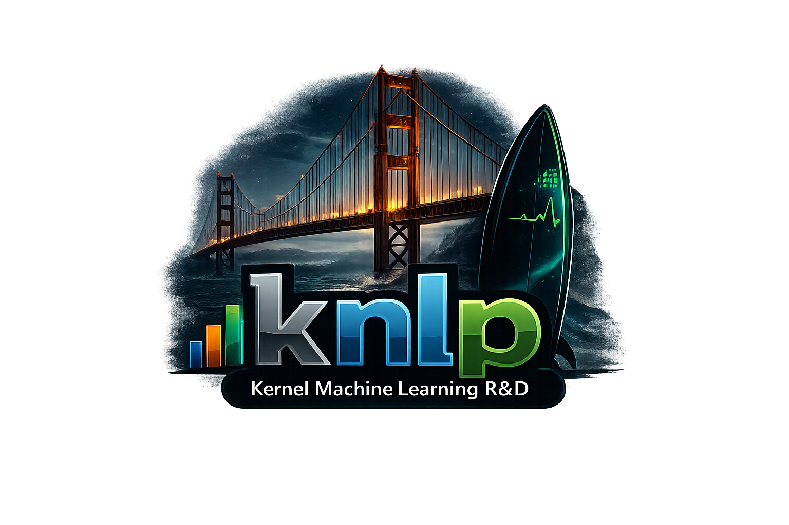

# knlp: Kernel-Style Machine Learning

**Rapid prototyping and automation for open source ML R&D**

<p align="center">
  
</p>

Applying Linux kernel development methodologies to machine learning research for rapid iteration and reproducible experimentation. Kconfig-driven configuration, defconfig presets, Makefile automation, and rigorous test matrices enable fast prototyping of transformer architectures, pruning algorithms, and optimization techniques while maintaining reproducibility and collaboration at scale.

<p align="center">
  <a href="https://mcgrof.github.io/knlp/index.html">
    <strong>Browse Interactive Demos</strong>
  </a>
</p>

### Research Highlights

| Area | Result | Docs | Demo |
|------|--------|------|------|
| **Unified Signal** | [FIM diagonal ≈ Adam exp_avg_sq](https://arxiv.org/abs/2507.18807) — unifies compression, pruning, and tiering | [docs](docs/hierarchical-tiering.md) | [demo](https://mcgrof.github.io/knlp/fisher_adam_visualization.html) |
| **FIM-Guided Quantization** | Diagonal Fisher identifies critical tensors. **1.26% better PPL** at **1.8% size increase** | [docs](docs/mobile-weight-packing.md) | [demo](https://mcgrof.github.io/knlp/fim_quantization_visualization.html) |
| **KVSplice** | **~20% extra compression on top of MLA** (7.2x vs 6x), **25% better PPL**, **+7 HellaSwag** | [docs](docs/kvsplice/README.md) | [demo](https://mcgrof.github.io/knlp/kvsplice_visualization.html) |
| **Reciprocal Attention** | Learned Q@K.T ↔ K@Q.T alternation. **5% better PPL**, **+2 HellaSwag** | [docs](docs/ra.md) | [demo](https://mcgrof.github.io/knlp/ra_visualization.html) |
| **Adam State-Based Pruning** | bitter7 achieves **15.6% better PPL** than magnitude baseline (37.28 vs 44.15) | [docs](docs/adamwprune_variants.md) | [demo](https://mcgrof.github.io/knlp/tiering_visualization.html) |
| **Page-Aware GNN Training** | **4× better I/O locality** (6.8× vs 28.5× RA) with **zero quality loss** on DGraphFin | [docs](gnn/docs/gnn-fraud.md) | [demo](https://mcgrof.github.io/knlp/gnn_fraud_visualization.html) |
| **KV Bandwidth Scaling** | Decode governed by memory bandwidth across 3 GPU architectures (7.6× BW range). **384K context** on B200 | [docs](docs/bpa.md) | [demo](https://mcgrof.github.io/knlp/kv_bandwidth_visualization.html) |

## Research Tracks

### Bandwidth-Proportional Attention (BPA)

knlp explores bandwidth-aware transformer inference systems including
KV cache scaling, compression, and selective memory access. Measurements
across AMD RDNA 3, NVIDIA Hopper, and NVIDIA Blackwell confirm that
autoregressive decode performance is governed by memory bandwidth, not
compute capacity or model architecture. BPA investigates architectures
where KV memory access per token scales with available bandwidth rather
than full context length.

See [docs/bpa.md](docs/bpa.md) for the current high-level BPA story,
[docs/paper/bpa/evolution.md](docs/paper/bpa/evolution.md) for how RGSA evolved
into BPA and then into fused KV quantization, and the
[KV Bandwidth visualization](https://mcgrof.github.io/knlp/kv_bandwidth_visualization.html)
for the current generic public explanation that decode is the issue.
A complementary structural explainer is available at
[AR Decode Bottleneck](https://mcgrof.github.io/knlp/ar_decode_bottleneck.html).
A first public writeup of the concrete fused-kernel result is available at
[docs/fused_kv_quantization.md](docs/fused_kv_quantization.md).

Paper-facing experiment scaffolding for the BPA KV scaling work lives in
[`docs/paper/bpa/`](docs/paper/bpa/) and
[`scripts/paper/bpa_paper/`](scripts/paper/bpa_paper/). These docs/scripts
define smoke tests, matrix plans, manifest validation, fit-output contracts,
and clean export packaging for the future `knlp-paper-kv-scaling` results tree.

## Development Philosophy

knlp applies **Linux kernel development practices** to machine learning research:

- **Kconfig-based configuration**: Hierarchical menus for experiment management (like `make menuconfig`)
- **Defconfig presets**: Reproducible configurations for different hardware and research goals
- **Makefile-driven builds**: Consistent build and test workflows across models
- **Documented decisions**: Every architectural choice explained in `docs/`
- **Rigorous validation**: Automated test matrices before merging experiments

See [docs/architecture.md](docs/architecture.md) for details on the kernel-inspired infrastructure.

## Installation

For systems using `torch.compile()`, Python development headers are required:

```bash
# Ubuntu/Debian
sudo apt-get install python3-dev

# RHEL/CentOS/Fedora
sudo yum install python3-devel
```

```bash
pip install -r requirements.txt
wandb login # optional
```

```bash
make defconfig-gpt2-vanilla-baseline
make
```

See [docs/quickstart.md](docs/quickstart.md) for detailed workflow.

## Contributing

knlp welcomes contributions.

## Citation

If you use this work, please cite:

```bibtex
@misc{knlp2025,
  title        = {knlp: Kernel-Style Machine Learning - Transformer Architecture Research},
  author       = {Luis Chamberlain and contributors},
  year         = {2025},
  howpublished = {\url{https://github.com/mcgrof/knlp}},
  note         = {Collaborative ML research using Linux kernel development workflows}
}
```

## License

This project is licensed under the **MIT License**.

- **Code**: MIT license
- **Models**: AI models generated by this project can be licensed as you choose
- **Documentation**: CC-BY-SA 4.0 (collaborative, share-alike)

See LICENSE for details.
# KNLP

## BPA paper scaffolding

Paper-oriented KV scaling scaffolding now lives under
`scripts/paper/bpa_paper/` with supporting docs in `docs/paper/bpa/`.

The scaffold provides:

- a canonical `results/knlp-paper-kv-scaling/` tree with `raw/`, `derived/`,
  `figures/`, `manifests/`, `logs/`, `system/`, and `reports/`
- device configs for `a100`, `h100`, `b200`, and `w7900`
- dry-run capable scripts for smoke validation, matrix planning, fit planning,
  and public-subset packaging
- lightweight manifest/config validation coverage in
  `tests/test_bpa_paper_manifest.py`

Example dry-run commands:

```bash
python -m scripts.paper.bpa_paper.run_smoke --dry-run
python -m scripts.paper.bpa_paper.run_matrix --dry-run --devices a100 h100
python -m scripts.paper.bpa_paper.fit_scaling --dry-run
python -m scripts.paper.bpa_paper.package_results --dry-run
```
