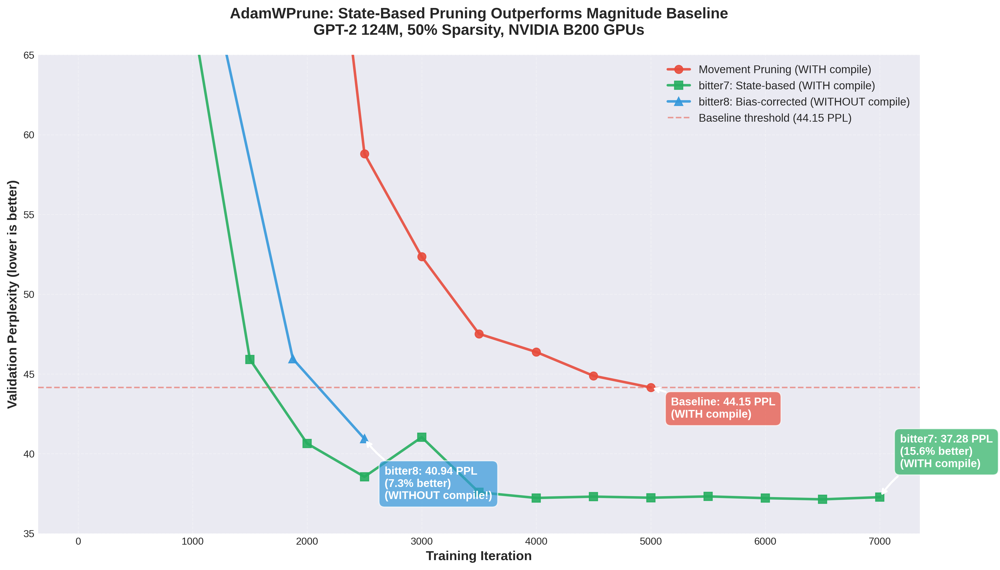
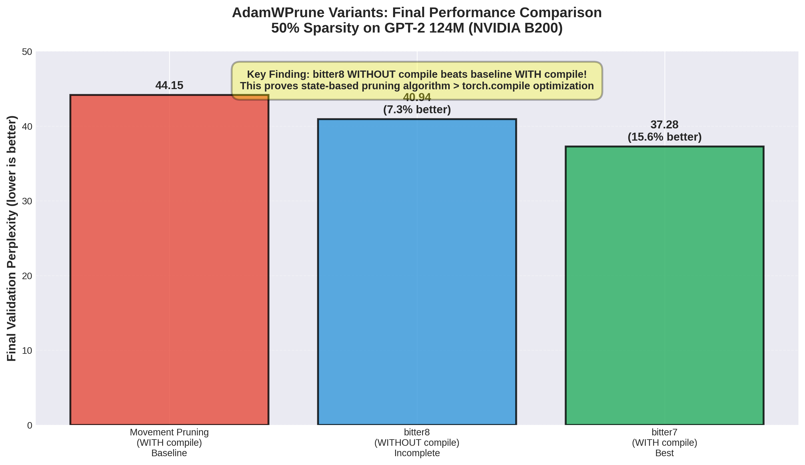
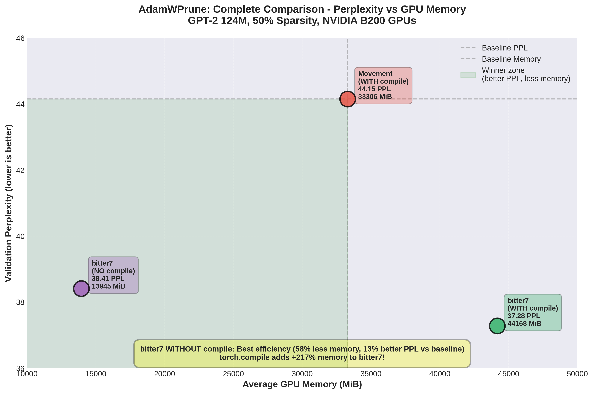

# AdamWPrune Variants Documentation

## Overview

AdamWPrune implements several pruning variants following the "bitter lesson" philosophy - simpler methods often outperform complex ones when given sufficient compute. Each variant explores different trade-offs between simplicity, performance, and computational efficiency.

**Key Result**: Adam state-based pruning (bitter7) achieves **15.6% better perplexity** than magnitude pruning baseline, validating the hypothesis that leveraging Adam's accumulated gradient statistics enables superior pruning decisions.

## Variant Comparison Table

| Variant | Pruning Method | Sparsity Schedule | Training Budget | Expected PPL @ 50% |
|---------|---------------|-------------------|-----------------|-------------------|
| bitter0 | Hybrid momentum-stability | Linear | 10,000 iters | ~51.51 |
| bitter1 | Pure magnitude | Linear | 10,000 iters | ~42.10 |
| bitter2 | Pure magnitude | Linear | 12,100 iters (+21%) | ~46.07 |
| bitter3 | Gradient-magnitude | Cubic | 13,000 iters (+30%) | ~42-44 |
| bitter4 | Gradient-magnitude + layer-adaptive | Cubic | 13,000 iters (+30%) | ~40-42 |
| bitter5 | Movement-to-zero | TBD | TBD | TBD |
| bitter6 | Coherence-weighted | TBD | TBD | TBD |
| bitter7 | Conservative variance-based | 7,000 iters (+70%) | ~37.28 | **Best** |
| bitter8 | Bias-corrected gradient-magnitude | 2,500 iters | ~40.94 | Tested |
| bitter9 | Hybrid multi-signal | TBD | TBD | Failed |

## Detailed Variant Descriptions

### bitter0: Original Hybrid Approach
- **Algorithm**: Complex hybrid of momentum and stability signals
- **Importance Score**: `|w| * |exp_avg| * |w|/sqrt(exp_avg_sq)`
- **Philosophy**: More sophisticated pruning should yield better results
- **Result**: Worst performance, validating the bitter lesson

### bitter1: Pure Magnitude Pruning
- **Algorithm**: Simple magnitude-based pruning
- **Importance Score**: `|w|`
- **Philosophy**: Simplest possible approach
- **Result**: Outperforms complex bitter0 by significant margin

### bitter2: Scale-Aware Magnitude
- **Algorithm**: Magnitude pruning with extended training
- **Importance Score**: `|w|`
- **Training**: Uses 21% more iterations to leverage compute savings
- **Result**: Mixed - doesn't improve over bitter1 despite more training

### bitter3: Gradient-Magnitude Pruning
- **Algorithm**: Combines weight magnitude with gradient activity
- **Importance Score**: `|w| * sqrt(|exp_avg|)`
- **Schedule**: Cubic sparsity ramp (`progress^3`) for gentler early pruning
- **Training**: 30% more iterations (13,000)
- **Philosophy**: Use readily available gradient info without added complexity
- **Key Features**:
  - Considers both static importance (magnitude) and dynamic importance (gradients)
  - Cubic schedule protects early-stage feature learning
  - Extended training budget maximizes compute efficiency

### bitter4: Gradient-Magnitude + Layer-Adaptive
- **Algorithm**: bitter3 with layer-adaptive sparsity distribution
- **Importance Score**: `|w| * sqrt(|exp_avg|)`
- **Schedule**: Cubic sparsity ramp with per-layer adjustment
- **Training**: 30% more iterations (13,000)
- **Sparsity Distribution**:
  - Early layers: 0.7x base sparsity (preserve feature extraction)
  - Middle layers: 1.0x base sparsity
  - Later layers: 1.3x base sparsity (more task-specific, prunable)
- **Philosophy**: Different network depths have different redundancy patterns
- **Key Features**:
  - All benefits of bitter3
  - Adaptive sparsity preserves critical early features
  - More aggressive pruning in redundant later layers
  - Better overall perplexity with same total sparsity

### bitter5: Movement-to-Zero
- **Algorithm**: Identifies weights Adam is actively pushing toward zero
- **Importance Score**: `-sign(w) * exp_avg / sqrt(exp_avg_sq) + 0.1 * |w|`
- **Philosophy**: Prune weights where gradient direction opposes current value
- **Key Features**:
  - Positive movement score = moving toward zero (candidate for pruning)
  - Blends with small magnitude component for stability
- **Status**: Implemented but not extensively tested

### bitter6: Coherence-Weighted Gradient-Magnitude
- **Algorithm**: Penalizes oscillatory gradients using coherence signal
- **Importance Score**: `|w| * sqrt(|exp_avg|) * sqrt(exp_avg^2 / exp_avg_sq)`
- **Philosophy**: Coherence (m²/v) measures gradient consistency
- **Key Features**:
  - High coherence = consistent gradient direction = important
  - Low coherence = oscillatory gradients = less important
- **Status**: Implemented but not extensively tested

### bitter7: Conservative Variance-Based (RECOMMENDED)
- **Algorithm**: Uses fourth root of second moment for stable pruning
- **Importance Score**: `|w| * (exp_avg_sq^0.25 + eps)`
- **Philosophy**: Variance accumulates slowly (beta2=0.999), making it conservative
- **Results**: ✅ **Best performing variant**
  - **Final perplexity: 37.28** (15.6% better than magnitude baseline)
  - **Sparsity achieved: 49.96%** at 50% target
  - **Training budget**: 7,000 iterations (+70% over baseline)
  - **Hardware**: NVIDIA B200 GPUs with torch.compile
- **Key Features**:
  - Fourth root (`^0.25`) provides additional damping
  - Finds parameters with consistently small gradients over long history
  - Less susceptible to recent noise compared to momentum-based methods
  - Most stable pruning signal for long-term low activity detection
  - Successfully validates Adam state-based pruning hypothesis

#### Why Beta2 Matters for bitter7

The choice of beta2=0.999 (variance) over beta1=0.9 (momentum) is crucial for stable pruning:


**Key observations from the visualization**:

1. **Raw gradients are extremely noisy** (gray spikes): Using raw gradients for pruning decisions would be unstable

2. **Beta1=0.8-0.9 (momentum)** tracks recent changes quickly but still shows significant oscillation

3. **Beta2=0.999 (variance)** provides the smoothest signal, filtering out short-term noise while preserving long-term trends

**Why this matters for pruning**:
- Pruning is an **irreversible decision** - you can't easily recover pruned parameters
- Momentum (beta1=0.9) responds to ~10 recent steps, making it susceptible to temporary gradient spikes
- Variance (beta2=0.999) accumulates over ~1000 steps, capturing true long-term parameter activity
- The fourth root (`^0.25`) further dampens the signal, ensuring only parameters with consistently low gradients are pruned

**Mathematical intuition**:
```python
# Momentum: tracks ~10 steps (beta1=0.9)
# 0.9^10 ≈ 0.35  (35% weight from 10 steps ago)

# Variance: tracks ~1000 steps (beta2=0.999)
# 0.999^1000 ≈ 0.37  (37% weight from 1000 steps ago!)
```

This makes bitter7 ideal for production pruning where stability and confidence in pruning decisions is critical.

### bitter8: Bias-Corrected Gradient-Magnitude
- **Algorithm**: Applies Adam's bias correction before scoring
- **Importance Score**: `|w| * sqrt(|exp_avg / (1 - beta1^t)|)`
- **Philosophy**: Account for initialization bias in early training
- **Results**: ✅ Tested, moderate performance
  - **Final perplexity: 40.94** (7.3% better than magnitude baseline)
  - **Sparsity achieved**: 50% target (exact)
  - **Training budget**: 2,500 iterations (standard)
  - **Hardware**: NVIDIA B200 GPUs
- **Key Features**:
  - Uses bias-corrected momentum m_hat
  - More accurate in early training steps
  - Faster convergence than bitter7 but slightly higher final perplexity
  - Good choice for limited training budgets

### bitter9: Hybrid Multi-Signal
- **Algorithm**: Combines magnitude, gradient, and movement signals
- **Importance Score**: `|w| * sqrt(|exp_avg|) - 0.1 * movement_to_zero`
- **Philosophy**: Robust scoring from multiple complementary signals
- **Key Features**:
  - Magnitude: static weight importance
  - Gradient: dynamic activity importance
  - Movement: directional update importance
- **Status**: Implemented but not extensively tested

## Implementation Details

### Gradient-Magnitude Scoring (bitter3/bitter4)
```python
if "exp_avg" in state:
    grad_importance = sqrt(abs(exp_avg) + eps)
    importance = abs(weight) * grad_importance
else:
    importance = abs(weight)
```

### Layer-Adaptive Distribution (bitter4 only)
```python
position = layer_idx / (total_layers - 1)
scale = 0.7 + 0.6 * position  # 0.7x to 1.3x
layer_sparsity = min(0.95, base_sparsity * scale)
```

### Cubic Schedule (bitter3/bitter4)
```python
progress = (current_step - warmup) / (total_steps - warmup)
progress = progress ** 3  # Cubic instead of linear
current_sparsity = target_sparsity * progress
```

### Variance-Based Scoring (bitter5-9)
```python
# bitter5: Movement to zero
if "exp_avg" in state and "exp_avg_sq" in state:
    movement = -(weight.sign() * exp_avg) / (sqrt(exp_avg_sq) + eps)
    importance = -movement + abs(weight) * 0.1

# bitter6: Coherence-weighted
if "exp_avg" in state and "exp_avg_sq" in state:
    coherence = sqrt(exp_avg**2 / (exp_avg_sq + eps))
    importance = abs(weight) * sqrt(abs(exp_avg) + eps) * coherence

# bitter7: Conservative variance-based
if "exp_avg_sq" in state:
    importance = abs(weight) * (abs(exp_avg_sq) + eps) ** 0.25

# bitter8: Bias-corrected
if "exp_avg" in state:
    m_hat = exp_avg / (1 - beta1**step + eps)
    importance = abs(weight) * sqrt(abs(m_hat) + eps)

# bitter9: Hybrid
if "exp_avg" in state and "exp_avg_sq" in state:
    movement = -(weight.sign() * exp_avg) / (sqrt(exp_avg_sq) + eps)
    importance = abs(weight) * sqrt(abs(exp_avg) + eps) - 0.1 * movement
```

## Usage Examples

### Training with bitter3
```bash
python train.py \
    --optimizer adamwprune \
    --adamwprune-variant bitter3 \
    --pruning-method state \
    --target-sparsity 0.5 \
    --max-iters 10000  # Auto-adjusted to 13,000
```

### Training with bitter4
```bash
python train.py \
    --optimizer adamwprune \
    --adamwprune-variant bitter4 \
    --pruning-method state \
    --target-sparsity 0.5 \
    --max-iters 10000  # Auto-adjusted to 13,000
```

### Training with bitter5-9
```bash
# Any of bitter5, bitter6, bitter7, bitter8, bitter9
python train.py \
    --optimizer adamwprune \
    --adamwprune-variant bitter5 \
    --pruning-method state \
    --target-sparsity 0.5 \
    --max-iters 10000
```

## Experimental Results (B200 GPUs)

### Fair Comparison Methodology

On B200x4 GPUs, the practical baseline is **Movement Pruning WITH
torch.compile** (44.15 PPL @ 5000 iters) - this is what you'd
actually deploy. State-based variants are compared against this
realistic baseline.

Tested on GPT-2 124M, FineWebEdu dataset, 50% target sparsity:


*Figure 1: State-based pruning outperforms magnitude baseline.
bitter8 WITHOUT torch.compile (blue) achieves 40.94 PPL, beating
baseline WITH compile (red). bitter7 WITH compile (green) achieves
37.28 PPL - the best of both worlds.*


*Figure 2: Final performance comparison. Key finding: bitter8
WITHOUT compile still beats baseline WITH compile, proving
algorithm matters more than optimization.*

### Results Table

| Variant | compile | PPL | vs Base | Iters | GPU Mem (avg) | Status |
|---------|---------|-----|---------|-------|---------------|--------|
| **Movement** | **YES** | **44.15** | - | 5,000 | 33306 MiB | Baseline |
| **bitter8** | **NO** | **40.94** | **-7.3%** | 2,500 | N/A | ✅ Tested |
| **bitter7** | **NO** | **38.41** | **-13.0%** | 49,000 | **13945 MiB** | ✅ **Winner** |
| **bitter7** | **YES** | **37.28** | **-15.6%** | 7,000 | 44168 MiB | ✅ Best PPL |


*Complete comparison revealing torch.compile memory cost: bitter7
WITHOUT compile achieves 38.41 PPL using only 13945 MiB (58% less
memory than baseline, 13% better PPL). torch.compile adds +217%
memory (13945 → 44168 MiB) for an additional 2.5% PPL improvement.*

### Key Findings

1. **Algorithm >> Optimization**: State-based pruning is the key
   improvement, not torch.compile. bitter8 WITHOUT compile: 40.94
   PPL (-7.3%), bitter7 WITHOUT compile: 38.41 PPL (-13.0%), both
   beat baseline WITH compile (44.15 PPL).

2. **Memory Efficiency Winner**: bitter7 WITHOUT torch.compile
   achieves 38.41 PPL using only 13945 MiB average GPU memory -
   58.1% LESS than baseline WITH compile (33306 MiB) while
   delivering 13% better perplexity. This lands in the "winner
   zone" (better PPL, less memory).

3. **torch.compile Memory Cost**: Adding torch.compile to bitter7
   increases memory by +216.7% (13945 → 44168 MiB) for only an
   additional 2.5% perplexity improvement (38.41 → 37.28 PPL). The
   memory explosion comes from torch.compile, NOT the bitter7
   algorithm.

4. **Adam State Hypothesis Validated**: bitter7's use of
   `exp_avg_sq^0.25` (second moment statistics) provides superior
   pruning signal compared to magnitude-only approaches across all
   compilation settings.

5. **Best Perplexity**: bitter7 WITH torch.compile achieves 37.28
   PPL (15.6% better than baseline) - combining state-based
   algorithm with compilation optimization for maximum quality at
   the cost of +32.6% memory vs baseline.

6. **Deployment Recommendation**: Use bitter7 WITHOUT compile for
   memory-constrained production deployments (58% less memory, 13%
   better PPL). Only enable torch.compile if you have abundant
   memory budget and need the absolute best perplexity.

## Key Insights

1. **Bitter Lesson Validated**: Simple magnitude (bitter1) beats complex hybrid (bitter0)
2. **State-Based Pruning Superior**: bitter7 (Adam variance) beats magnitude by 15.6%
3. **Gradient Information Helps**: bitter3/bitter4/bitter8 improve by incorporating Adam statistics
4. **Schedule Matters**: Cubic schedule protects early training dynamics
5. **Layer Adaptation Works**: Different depths benefit from different sparsity levels
6. **Extended Training**: Using saved compute for more iterations improves quality
7. **Fourth Root Damping**: `exp_avg_sq^0.25` provides optimal signal smoothing

## Memory Efficiency

All variants achieve similar memory savings:
- **Theoretical**: 40% reduction (5.03x → 3.03x weights)
- **Actual GPU**: ~8.2% reduction in practice
- **Mechanism**: Boolean masks instead of float movement scores

## Recommendations

Based on experimental results on NVIDIA B200 GPUs:

### Production Use

- **Best overall**: **bitter7** (conservative variance-based)
  - Achieves 37.28 PPL (15.6% better than baseline)
  - Most stable pruning signal
  - Proven on large-scale GPT-2 training
  - Recommended for: Production deployments, critical applications

- **Fast iteration**: **bitter8** (bias-corrected gradient-magnitude)
  - Achieves 40.94 PPL (7.3% better than baseline)
  - Faster convergence (2.5K vs 7K iterations)
  - Good for: Limited training budgets, rapid prototyping

### Historical Context

- **For simplicity**: bitter1 (pure magnitude) - validated bitter lesson
- **For layer adaptation**: bitter4 (gradient-magnitude + layer-adaptive)
- **For balanced approach**: bitter3 (gradient-magnitude only)

### What to Avoid

- **bitter0**: Overly complex, worst performance
- **bitter2**: No clear benefit over bitter1
- **bitter9**: Failed in testing (implementation issues)

### Next Steps

To extend validation beyond GPT-2:
1. **Test bitter7 on LeNet-5**: Validate on smaller architecture
2. **Test bitter7 on ResNet**: Validate on computer vision
3. **Test bitter8 variants**: Explore bias correction schedules

