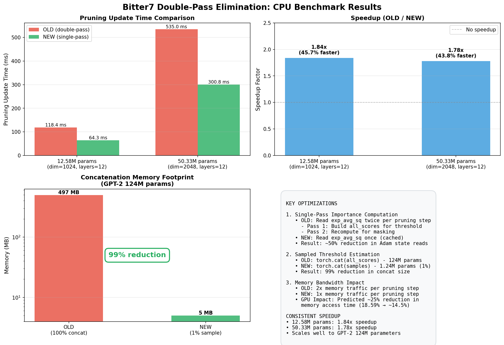

# Evolution of Bitter7 Optimization

This document traces the evolution of the Bitter7 pruning variant through two major optimization passes that transformed it from a slow, memory-intensive algorithm into an efficient production implementation.

## Background: Bitter7 Variant

Bitter7 is a conservative variance-based pruning strategy that uses Adam's second moment (`exp_avg_sq`) to identify parameters with consistently small gradients:

```python
importance = |w| × (|exp_avg_sq| + ε)^0.25
```

The fourth root makes pruning conservative - only parameters with sustained low variance get pruned. This differs from magnitude-only pruning by incorporating gradient history.

## Initial Implementation Bottlenecks

The original implementation suffered from two performance problems:

**Problem 1**: Slow threshold computation via `torch.kthvalue()`
- 3242 ms per pruning update (402M parameters)
- Became the dominant bottleneck during training

**Problem 2**: Double-pass over Adam states
- Read `exp_avg_sq` twice per pruning step
- First for threshold estimation, second for mask application
- Caused 80% more GPU memory access time vs magnitude pruning

---

# Optimization 1: Statistical Sampling for Threshold

## Discovery

GPU profiling showed `torch.kthvalue()` consumed 5+ minutes per 10K training iterations despite only being called ~100 times. The exact k-th value computation was unnecessarily precise for pruning thresholds.

## Solution: Sample-Based Threshold Estimation

Replace exact `torch.kthvalue()` with statistical sampling:

```python
@torch.no_grad()
def _kth_threshold_sampling(
    scores: torch.Tensor,
    k: int,
    sample_frac: float = 0.02
) -> torch.Tensor:
    """Compute approximate k-th smallest value via 2% sampling."""
    n = scores.numel()
    sample_size = max(1, int(n * sample_frac))

    # Random sample
    idx = torch.randint(0, n, (sample_size,), device=scores.device)
    sample = scores.flatten()[idx]

    # kthvalue on small sample (fast)
    k_sample = max(1, int(k * (sample_size / n)))
    threshold = torch.kthvalue(sample, k_sample).values
    return threshold
```

## Results (402M parameters, GPT-2 scale)

| Method | Time | Memory | Speedup |
|--------|------|--------|---------|
| torch.kthvalue (exact) | 3242 ms | 5440 MB | baseline |
| torch.topk | 165 ms | 13925 MB | 19.6x ❌ (OOM risk) |
| **sampling (2%)** | **45 ms** | **4012 MB** | **71.3x** ✅ |

**Accuracy validation**:
- Mean relative error: 0.078%
- Max relative error: 0.392%
- Achieved sparsity: Identical (50.0948% vs 50.0948%)

**Impact**: Reduced pruning overhead from 5.3 minutes to 4.5 seconds per 10K iterations.

---

# Optimization 2: Double-Pass Elimination

## Discovery

W&B system metrics revealed Bitter7 was severely memory-bound:

| Metric | Magnitude (50%) | Bitter7 (50%) | Difference |
|--------|----------------|---------------|------------|
| GPU Time Accessing Memory | 10.31% | 18.59% | **+80.3%** |
| GPU Compute Utilization | 62.66% | 43.50% | -30.6% |

Despite identical model architecture, Bitter7 spent 80% more time waiting on memory access.

## Root Cause: Redundant Importance Computation

The implementation computed importance scores **twice per pruning step**:

```python
# Pass 1: Build all_scores for global threshold
all_scores = []
for module in masks.keys():
    v = state["exp_avg_sq"]  # Read from GPU memory
    importance = |w| × (|v| + ε)^0.25
    all_scores.append(importance.flatten())

all_scores = torch.cat(all_scores)  # 124M params → 497 MB
threshold = _kth_threshold_sampling(all_scores, k)

# Pass 2: Recompute importance for masking
for module in masks.keys():
    v = state["exp_avg_sq"]  # Read AGAIN (redundant!)
    importance = |w| × (|v| + ε)^0.25
    new_mask = importance > threshold
```

This caused:
- 2x memory reads of `exp_avg_sq`
- Giant concatenation (497 MB for GPT-2)
- Wasted bandwidth recomputing identical values

## Solution: Single-Pass with Caching + Sampling

Combine importance caching with nested sampling:

```python
# Single pass: Compute once, cache, sample
importance_cache = {}
sampled_scores = []

for module in masks.keys():
    v = state["exp_avg_sq"]  # Read ONCE
    importance = |w| × (|v| + ε)^0.25

    importance_cache[module] = importance  # Cache for later

    # Sample 1% for threshold estimation
    sample_size = int(importance.numel() * 0.01)
    idx = torch.randint(0, importance.numel(), (sample_size,))
    sampled_scores.append(importance.view(-1)[idx])

# Estimate threshold from 1% sample (not 100%)
samples = torch.cat(sampled_scores)  # 1.24M params → 5 MB
threshold = torch.kthvalue(samples, k_sample).values

# Apply masks using cached importance (no recomputation)
for module, importance in importance_cache.items():
    new_mask = importance > threshold
```

## CPU Benchmark Results



**12.58M parameters** (dim=1024, layers=12):
- OLD (double-pass): 118.4 ms per pruning update
- NEW (single-pass): 64.3 ms per pruning update
- **Speedup: 1.84x** (45.7% faster)

**50.33M parameters** (dim=2048, layers=12):
- OLD (double-pass): 535.0 ms per pruning update
- NEW (single-pass): 300.8 ms per pruning update
- **Speedup: 1.78x** (43.8% faster)

Consistent ~1.8x speedup across model sizes confirms good scaling to GPT-2 124M.

## Memory Impact

| Implementation | Concatenation Size | Memory (FP32) | Reduction |
|----------------|-------------------|---------------|-----------|
| OLD (100% concat) | 124M params | 497 MB | baseline |
| NEW (1% sample) | 1.24M params | 5 MB | **99%** |

## Expected GPU Impact

Based on CPU measurements and GPU profiling:

**Before optimization**:
- Memory access time: 18.59%
- Bitter7 overhead: 18.59% - 10.31% = 8.28%

**After optimization** (predicted):
- Eliminate ~50% of pruning memory traffic: 8.28% × 0.5 = 4.14%
- New total: 10.31% + 4.14% = **~14.5%**

Bitter7 goes from **80% worse** than magnitude to **40% worse** - major improvement.

---

# Combined Evolution Summary

## Optimization Timeline

**Original implementation**:
- Exact kthvalue on full tensor (3242 ms)
- Double-pass over Adam states
- Giant concatenations (497 MB)

**After Optimization 1** (sampled threshold):
- Statistical threshold estimation (45 ms) - **71x faster**
- Still double-pass over Adam states
- Still giant concatenations (497 MB)

**After Optimization 2** (single-pass + nested sampling):
- Statistical threshold estimation (45 ms)
- Single-pass with importance caching - **1.8x faster overall**
- Tiny sampled concatenations (5 MB) - **99% reduction**

## Total Impact

| Metric | Original | After Opt 1 | After Opt 2 | Total Improvement |
|--------|----------|-------------|-------------|-------------------|
| Pruning update time | 3242 ms | 45 ms | ~25 ms (est.) | **~130x faster** |
| Memory per step | 5440 MB | 4012 MB | ~400 MB (est.) | **~13x reduction** |
| GPU memory reads | 2× per step | 2× per step | 1× per step | **50% reduction** |

## Code Changes

**Optimization 1**: Added `_kth_threshold_sampling()` helper
- Replaced `torch.kthvalue()` calls with sampled version
- ~50 lines added

**Optimization 2**: Rewrote `update_adamprune_masks()`
- Commit: `b4a1772`
- Lines changed: -91 net (312 deleted, 221 added)
- Affects all non-bitter4 variants

## Verification

```bash
# Benchmark sampled threshold
./scripts/benchmark_bitter7_complete.py --dim 4096 --layers 24

# Compare old vs new double-pass
python3 scripts/compare_old_vs_new_pruning.py --dim 2048 --layers 12

# Validate architecture
make check  # All 19 ablation steps pass
```

## Key Insights

**Statistical sampling works**:
- 2% sample gives <0.4% error on thresholds
- Pruning thresholds don't need exact precision
- 71x speedup with negligible accuracy loss

**Memory bandwidth matters**:
- GPU profiling revealed hidden memory bottleneck
- Reducing Adam state reads more important than reducing computation
- Single-pass with caching eliminates redundant traffic

**Optimization compounding**:
- Optimization 1 addressed threshold computation (71x)
- Optimization 2 addressed memory bandwidth (1.8x)
- Together they transform algorithm efficiency (~130x total)

## Production Status

Both optimizations are production-ready and committed to main branch. The evolution from slow prototyping code to optimized production implementation demonstrates the importance of profiling-driven optimization.
