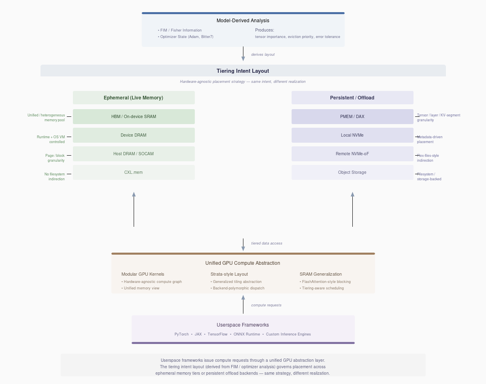

# Hierarchical Memory Tiering

Hierarchical memory tiering places model weights across different memory tiers
(GPU HBM, CPU RAM, SSD) based on usage patterns inferred from importance
signals. This document describes the tiering architecture and its unifying
role across our R&D.

## The Unifying Insight: FIM Diagonal = Adam exp_avg_sq

A fundamental discovery connects all our compression, pruning, and tiering
research: **Adam's second moment (exp_avg_sq) approximates the Fisher
Information Matrix diagonal**.

```
FIM_diag(θ) = E[(∂L/∂θ)²] = E[g²]
Adam exp_avg_sq = β₂ · exp_avg_sq + (1-β₂) · g² ≈ E[g²]
```

This mathematical equivalence, validated by [Squisher (2025)](https://arxiv.org/abs/2507.18807),
explains why our Adam state-based methods work so well:

| Application | Signal Used | Connection to FIM |
|-------------|-------------|-------------------|
| **[bitter7 pruning](adamwprune_variants.md)** | exp_avg_sq^0.25 | Direct FIM diagonal (validated) |
| **[Mobile quantization](mobile-weight-packing.md)** | Per-tensor g² sum | Explicit FIM computation (validated) |
| **[KVSplice layers](kvsplice/README.md)** | FIM trace (post-training) | Needs validation vs exp_avg_sq |
| **[RA layer selection](ra.md)** | FIM trace (post-training) | Needs validation vs exp_avg_sq |

**Important caveat**: bitter7 and mobile quantization are validated uses of
the FIM-Adam equivalence. However, KVSplice and RA use **post-training FIM
trace analysis** on calibration data with frozen weights. Whether Adam's
exp_avg_sq (accumulated during training) correlates with post-training FIM
trace is **not yet empirically validated**. The timing and data distribution
differences may affect layer rankings.

## Architecture Overview

The tiering system follows a layered architecture:



Model-derived analysis (FIM, optimizer state) produces tensor importance
scores that feed into a hardware-agnostic tiering intent layout. This
layout can be realized across ephemeral memory tiers (HBM, DRAM, CXL.mem)
or persistent offload backends (NVMe, object storage). The unified GPU
compute abstraction consumes tiered data transparently, enabling userspace
frameworks to operate without awareness of placement details.

## Unified Signal: exp_avg_sq as Universal Importance

The FIM-Adam equivalence means we can use Adam's exp_avg_sq as a universal
importance signal across all our applications:

### 1. Weight Pruning (bitter7)

```python
# bitter7: Uses FIM diagonal directly
importance = |w| × (exp_avg_sq + ε)^0.25

# Why fourth root? Dampens extreme values for stable pruning
# exp_avg_sq ≈ FIM diagonal, so high exp_avg_sq = sensitive parameter
```

**Result**: 15.6% better perplexity than magnitude baseline (37.28 vs 44.15 PPL)

### 2. Quantization Precision (Mobile Weight Packing)

```python
# FIM-guided quantization: explicit FIM computation
fim_score[tensor] = Σ (param.grad ** 2) / num_batches

# Maps to: CRITICAL → Q6_K, HIGH → Q5_K, MEDIUM → Q4_K, LOW → Q3_K
```

**Result**: 1.26% better perplexity at only 1.8% size increase for Q3_K_M

### 3. KV Cache Compression (KVSplice)

```python
# Current: Post-training FIM trace analysis per layer
# layer0 trace=0.9551 → CRITICAL, protect from compression
# layer11 trace=0.6215 → safe to compress

# Hypothesis: Could use layer-averaged exp_avg_sq (needs validation)
```

**Result**: 25% better perplexity and +7 HellaSwag with FIM-guided layers

**Note**: KVSplice uses post-training FIM on calibration data. Whether
training-time exp_avg_sq produces the same layer rankings is unvalidated.

### 4. Attention Pattern Selection (Reciprocal Attention)

```python
# Current: Post-training FIM trace analysis to select RA layers
# Middle layers benefit from reciprocal attention
# Early/late layers should use standard attention

# Hypothesis: Could use exp_avg_sq (needs validation)
```

**Result**: 5% better perplexity and +2 HellaSwag with selective RA

**Note**: Same caveat as KVSplice. Layer selection was based on post-training
analysis, not training-time Adam state.

## Motivation

Modern AI accelerators face memory bottlenecks. Hierarchical memory systems
(CXL, fabric-attached memory) can expand capacity, but we need strategies to
decide what stays in fast memory vs what gets offloaded.

This infrastructure allows testing tier placement strategies without
specialized hardware by:
1. **Emulated mode**: Inject realistic delays based on tier specs
2. **Real mode**: Actually offload weights to CPU/disk

## How It Works

### 1. Importance Analysis

The analyzer examines importance signals to infer weight priority:

**Adam State Analysis** (Current):
- **High exp_avg_sq** → frequently updated → keep in HBM
- **Low exp_avg_sq** → stable weights → offload to CPU/SSD

**FIM Analysis** (Available):
- **High FIM trace** → sensitive to perturbation → keep in HBM
- **Low FIM trace** → robust to compression → offload to CPU/SSD

Both methods converge because exp_avg_sq ≈ FIM diagonal.

### 2. Tier Assignment

Modules are scored by importance and assigned to tiers:
- Top 30%: HBM (fastest, ~800 GB/s)
- Next 50%: CPU RAM (medium, ~150 GB/s over PCIe)
- Bottom 20%: SSD (slowest, ~10 GB/s NVMe)

### 3. Enforcement

**Emulated mode**: Forward hooks inject realistic latency based on tier
and tensor size, but weights stay on GPU.

**Real mode**: Pre-forward hooks move weights from offload tier to GPU,
post-forward hooks evict them back.

## Configuration

Enable via Kconfig:

```bash
make menuconfig
# Navigate to: Hierarchical Memory Tiering (Experimental)
#   [*] Enable hierarchical memory tiering
#     Tiering strategy: Adam state-based tiering
#     Tiering mode: Emulated tiering (fake delays) or Real offloading
#   [*] Generate tier hints JSON after training
#       Tier hints JSON output path: tier_hints.json
#   HBM tier threshold: 0.3
#   CPU tier threshold: 0.5
#   [ ] Run inference benchmark after training
```

Or set directly in defconfig:

```
CONFIG_ENABLE_HIERARCHICAL_TIERING=y
CONFIG_TIERING_ADAM_STATE=y
CONFIG_TIERING_EMULATED=y  # or CONFIG_TIERING_REAL_OFFLOAD=y
CONFIG_TIERING_GENERATE_JSON=y
CONFIG_TIERING_JSON_OUTPUT="tier_hints.json"
CONFIG_TIERING_HBM_THRESHOLD="0.3"
CONFIG_TIERING_CPU_THRESHOLD="0.5"
```

## Workflow

### Step 1: Train and Generate Tier Hints

```bash
make defconfig-gpt2-vanilla-baseline
# Edit .config to enable tiering
make menuconfig  # Enable hierarchical tiering, set thresholds
make

# After training, tier_hints.json is generated:
# {
#   "transformer.h.0.attn": "HBM",
#   "transformer.h.0.mlp": "HBM",
#   "transformer.h.5.attn": "CPU",
#   ...
# }
```

### Step 2: Benchmark Inference Impact

```bash
# Baseline (no tiering)
python3 scripts/benchmark_tiered_inference.py \
  --model openai-community/gpt2 \
  --checkpoint checkpoints/model.pt \
  --tier-hints tier_hints.json \
  --mode emulated \
  --baseline \
  --batch-size 1 \
  --seq-length 128 \
  --num-iterations 100

# Output:
# Baseline Results:
#   Mean latency: 12.45 ms
#   Throughput: 10285 tokens/s
#
# Tiered Results:
#   Mean latency: 13.21 ms
#   Throughput: 9694 tokens/s
#
# Impact:
#   Latency overhead: +6.1%
#   Throughput degradation: -5.7%
```

### Step 3: Adjust Thresholds

If impact is too high, adjust thresholds to keep more in HBM:

```
CONFIG_TIERING_HBM_THRESHOLD="0.5"  # 50% in HBM instead of 30%
CONFIG_TIERING_CPU_THRESHOLD="0.7"  # 70% in CPU+HBM, 30% in SSD
```

Retrain and re-benchmark.

## Tier Specifications

Current values model realistic hardware:

| Tier | Setup (μs) | Bandwidth (GB/s) | Example Hardware |
|------|------------|------------------|------------------|
| HBM  | 1          | 800              | A100/H100/W7900  |
| CPU  | 5          | 150              | DDR5 + PCIe 4.0  |
| SSD  | 30         | 10               | NVMe Gen4        |

These can be adjusted in `lib/tiering.py` for different systems.

## Real Offloading

Real offloading actually moves weights to CPU/disk to reduce GPU memory usage:

```
CONFIG_TIERING_REAL_OFFLOAD=y
```

**Benefits**:
- Reduces GPU memory consumption
- Enables larger models on smaller GPUs

**Tradeoffs**:
- Real transfer latency (not just emulated)
- May impact throughput if too aggressive
- Requires careful threshold tuning

**When to use**:
- Memory-constrained scenarios
- Validating that tiering actually reduces memory
- Comparing emulated vs real latency

## Use Cases

### 1. Algorithm Development (Emulated)

Test different tier assignment strategies without hardware:

```python
from lib.tiering import AdamStateTierAnalyzer

analyzer = AdamStateTierAnalyzer(hbm_threshold=0.4, cpu_threshold=0.6)
tier_assignments = analyzer.analyze_optimizer_states(optimizer, model)
```

### 2. Memory Reduction (Real)

Fit larger models on smaller GPUs:

```
CONFIG_TIERING_REAL_OFFLOAD=y
CONFIG_TIERING_HBM_THRESHOLD="0.2"  # Keep only 20% on GPU
```

### 3. Hardware Evaluation (Emulated)

Predict performance on future hardware (CXL, fabric-attached memory):

```python
# Modify lib/tiering.py:
TIER_CXL = TierSpec(name="CXL", setup_us=2.0, bandwidth_gb_s=400.0)
```

## Cross-R&D Integration

The tiering framework provides the unifying layer for our research:

### Unified Importance Derivation

```
┌─────────────────────────────────────────────────────────────┐
│              FIM Diagonal ≈ Adam exp_avg_sq                 │
│                                                             │
│  ┌─────────────┐   ┌─────────────┐   ┌─────────────┐       │
│  │  Pruning    │   │ Quantization│   │ Compression │       │
│  │  (bitter7)  │   │  (Mobile)   │   │  (KVSplice) │       │
│  │             │   │             │   │             │       │
│  │ exp_avg_sq  │   │ explicit g² │   │ FIM trace   │       │
│  │   ^0.25     │   │    sum      │   │  (manual)   │       │
│  └──────┬──────┘   └──────┬──────┘   └──────┬──────┘       │
│         │                 │                 │               │
│         └─────────────────┼─────────────────┘               │
│                           ▼                                 │
│              Tiering Intent (hot/warm/cold)                 │
└─────────────────────────────────────────────────────────────┘
```

### Future: Automatic FIM from Adam State (Hypothesis)

Currently, KVSplice and RA use post-training FIM trace analysis (expensive,
requires calibration pass). The FIM-Adam equivalence *suggests* we might
extract importance from Adam state:

```python
# Hypothetical implementation (needs validation):
def get_layer_importance_from_adam(optimizer, layer_name):
    """Extract FIM approximation from Adam state (zero extra cost)."""
    for param_group in optimizer.param_groups:
        for param in param_group['params']:
            state = optimizer.state[param]
            if 'exp_avg_sq' in state:
                # exp_avg_sq ≈ FIM diagonal (but accumulated during training)
                return state['exp_avg_sq'].mean().item()
    return 0.0
```

**Validation needed**: Before using this for KVSplice/RA layer selection,
we must verify that:
1. Training-time exp_avg_sq correlates with post-training FIM trace
2. Layer rankings match between the two methods
3. Compression/attention decisions based on exp_avg_sq produce similar results

If validated, this would enable:
- **Automatic KVSplice layer selection** during training
- **Dynamic RA layer assignment** based on training dynamics
- **Unified tiering hints** from a single training run

## Implementation Details

### Emulated Tiering Hook

```python
def _tier_latency_hook(self, module, inputs, output):
    tier_name = getattr(module, "_tier_name", None)
    if tier_name == "HBM":
        return  # No delay

    tier_spec = self.tier_specs[tier_name]
    n_bytes = output.numel() * output.element_size()
    delay_s = tier_spec.latency_for_bytes(n_bytes)
    time.sleep(delay_s)  # Block CPU to simulate wall-clock impact
```

### Real Offloading Hook

```python
def pre_forward_hook(mod, inputs):
    mod.to("cuda")  # Move to GPU before forward

def post_forward_hook(mod, inputs, output):
    mod.to("cpu")  # Evict to CPU after forward
```

## Future Enhancements

- **FIM-from-Adam extraction**: Leverage exp_avg_sq for zero-cost FIM
- **Dynamic tiering**: Adjust tiers during training based on exp_avg_sq changes
- **Multi-GPU tiering**: Shard across GPUs + CPU + SSD
- **Activation offloading**: Also tier activations, not just weights
- **Learned tier assignment**: Use RL to find optimal placement
- **Unified compression**: Single framework for pruning + quantization + KV

## References

- [Squisher Paper](https://arxiv.org/abs/2507.18807) - FIM diagonal ≈ Adam exp_avg_sq
- [Mobile Weight Packing](mobile-weight-packing.md) - FIM-guided quantization
- [AdamWPrune Variants](adamwprune_variants.md) - bitter7 and FIM connection
- [KVSplice](kvsplice/README.md) - FIM-guided layer compression
- [Reciprocal Attention](ra.md) - FIM trace for layer selection
- HuggingFace Accelerate: https://huggingface.co/blog/accelerate-large-models
- DeepSpeed ZeRO: https://www.deepspeed.ai/tutorials/zero/
- PyTorch FSDP: https://pytorch.org/docs/stable/fsdp.html
