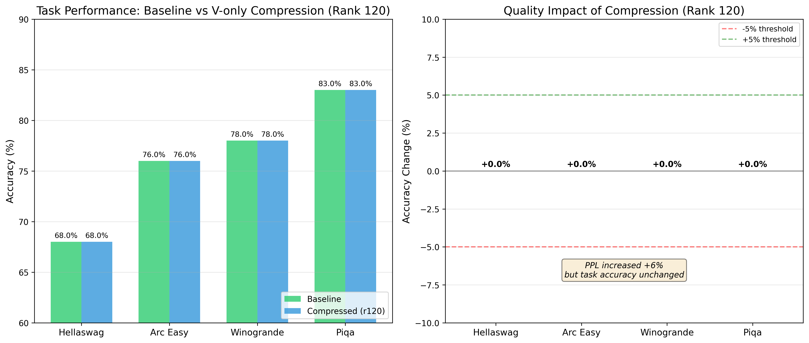
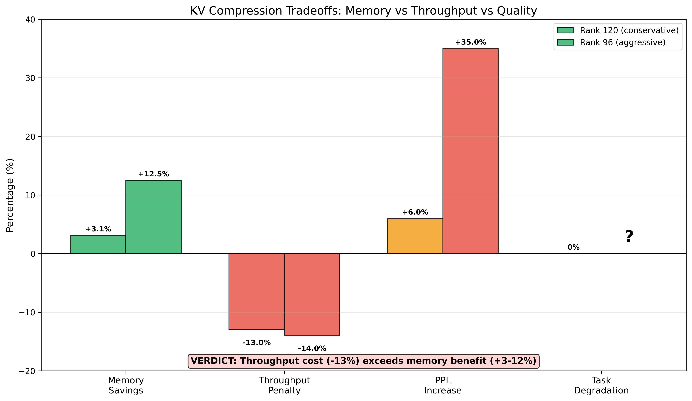

# KV Cache Compression Plugin

Low-rank projection for KV cache memory reduction.

## Verdict: Not Recommended for Most Use Cases

**The throughput cost exceeds the memory benefit.**

This plugin reduces KV cache memory via orthogonal projection. The compression
math is sound and memory savings are real. However, the compression/expansion
overhead makes inference slower, typically negating any practical benefit.

### Measured Results on B200 (Qwen2.5-7B)

| Rank | Memory Savings | Throughput Penalty | PPL Increase | Task Degradation |
|------|----------------|-------------------|--------------|------------------|
| 120 | 3.1% | **-13%** | +6% | 0% |
| 96 | 12.5% | **-14%** | +35% | Unknown |
| 64 | 25.0% | ~-15% | +647% | Catastrophic |

**The problem**: You save 3-12% memory but lose 13-14% throughput. For most
deployments, this is a net negative. Memory is cheap; latency matters.

---

## When This Might Be Useful

Use only if ALL of these apply:

1. **Memory-bound, not compute-bound**: You're hitting GPU memory limits
   before compute saturation
2. **Latency-insensitive**: You can tolerate 13-15% slower inference
3. **Batch size constrained**: You need to fit more concurrent requests
   and can't add more GPUs
4. **Quality-tolerant**: Your use case can handle 6-35% perplexity increase

Example use case: Batch inference with very long contexts where memory is
the bottleneck and latency doesn't matter.

---

## Key Findings

### Memory Savings Work as Expected

The compression ratios match theory. For head_dim=128:

| Rank | V Compression | Effective Savings |
|------|---------------|-------------------|
| 120 | 128/120 = 1.07x | 3.1% |
| 112 | 128/112 = 1.14x | 6.2% |
| 96 | 128/96 = 1.33x | 12.5% |
| 64 | 128/64 = 2.00x | 25.0% |

### Throughput Penalty is Fixed

The ~13-14% overhead comes from:
- Compression: `(x - mean) @ U` per layer per token
- Expansion: `z @ U.T + mean` per layer per token

This overhead is roughly constant regardless of compression rank.

### Task Performance vs Perplexity

Interesting finding: +6% PPL increase (rank 120) showed **0% degradation** on
downstream tasks (HellaSwag, ARC-Easy, WinoGrande, PIQA). The perplexity
increase doesn't directly translate to task performance loss at conservative
compression levels.

However, at +35% PPL (rank 96), task degradation is likely significant (not
fully tested).

### V-Only Compression is Essential

K compression causes catastrophic quality degradation due to extreme variance
concentration (132x spread in K vs 4x in V). Always use V-only compression.

### Calibration Provides Modest Improvement

PCA-calibrated projections outperform random orthogonal by ~8%:

| Method | Rank 112 PPL |
|--------|--------------|
| Random orthogonal | +15.2% |
| Calibrated PCA | +14.0% |

Calibration helps but isn't transformative.

---

## If You Still Want to Use This

### Conservative Configuration (Rank 120)

3.1% memory savings, 6% PPL increase, 0% task degradation, 13% slower:

```python
from gpt2.compression.compressed_cache import (
    CompressedDynamicCache,
    CalibratedCompressor,
    IdentityCompressor,
)

# Load calibration
calib = torch.load("key_results/kv_calib_qwen7b_r120.pt")

# V-only compression
k_compressors = [IdentityCompressor() for _ in range(num_layers)]
v_compressors = [
    CalibratedCompressor(layer["V"]["U"], layer["V"]["mean"])
    for layer in calib["layers"]
]

cache = CompressedDynamicCache(k_compressors, v_compressors, num_layers)
outputs = model.generate(input_ids, past_key_values=cache, max_new_tokens=100)
```

### Aggressive Configuration (Rank 96)

12.5% memory savings, 35% PPL increase, unknown task degradation, 14% slower:

Not recommended unless you've validated quality on your specific use case.

---

## Calibration

Create calibration files with:

```bash
python scripts/calibrate_kv_lowrank.py \
    --model Qwen/Qwen2.5-7B \
    --rank 120 \
    --output key_results/kv_calib_qwen7b_r120.pt
```

---

## Benchmarking

Run comprehensive benchmarks:

```bash
# Memory + throughput + quality
python scripts/benchmark_kv_comprehensive.py \
    --model Qwen/Qwen2.5-7B \
    --rank 120 \
    --calibration key_results/kv_calib_qwen7b_r120.pt

# Quality only (lm-eval)
python scripts/benchmark_kv_comprehensive.py \
    --model Qwen/Qwen2.5-7B \
    --rank 120 \
    --calibration key_results/kv_calib_qwen7b_r120.pt \
    --skip-memory --skip-throughput
```

---

## INT8 Quantization

The plugin supports INT8 quantization on top of low-rank compression via
`QuantizedCalibratedCompressor`. Values are stored as actual int8 tensors with
per-row float16 scales.

**Measured results (INT8 vs FP16 low-rank at rank 120):**

| Metric | FP16 Low-Rank | INT8 Low-Rank |
|--------|---------------|---------------|
| Memory | 54.25 MB | **41.12 MB** (-24%) |
| Throughput | -5.3% | **-20.9%** |
| PPL | +5.6% | +5.5% |

INT8 saves 24% additional memory but costs 16% more throughput. Total vs baseline:
- Memory: ~25% of original (low-rank + int8)
- Throughput: -21% slower
- Quality: +5.5% PPL

**When to use INT8**: Only if you're severely memory-bound AND can tolerate the
throughput penalty. The 24% memory savings come at significant speed cost.

---

## Benchmark Plots

### Task Performance (lm-eval)



Zero task degradation at rank 120 despite +6% PPL increase.

### Tradeoff Summary



---

## Alternatives

For significant KV cache reduction with better tradeoffs, consider:

1. **Quantization**: INT8 KV cache gives 2x memory reduction with minimal
   quality loss and no throughput penalty (often faster due to memory
   bandwidth)

2. **Sliding window attention**: Fixed memory regardless of sequence length

3. **Sparse attention**: Reduce attention compute and memory together

4. **Flash attention with paging**: Better memory utilization without
   compression overhead

5. **Multi-Query/Grouped-Query Attention**: Architecture change that reduces
   KV cache at the model level

---

## Hardware Tested

- 4x NVIDIA B200 (766 GB total VRAM)
- Model: Qwen2.5-7B (28 layers, head_dim=128)
- Framework: PyTorch 2.x, Transformers 4.x

---

## Conclusion

KV cache compression via low-rank projection is mathematically elegant but
practically limited. The throughput penalty (13-14%) typically exceeds the
memory benefit (3-12.5%). For most deployments, the tradeoff isn't worthwhile.

The plugin may have value in extreme memory-constrained scenarios where latency
doesn't matter, but these are rare in production.
