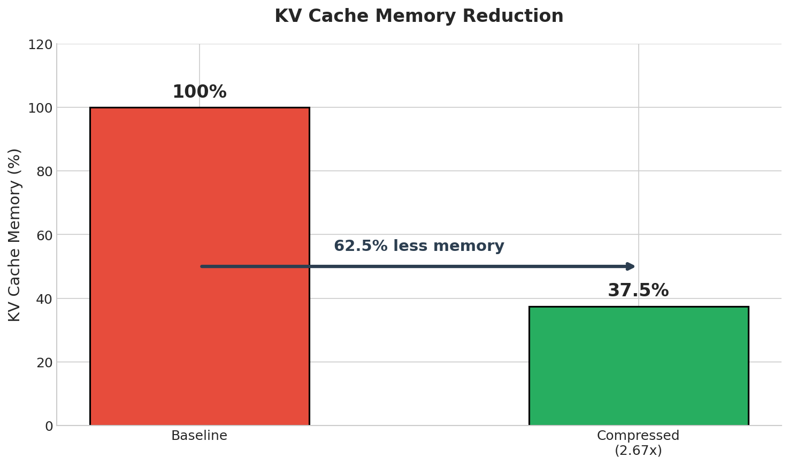
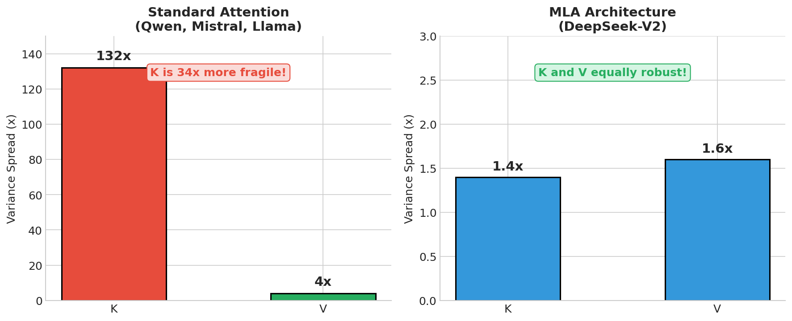
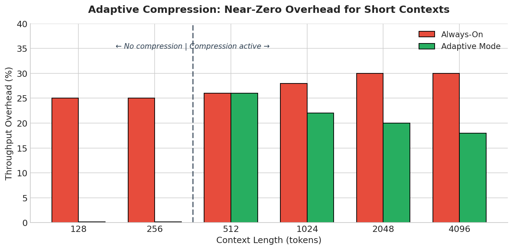
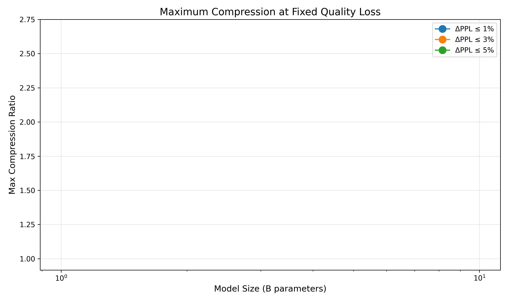

# KV Cache Compression Plugin

Reduce KV cache memory by **2.67x** with **<1% quality loss** on 7B models.



## Quick Start

```python
from transformers import AutoModelForCausalLM, AutoTokenizer
from gpt2.compression.compressed_cache import load_preset_cache

# Load model
model = AutoModelForCausalLM.from_pretrained("Qwen/Qwen2.5-7B", device_map="cuda")
tokenizer = AutoTokenizer.from_pretrained("Qwen/Qwen2.5-7B")

# Load compressed cache (one line!)
cache = load_preset_cache(
    preset_path="kv_preset_qwen2.5-7b.json",
    num_layers=model.config.num_hidden_layers,
    device="cuda",
)

# Use normally - compression is automatic
inputs = tokenizer("Hello, world!", return_tensors="pt").to("cuda")
outputs = model.generate(**inputs, past_key_values=cache, max_new_tokens=100)
```

That's it. The cache compresses V projections using calibrated PCA + int8 quantization.

---

## Why It Works


The sweet spot is **2.67x compression** (rank 96 + int8): maximum memory savings
before quality degrades. Larger models tolerate more compression.

---

## Architecture Matters

**Critical**: Compression strategy depends on your model's attention type.



| Architecture | Strategy | Why |
|--------------|----------|-----|
| **Standard** (Qwen, Mistral, Llama) | V-only compression | K is 34x more fragile than V |
| **MLA** (DeepSeek-V2) | Compress shared latent | K and V equally robust |

Our presets use V-only compression, optimized for standard attention models.

---

## Adaptive Mode

For production serving, enable **Adaptive Mode** to eliminate overhead on short requests:

```python
cache = load_preset_cache(
    preset_path="kv_preset_qwen2.5-7b.json",
    num_layers=num_layers,
    device="cuda",
    adaptive=True,           # Enable adaptive compression
    compress_after=512,      # Start compressing after 512 tokens
    keep_recent=256,         # Keep last 256 tokens uncompressed
)
```



- **Short contexts (<512 tokens)**: No compression, no overhead
- **Long contexts**: 2.67x memory savings, ~20% throughput cost

---

## Results at a Glance (H100)

Results from NVIDIA H100 80GB HBM3:

| Model | Compression | Quality Loss | Config |
|-------|-------------|--------------|--------|
| **Qwen2.5-7B** | **2.67x** | **+1.97%** PPL | V-only, rank 96, int8 |
| Mistral-7B | 2.67x | +4.23% PPL | V-only, rank 96, int8 |
| Qwen2-1.5B | 2.51x | +2.22% PPL | V-only, rank 102, int8 |
| Qwen2.5-0.5B | 2.51x | +4.68% PPL | V-only, rank 51, int8 |

**Scaling law**: Larger models compress better. 7B models achieve 2.67x compression
with only ~2-4% PPL loss; smaller models show higher degradation at the same ratio.

---

## Scaling Laws


The graph shows PPL degradation across compression ratios for all tested models.
Key observation: **larger models follow a flatter curve**, meaning they tolerate
more compression before quality degrades.



At a fixed quality loss threshold (e.g., 3% ΔPPL), larger models achieve higher
compression ratios. This validates the scaling law hypothesis.


At fixed compression (e.g., 2.5x), quality loss decreases with model size.
This is consistent with larger models having more redundancy in KV representations.

---

## Documentation

| Topic | Description |
|-------|-------------|
| [Architecture Analysis](architecture_analysis.md) | Why K is fragile in standard attention, MLA differences |
| [API Reference](api_reference.md) | Complete API documentation |
| [Calibration Guide](calibration_guide.md) | How to calibrate for custom models |
| [Integration Guide](integration_guide.md) | Step-by-step integration tutorial |

To regenerate plots: `python scripts/plot_kv_plugin_charts.py`

---

## Key Findings

1. **V-only compression is optimal** for standard attention (Qwen, Mistral, Llama)
2. **K compression is risky** - K has 132x variance spread vs V's 4x
3. **MLA is different** - DeepSeek-V2 has equalized K/V, both safe to compress
4. **Larger models compress better** - more redundancy in KV representations
5. **Adaptive mode** eliminates overhead for short contexts

---

## Citation

If you use this plugin in your research, please cite:

```bibtex
@software{kv_compression_plugin,
  title = {KV Cache Compression Plugin},
  author = {Chamberlain, Luis},
  year = {2025},
  url = {https://github.com/mcgrof/knlp}
}
```
