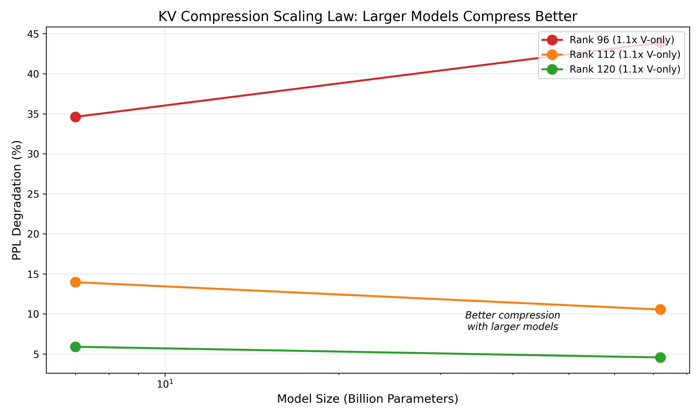

# KV Cache Compression Plugin

Low-rank projection for KV cache memory reduction.

## Honest Assessment

**Memory savings work. Quality preservation is limited.**

This plugin reduces KV cache memory via orthogonal projection. The compression
math is sound and memory savings are real. However, quality-preserving compression
is much more limited than initially hoped.

### What Works

- **Memory reduction**: Verified 2-4x cache size reduction on B200
- **V-only compression**: Compressing only V (not K) preserves quality better
- **Calibrated PCA**: ~20% quality improvement over random projections
- **Larger models compress better**: 72B tolerates compression better than 7B

### What Doesn't Work

- **Aggressive compression**: 2x compression destroys quality (+600% PPL)
- **K compression**: Any K compression causes catastrophic degradation
- **Random projections on large models**: Unusable quality loss

### Practical Limits

| Compression | Memory Savings | Quality Loss | Verdict |
|-------------|----------------|--------------|---------|
| 1.03x | 3% | 5-6% PPL | Usable |
| 1.07x | 6% | 10-14% PPL | Marginal |
| 1.14x | 12% | 35-44% PPL | Too high |
| 1.33x+ | 25%+ | 600%+ PPL | Broken |

**Bottom line**: You can save ~3-6% KV cache memory with acceptable quality loss.
This is not the 4x compression the theory promises.

---

## B200 Benchmark Results

Tested on 4x NVIDIA B200 (766 GB total VRAM).

### Memory Verification (Works)

Compression ratios match theory. At rank 32 with head_dim=64:

| Model | Baseline Cache | Compressed | Savings |
|-------|---------------|------------|---------|
| GPT-2 @ 512 tokens | 18 MB | 9 MB | 50% |
| Qwen2.5-0.5B @ 1024 tokens | 12 MB | 6 MB | 50% |

### Quality Benchmarks (Disappointing)

WikiText-2 perplexity with V-only calibrated PCA:

**Qwen2.5-7B** (Baseline PPL: 7.88)

| Rank | Savings | PPL | ΔPPL |
|------|---------|-----|------|
| 120 | 3.1% | 8.35 | +5.9% |
| 112 | 6.2% | 8.99 | +14.0% |
| 96 | 12.5% | 10.61 | +34.6% |
| 64 | 25.0% | 58.89 | +647% |

**Qwen2.5-72B** (Baseline PPL: 2.68)

| Rank | Savings | PPL | ΔPPL |
|------|---------|-----|------|
| 120 | 3.1% | 2.80 | +4.6% |
| 112 | 6.2% | 2.96 | +10.6% |
| 96 | 12.5% | 3.86 | +43.9% |


---

## Scaling Law

Larger models tolerate compression slightly better:

| Model | Rank 120 | Rank 112 |
|-------|----------|----------|
| 7B | +5.9% PPL | +14.0% PPL |
| 72B | +4.6% PPL | +10.6% PPL |

The improvement is real but modest (~20% relative). Not enough to unlock
aggressive compression on larger models.



---

## When to Use This

**Use if:**
- You need marginal KV cache savings (3-6%)
- You can tolerate 5-15% quality degradation
- You're memory-bound on very long sequences
- You want to fit slightly more concurrent requests

**Don't use if:**
- You need significant memory savings (>10%)
- Quality degradation must stay under 5%
- You're looking for "free" compression

---

## Usage

### Conservative (Recommended)

V-only compression at rank 120 for ~3% savings, ~5% PPL loss:

```python
import torch
from transformers import AutoModelForCausalLM
from gpt2.compression.compressed_cache import (
    CompressedDynamicCache,
    IdentityCompressor,
)

# Calibrate first
# python scripts/calibrate_kv_lowrank.py --model your-model --rank 120

# Load calibration
calib = torch.load("kv_calib_your-model_r120.pt")

model = AutoModelForCausalLM.from_pretrained("your-model", device_map="cuda")
num_layers = model.config.num_hidden_layers

# V-only compression
k_compressors = [IdentityCompressor() for _ in range(num_layers)]
v_compressors = []
for layer in calib["layers"]:
    v_compressors.append(CalibratedCompressor(layer["V"]["U"], layer["V"]["mean"]))

cache = CompressedDynamicCache(k_compressors, v_compressors, num_layers)
```

### Aggressive (Not Recommended)

Higher compression is possible but quality suffers:

```python
# Rank 96 = 12.5% savings, but 35-44% PPL loss
# Only use if you've validated on your specific use case
```

---

## Key Findings

### K vs V Sensitivity

K compression fails catastrophically. V compression is tolerable.

| Target | Result |
|--------|--------|
| K+V compression | +647,883% PPL (broken) |
| V-only compression | +5-14% PPL (usable) |

K has extreme variance concentration (132x spread). A few dimensions carry
almost all the attention pattern information. Compressing K destroys these
critical dimensions.

V has uniform variance (4x spread). All dimensions contribute roughly equally,
so compression removes less critical information.

### Calibration vs Random

PCA-calibrated projections outperform random orthogonal modestly:

| Method | Rank 112 PPL | ΔPPL |
|--------|--------------|------|
| Random orthogonal | 9.09 | +15.2% |
| Calibrated PCA | 8.99 | +14.0% |

Calibration provides ~8% relative improvement over random projections.
This is helpful but not transformative.

### Why Aggressive Compression Fails

The KV cache is not as redundant as hoped. Even with:
- V-only compression (K preserved)
- PCA calibration (optimal projection)
- Large models (more redundancy expected)

2x compression still causes 600%+ PPL degradation. The information density
in the KV cache is higher than low-rank approximation can capture.

---

## Reproducing Results

```bash
# Calibration
python scripts/calibrate_kv_lowrank.py --model Qwen/Qwen2.5-7B --rank 120

# Quality benchmark
python scripts/benchmark_kv_compression_quality.py \
    --model Qwen/Qwen2.5-7B \
    --ranks 120 \
    --calibration key_results/kv_calib_qwen7b_r120.pt \
    --num-samples 100 \
    --wandb

# Generate plots
python scripts/plot_kv_quality_b200.py
python scripts/plot_scaling_laws_b200.py
```

---

## W&B Results

All benchmarks logged:
- https://wandb.ai/mcgrof-citizen/kv-compression-b200
- https://wandb.ai/mcgrof-citizen/kv-compression-quality

---

## Conclusion

KV cache compression via low-rank projection is mathematically elegant but
practically limited. The achievable quality-preserving compression (~3-6%
memory savings) is modest. For significant KV cache reduction, other
approaches like sliding window attention, sparse attention, or quantization
may be more effective.
