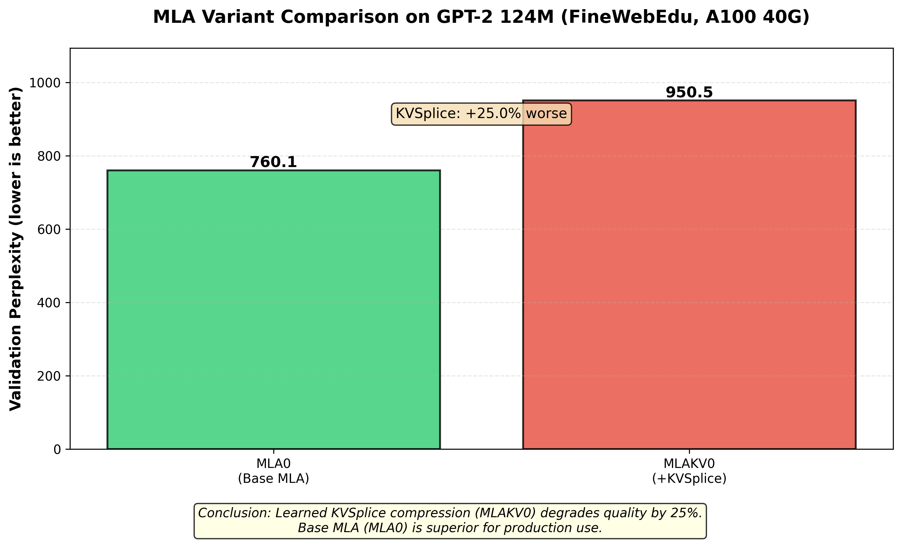

# KV Cache Compression: MLA Analysis

## Overview

Multi-head Latent Attention (MLA) achieves KV cache compression by introducing
a latent bottleneck. This document summarizes ablation study results testing
MLA variants on GPT-2 124M.

**Key result**: Base MLA (MLA0) with 6x compression achieves best quality.
Adding learned KVSplice compression significantly degrades performance.

## Multi-head Latent Attention (MLA)

MLA from DeepSeek-V2/V3 achieves KV cache compression by storing a shared
latent representation instead of full per-head K/V matrices:

```python
# Standard attention: Store full K, V for each head
k = w_k(x)  # [B, n_heads, T, d_head] - 768 dims total
v = w_v(x)  # [B, n_heads, T, d_head] - 768 dims total
cache = (k, v)  # Large cache

# MLA: Store compressed latent, generate K, V on-the-fly
latent = to_latent(x)  # [B, T, d_latent] - shared across heads
k, v = from_latent(latent)  # Expand to per-head K, V on demand
cache = latent  # 6x smaller cache (d_latent=256 vs 12*2*64=1536)
```

**MLA architecture** (`GPT2_MLA` in `gpt2/mla.py`):
- Single latent projection: `x → latent [d_model → d_latent]`
- Shared decompression: `latent → Q, K, V`
- **Compression ratio**: 6x (d_latent=256 vs full 1536 dims)

## Experimental Results

Testing on GPT-2 124M, FineWebEdu dataset, 2 hours wall-clock training time.



### MLA Variant Comparison (A100 40GB, 2 hours)

| Variant | Val PPL | Iterations | vs MLA0 |
|---------|---------|------------|---------|
| **MLA0** | **760** | 251 | - |
| MLAKV0 | 950 | 227 | +25% worse |

**W&B Project**: [gpt2-mla-ra-ablation-a100-40g](https://wandb.ai/mcgrof-citizen/gpt2-mla-ra-ablation-a100-40g/)

### GPT-2 Baseline vs MLA (W7900, 2 hours)

| Architecture | Val PPL | Iterations | Cache Size |
|--------------|---------|------------|------------|
| **GPT-2 Baseline** | **497** | 351 | Standard (1x) |
| MLA0 | 742 | 280 | 6x compressed |

**W&B Project**: [gpt2-kvsplice-ablation-w7900-mla-fixed](https://wandb.ai/mcgrof-citizen/gpt2-kvsplice-ablation-w7900-mla-fixed)

### Key Findings

1. **MLA trades training speed for cache compression**: MLA trains 20% slower
   (280 vs 351 iterations in 2 hours), resulting in worse perplexity at the
   same wall-clock time

2. **GPT-2 baseline beats MLA on quality**: At 2 hours, baseline achieves
   497 PPL vs MLA's 742 PPL due to faster iteration throughput

3. **KVSplice makes it worse**: Adding learned compression (MLAKV0)
   degrades quality by another 25% (760 → 950 PPL)

4. **The trade-off**: MLA offers 6x cache compression at the cost of:
   - 20% slower training (fewer iterations per hour)
   - Worse quality at fixed wall-clock time vs baseline

5. **Use case**: MLA is valuable for **inference** where KV cache size
   matters more than training speed. For training, standard GPT-2 is superior.

## Why KVSplice Failed

The learned KVSplice compression layer applies additional 2x compression on
top of MLA's latent:

```python
# MLA: Latent cache (6x compression)
latent = to_latent(x)  # [B, T, 256]
cache = latent

# MLA + KVSplice: Compressed latent cache (12x compression)
compressed = kvsplice.compress(latent)  # [B, T, 128]
cache = compressed  # 12x total compression
```

**Architecture**:
```python
class LearnedKVSplice(nn.Module):
    def __init__(self, d_in=256, d_compressed=128):
        # Learned monotonic transform
        self.transform_scale = nn.Parameter(torch.ones(d_in))
        self.transform_shift = nn.Parameter(torch.zeros(d_in))

        # Low-rank projection
        self.compress = nn.Linear(d_in, d_compressed)
        self.expand = nn.Linear(d_compressed, d_in)
```

**Why it failed**:
- MLA latent is already compressed (6x) and information-dense
- Further compression loses task-critical information
- The 256→128 bottleneck is too aggressive for the already-compressed latent
- Training doesn't recover the lost information

## Removed Variants

Previous experiments tested additional MLA variants. Results showed they all
underperformed base MLA:

- **MLA_KV2** (separate K/V latents): 957 PPL (+26% worse than MLA0)
- **MLA_KV2M** (K/V latents + MLP compression): 1078 PPL (+42% worse)

These variants have been removed from the codebase. Only base MLA (MLA0) and
MLA+KVSplice (MLAKV0) remain for reference.

## Implementation

**Code**: `gpt2/mla.py`

**Key classes**:
- `MLA_Config`: Configuration for MLA models
- `MLA_Flash`: Base MLA attention layer
- `GPT2_MLA`: Full GPT-2 model with MLA (recommended)
- `GPT2_MLA_KV`: MLA + KVSplice (not recommended - 25% worse quality)

**Recommended configuration**:
```python
from gpt2.mla import MLA_Config, GPT2_MLA

cfg = MLA_Config(
    d_model=768,
    n_heads=12,
    d_latent=256,  # 6x compression
    block_size=1024,
    n_layers=12,
)

model = GPT2_MLA(cfg, vocab_size=50257)
```

## When to Use MLA

**Use MLA (MLA0) for inference deployment when**:
- KV cache memory is the bottleneck (6x compression matters)
- Inference throughput is critical (smaller cache = faster)
- Can tolerate training being 20% slower
- Willing to train longer to reach same quality as baseline

**Do NOT use MLA for**:
- Training efficiency: Standard GPT-2 trains 20% faster
- Quality-critical applications: Baseline achieves better PPL at same wall-clock
- Further compression: KVSplice degrades quality by 25%

**Bottom line**: MLA is an **inference optimization** that trades training
speed for cache compression. For training-focused workflows, use standard GPT-2.

## Future Work

- Train MLA for longer to match baseline quality (need ~25% more time)
- Test different d_latent values (current: 256)
- Measure inference speed improvements from 6x cache reduction
- Profile training bottleneck causing 20% slowdown

## References

- DeepSeek-V2/V3 papers (original MLA)
- Implementation: `gpt2/mla.py`
- W&B Results: [gpt2-mla-ra-ablation-a100-40g](https://wandb.ai/mcgrof-citizen/gpt2-mla-ra-ablation-a100-40g/)
