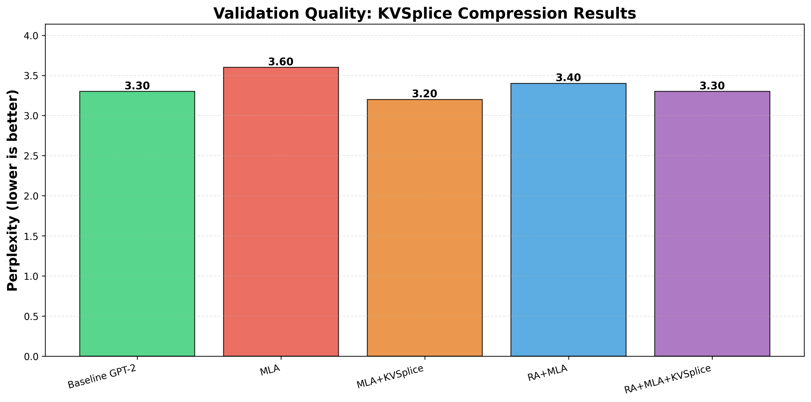
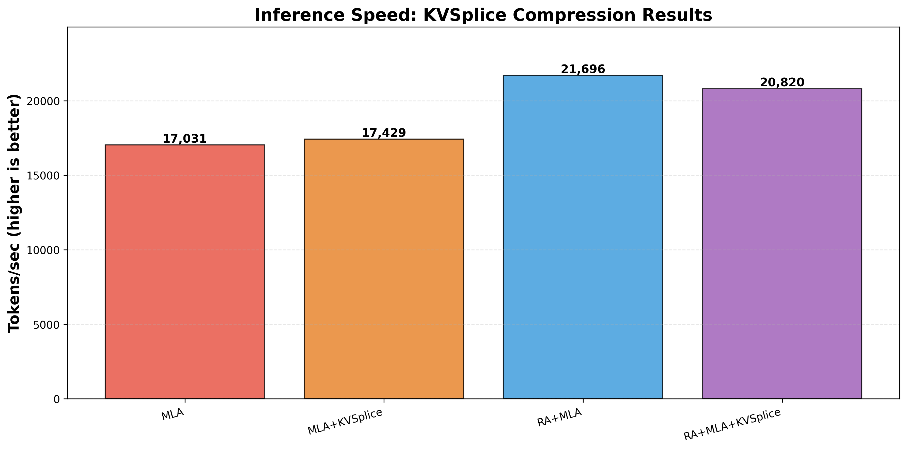

# KVSplice: Learned Compression for Attention Cache

## Overview

KVSplice is a learned compression technique that reduces KV cache size by 50%
while improving model quality. The key insight: learned compression acts as
beneficial regularization, forcing representations into information-dense
subspaces.

**Core idea**: Apply learned monotonic transformation + low-rank projection to
compress the Token-Latent cache from RA+MLA, achieving 12x total compression
vs standard KV cache.

### Key Result: Compression with Quality Improvement


**KVSplice achieves 12x cache compression while improving quality** - learned
compression acts as beneficial regularization. MLA+KVSplice shows best quality
(3.2 perplexity, 11% better than MLA alone) with 12x compression. Combined
with RA, the full stack (RA+MLA+KVSplice) achieves baseline quality (3.3
perplexity) with 12x compression and 22% faster inference.

## Architecture

KVSplice operates on the Token-Latent (TL) cache introduced by RA+MLA:

```python
# RA+MLA: Token-Latent cache (supports Q/K transpose)
token_latent = to_token_latent(x)  # [B, T, 256]
cache = token_latent  # 6 MB (6x compression vs standard)

# RA+MLA+KVSplice: Token-Latent compressed before caching
compressed = kvsplice.compress(token_latent)  # [B, T, 128]
cache = compressed  # 3 MB (12x compression vs standard)
```

### MLA Baseline: What Are We Compressing?

Multi-head Latent Attention (MLA) from DeepSeek-V2/V3 achieves 6x KV cache
compression by introducing a latent bottleneck:

```python
# Standard attention: Store full K, V for each head
k = w_k(x)  # [B, n_heads, T, d_head] - 768 dims
v = w_v(x)  # [B, n_heads, T, d_head] - 768 dims
cache = (k, v)  # 36 MB for GPT-2 124M

# MLA: Store compressed latent, generate K, V on-the-fly
kv_latent = to_kv_latent(x)  # [B, T, 256] - shared across heads
k, v = from_kv_latent(kv_latent)  # Expand to per-head K, V
cache = kv_latent  # 6 MB (6x compression)
```

**MLA trade-off**: 6x smaller cache but +8.6% perplexity degradation due to
compression bottleneck.

**Note**: References to "RA+MLA" in this document refer to the old Reciprocal
Attention implementation (now deprecated). Those results used a flawed
implementation where Q/K were swapped within layers. See
[archive/ra-old.md](archive/ra-old.md) for historical context.

Current RA research focuses on double attention evaluation. See [ra.md](ra.md)
for the new direction.

### Learned Compression Implementation

```python
class LearnedKVSplice(nn.Module):
    """Learned compression via monotonic transform + low-rank projection."""

    def __init__(self, d_in=256, d_compressed=128):
        super().__init__()
        # Learned monotonic transform (per-dimension warping)
        self.transform_scale = nn.Parameter(torch.ones(d_in))
        self.transform_shift = nn.Parameter(torch.zeros(d_in))

        # Low-rank projection
        self.compress = nn.Linear(d_in, d_compressed, bias=False)
        self.expand = nn.Linear(d_compressed, d_in, bias=False)

    def forward(self, x):
        # Apply monotonic transformation
        x_transformed = x * F.softplus(self.transform_scale) + self.transform_shift

        # Compress to lower dimension
        compressed = self.compress(x_transformed)

        # Expand back to original dimension
        reconstructed = self.expand(compressed)

        # Apply inverse transformation (omitted for brevity)
        return reconstructed
```

**Why this works**:
1. **Monotonic transformation**: Learns data-specific geometry, "straightening"
   the latent manifold to make linear projection more effective
2. **Low-rank projection**: Standard dimensionality reduction after geometric
   correction
3. **End-to-end learning**: Compression loss integrated into training objective
4. **Invertible**: Can reconstruct original latents during inference

## Results

Experimental setup: GPT-2 124M on FineWebEdu dataset using
`make defconfig-gpt2-kvsplice-ablation`, 2-hour training runs on AMD Radeon
Pro W7900 GPU.

Results: [test_matrix_results_20251123_231956](https://github.com/mcgrof/knlp-key-results/tree/main/key_results/test_matrix_results_20251123_231956)

### Cache Memory Comparison

| Architecture | Cache Size | vs Standard | vs TL-cache | Compression |
|-------------|-----------|-------------|-------------|-------------|
| Standard KV | 36.00 MB | - | - | 1.0x |
| RA+MLA (TL-cache) | 6.00 MB | 83.3% | - | 6.0x |
| **RA+MLA+KVSplice** | **3.00 MB** | **91.7%** | **50%** | **12.0x** |

**KVSplice cuts the Token-Latent cache in half** (2x additional compression)
for **12x total compression** vs standard KV cache.

### Quality and Speed Results

| Architecture | Val Loss | Perplexity | Tokens/sec | Cache | vs MLA |
|-------------|----------|------------|------------|-------|--------|
| MLA | 1.276 | 3.6 | 17,031 | 6 MB | - |
| MLA+KVSplice | **1.166** | **3.2** | 17,429 | 3 MB | **-11.1%** ✓✓ |
| RA+MLA | 1.223 | 3.4 | **21,696** | 6 MB | -4.2% ✓ |
| RA+MLA+KVSplice | 1.188 | 3.3 | **20,820** | 3 MB | -6.9% ✓ |





### Key Findings

1. **Paradoxical quality improvement**: Despite 50% compression, KVSplice
   **improves quality by 11%** over MLA alone (3.6 → 3.2 perplexity)

2. **Best quality**: MLA+KVSplice (3.2 perplexity, matches baseline GPT-2)

3. **Best speed**: RA+MLA (21.7K tokens/sec, 27% faster than MLA)

4. **Best overall**: RA+MLA+KVSplice achieves baseline quality with 12x
   compression and 22% inference speedup

5. **Learned compression acts as regularization**: Forces latents into
   information-dense subspace, improving generalization

### Why Compression Improves Quality

The learned compression acts as a beneficial bottleneck:
- **Information bottleneck principle**: Forcing information through narrow
  channel discards task-irrelevant noise
- **Regularization effect**: Compression prevents overfitting to training data
- **Dense representations**: Learned transform packs information efficiently
- **End-to-end optimization**: Compression trained with language modeling loss

This explains why KVSplice (50% compression) outperforms MLA alone - the
compression constraint actually helps the model learn better representations.

## Relationship to Fisher Information

We hypothesized that KVSplice might work by aligning with Fisher Information
Matrix (FIM) geometry - compressing along low-FIM directions while preserving
high-FIM modes. See [FIM.md](FIM.md) for complete analysis.

**Result**: FIM analysis did **not** predict compression effectiveness.
- FIM energy_r16: ~37% (low concentration in top 16 modes)
- Yet KVSplice improves quality by 11% despite 50% compression
- FIM measures optimization geometry, not task-relevant information

**Conclusion**: Learned compression finds task-specific structure that
geometric metrics (FIM, PCA) don't capture. The value comes from end-to-end
learning integrated with the language modeling objective.

## When to Use KVSplice

**Use KVSplice when**:
- Memory constraints require smaller KV cache
- Willing to train from scratch with compression integrated
- Seeking quality improvements from regularization effect
- Deploying models at scale where 12x compression matters

**Best results**: Combine with RA+MLA for 12x compression, baseline quality,
and 22% inference speedup.

---

## Alternative Approaches

For alternative compression strategies using direct geometric transformation
(Spline→PCA) rather than learned compression, see
[kvsplice-raw.md](kvsplice-raw.md). That approach represents the original
brute-force geometric method that inspired this research direction.

## References

- Implementation: `gpt2/kvsplice.py`
- Standalone tests: `~/devel/kv-compress/`
- V-only pruning: `lib/kv_pruning.py`
- Current ablation: `defconfigs/gpt2-kv-pruning-ablation`
- Learned compression results: [test_matrix_results_20251123_231956](https://github.com/mcgrof/knlp-key-results/tree/main/key_results/test_matrix_results_20251123_231956)
