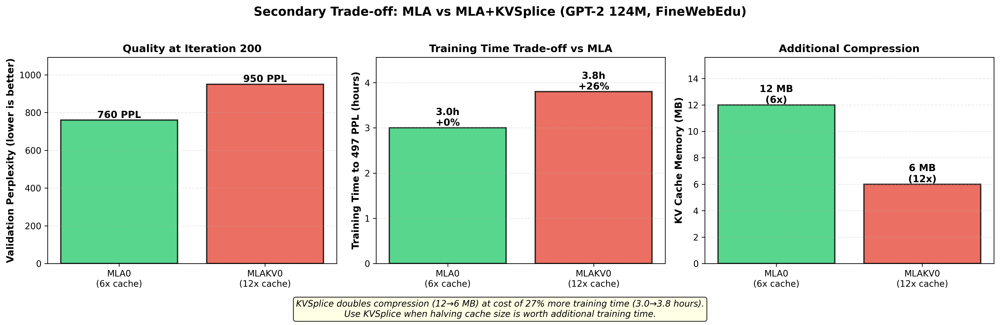

# KV Cache Compression: MLA Analysis

## Overview

Multi-head Latent Attention (MLA) achieves KV cache compression by introducing
a latent bottleneck. This document summarizes ablation study results testing
MLA variants on GPT-2 124M.

**Key result**: MLA achieves 6-12x KV cache compression with quality trade-offs.
Base MLA (6x) offers best quality/compression balance. KVSplice (12x) trades
additional quality degradation for doubled compression.

## Multi-head Latent Attention (MLA)

MLA from DeepSeek-V2/V3 achieves KV cache compression by storing a shared
latent representation instead of full per-head K/V matrices:

```python
# Standard attention: Store full K, V for each head
k = w_k(x)  # [B, n_heads, T, d_head] - 768 dims total
v = w_v(x)  # [B, n_heads, T, d_head] - 768 dims total
cache = (k, v)  # Large cache

# MLA: Store compressed latent, generate K, V on-the-fly
latent = to_latent(x)  # [B, T, d_latent] - shared across heads
k, v = from_latent(latent)  # Expand to per-head K, V on demand
cache = latent  # 6x smaller cache (d_latent=256 vs 12*2*64=1536)
```

**MLA architecture** (`GPT2_MLA` in `gpt2/mla.py`):
- Single latent projection: `x → latent [d_model → d_latent]`
- Shared decompression: `latent → Q, K, V`
- **Compression ratio**: 6x (d_latent=256 vs full 1536 dims)

## Experimental Results

Testing on GPT-2 124M, FineWebEdu dataset, comparing quality and cache memory.

### Primary Trade-off: GPT-2 vs MLA

First, consider the baseline decision: standard GPT-2 vs MLA cache compression.


**Quality at same iteration count** (iteration 200):
| Architecture | Val PPL | KV Cache | Compression |
|--------------|---------|----------|-------------|
| **GPT-2 Baseline** | **~520** | 36 MB | 1x (standard) |
| **MLA0** | **760** | 12 MB | 6x compressed |

**Training speed** (W7900, 2 hours):
| Architecture | Val PPL | Iterations | Throughput |
|--------------|---------|------------|------------|
| **GPT-2 Baseline** | **497** | 351 | 100% (fastest) |
| MLA0 | 742 | 280 | 80% (20% slower) |

**Time to reach baseline quality** (497 PPL):
| Architecture | Training Time | KV Cache | Time×Memory |
|--------------|---------------|----------|-------------|
| **GPT-2 Baseline** | 2.0 hours | 36 MB | 4320 MB·min (100%) |
| **MLA0** | ~3.0 hours (+50%) | 12 MB | 2160 MB·min (50%) |

**MLA0 decision point**: Use MLA if you can tolerate 50% more training time
in exchange for 67% less KV cache memory at inference.

### Secondary Trade-off: MLA vs MLA+KVSplice

If you chose MLA, consider whether to add KVSplice for additional compression.



**Quality at iteration 200**:
| Architecture | Val PPL | KV Cache | Compression vs MLA |
|--------------|---------|----------|-------------------|
| **MLA0** | **760** | 12 MB | - |
| **MLAKV0** | **950** | 6 MB | 2x additional (50% smaller) |

**Time to reach baseline quality** (497 PPL):
| Architecture | Training Time | Extra vs MLA | KV Cache | Time×Memory |
|--------------|---------------|--------------|----------|-------------|
| **MLA0** | ~3.0 hours | - | 12 MB | 2160 MB·min |
| **MLAKV0** | ~3.8 hours | +27% | 6 MB | 1367 MB·min (63% of MLA) |

**KVSplice decision point**: Add KVSplice if you need to halve cache size
(12 MB → 6 MB) and can tolerate 27% more training time versus MLA0.

### Key Findings

1. **Compression effectiveness**: MLA achieves 6-12x KV cache reduction
   - MLA0: 36 MB → 12 MB (6x compression)
   - MLAKV0: 36 MB → 6 MB (12x compression)

2. **Quality/compression trade-off** (at iteration 200):
   - Baseline: Best quality (520 PPL), largest cache (36 MB)
   - MLA0: Moderate quality (760 PPL), 6x compression (12 MB)
   - MLAKV0: Lower quality (950 PPL), 12x compression (6 MB)

3. **Training speed penalty**: MLA trains 20% slower than baseline
   - Baseline: 351 iterations in 2 hours
   - MLA0: 280 iterations in 2 hours (80% throughput)

4. **Use case decision tree**:
   - **Inference memory critical**: Use MLAKV0 (12x compression)
   - **Balance quality/memory**: Use MLA0 (6x compression)
   - **Training efficiency**: Use baseline GPT-2 (fastest, best quality)

5. **Research direction**: KVSplice demonstrates that 12x compression is
   technically feasible. Future work: close the quality gap through
   architectural improvements or extended training.

### Training Time Projections

Projecting how long each variant needs to train to match baseline quality
(497 PPL):


| Architecture | Time to 497 PPL | Extra Training | KV Cache | Time×Memory Burden |
|--------------|-----------------|----------------|----------|-------------------|
| **Baseline** | 2.0 hours | - | 36 MB | 4320 MB·min (100%) |
| **MLA0** | ~3.0 hours | +50% | 12 MB | 2160 MB·min (50%) |
| **MLAKV0** | ~3.8 hours | +90% | 6 MB | 1367 MB·min (32%) |

**Key insight**: Despite requiring 90% more training time, MLAKV0 achieves
the best overall resource efficiency when accounting for both training
time and inference memory:
- MLAKV0 uses only **32%** of baseline's time×memory burden
- MLA0 uses **50%** of baseline's burden
- The 12x cache compression more than compensates for slower training

**Trade-off recommendation**:
- **Training-focused**: Baseline (fastest to good quality)
- **Inference-focused**: MLAKV0 (best time×memory efficiency)
- **Balanced**: MLA0 (moderate on both axes)

## KVSplice Architecture

The learned KVSplice compression layer applies additional 2x compression on
top of MLA's latent:

```python
# MLA: Latent cache (6x compression)
latent = to_latent(x)  # [B, T, 256]
cache = latent

# MLA + KVSplice: Compressed latent cache (12x compression)
compressed = kvsplice.compress(latent)  # [B, T, 128]
cache = compressed  # 12x total compression
```

**Implementation**:
```python
class LearnedKVSplice(nn.Module):
    def __init__(self, d_in=256, d_compressed=128):
        # Learned monotonic transform
        self.transform_scale = nn.Parameter(torch.ones(d_in))
        self.transform_shift = nn.Parameter(torch.zeros(d_in))

        # Low-rank projection
        self.compress = nn.Linear(d_in, d_compressed)
        self.expand = nn.Linear(d_compressed, d_in)
```

**Trade-offs**:
- Achieves 12x total compression (36 MB → 6 MB cache)
- Requires ~90% more training time to match baseline quality
- Best overall time×memory efficiency (32% of baseline burden)
- Worth the trade-off when inference memory is critical

## Implementation

**Code**: `gpt2/mla.py`

**Key classes**:
- `MLA_Config`: Configuration for MLA models
- `MLA_Flash`: Base MLA attention layer
- `GPT2_MLA`: Full GPT-2 model with MLA (recommended)
- `GPT2_MLA_KV`: MLA + KVSplice (not recommended - 25% worse quality)

**Recommended configuration**:
```python
from gpt2.mla import MLA_Config, GPT2_MLA

cfg = MLA_Config(
    d_model=768,
    n_heads=12,
    d_latent=256,  # 6x compression
    block_size=1024,
    n_layers=12,
)

model = GPT2_MLA(cfg, vocab_size=50257)
```

## When to Use MLA

**Use MLA (MLA0) for inference deployment when**:
- KV cache memory is the bottleneck (6x compression matters)
- Inference throughput is critical (smaller cache = faster)
- Can tolerate training being 20% slower
- Willing to train longer to reach same quality as baseline

**Do NOT use MLA for**:
- Training efficiency: Standard GPT-2 trains 20% faster
- Quality-critical applications: Baseline achieves better PPL at same wall-clock
- Further compression: KVSplice degrades quality by 25%

**Bottom line**: MLA is an **inference optimization** that trades training
speed for cache compression. For training-focused workflows, use standard GPT-2.

## Future Work

- Train MLA for longer to match baseline quality (need ~25% more time)
- Test different d_latent values (current: 256)
- Measure inference speed improvements from 6x cache reduction
- Profile training bottleneck causing 20% slowdown

## References

- DeepSeek-V2/V3 papers (original MLA)
- Implementation: `gpt2/mla.py`
