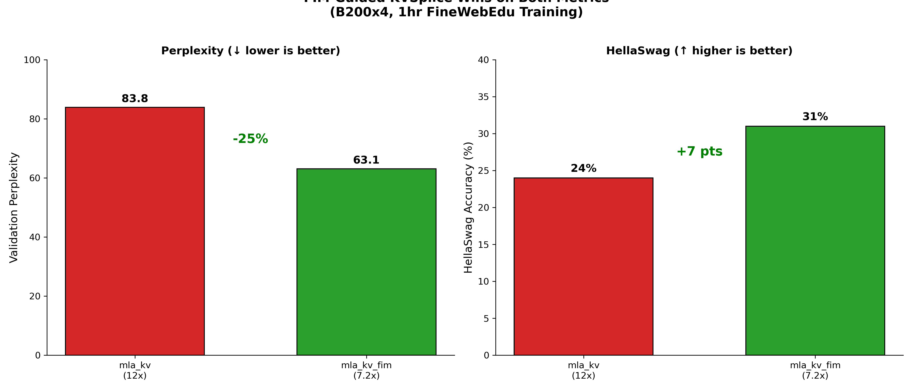

# KVSplice: Learned KV Cache Compression

## Overview

KVSplice achieves KV cache compression through learned low-rank projection
on top of MLA's latent representation. This compresses the MLA latent space
(256 dims) to smaller dimensions (128 dims at 50% compression) using
orthogonal linear transformations.

**Compression stack**:
- Standard GPT-2: 1536 dims (full K+V per head)
- MLA: 256 dims (6x compression via shared latent)
- MLA + KVSplice: 128 dims (12x total compression)

## Architecture

### Multi-head Latent Attention (MLA)

MLA from DeepSeek-V2/V3 achieves 6x KV cache compression by storing a shared
latent representation instead of full per-head K/V matrices:

```python
# Standard attention: Store full K, V for each head
k = w_k(x)  # [B, n_heads, T, d_head] - 768 dims total
v = w_v(x)  # [B, n_heads, T, d_head] - 768 dims total
cache = (k, v)  # 1536 dims cached

# MLA: Store compressed latent, generate K, V on-the-fly
latent = to_latent(x)  # [B, T, 256] - shared across heads
k, v = from_latent(latent)  # Expand to per-head K, V on demand
cache = latent  # 256 dims cached (6x compression)
```

### KVSplice Layer

KVSplice adds learned low-rank projection to further compress the MLA latent:

```python
class MLA_KVSplice(nn.Module):
    """Learned KV cache compression via low-rank projection."""

    def __init__(self, d_latent: int, compression_ratio: float = 0.5):
        super().__init__()
        d_compressed = int(d_latent * compression_ratio)

        # Low-rank projection with orthogonal initialization
        self.compress = nn.Linear(d_latent, d_compressed, bias=False)
        self.expand = nn.Linear(d_compressed, d_latent, bias=False)

        nn.init.orthogonal_(self.compress.weight)
        with torch.no_grad():
            self.expand.weight.copy_(self.compress.weight.T)
```

The implementation uses latent-only SDPA (Scaled Dot-Product Attention) where
the compressed latent is stored and expanded on-demand during attention.

## B200x4 Results (FineWebEdu)

**Hardware**: 4x NVIDIA B200 (191.5GB total VRAM)

**Training configuration**:
- Dataset: FineWebEdu (web text)
- Model: GPT-2 124M
- Training time: 1 hour per variant
- Batch size: 76 per GPU
- Effective batch: 1216 (76 x 4 GPUs x 4 grad_acc)
- Optimizer: AdamWSPAM

### Quality Comparison

| Architecture | Val PPL | HellaSwag | Iterations | Speed |
|--------------|---------|-----------|------------|-------|
| MLA+KVSplice FIM (7.2x) | **63.08** | **31%** | 2601 | 1392ms/iter |
| MLA+KVSplice (12x) | 83.85 | 24% | 3065 | 1176ms/iter |

**FIM-guided wins**: The selective compression approach (mla_kv_fim) achieves
25% better perplexity and +7 points on HellaSwag compared to full KVSplice,
despite 18% slower iteration speed. Protecting early layers with high FIM
trace preserves critical representational capacity.



*FIM-guided selective compression (green) outperforms full KVSplice (red) on
both metrics. Lower perplexity and higher HellaSwag accuracy demonstrate that
protecting early layers preserves model quality.*

### Training Speed

Full KVSplice trains **18% faster** than FIM-guided (1176ms vs 1392ms per
iteration) due to smaller latent dimensions across all layers. In the same
training time:
- mla_kv: 3065 iterations
- mla_kv_fim: 2601 iterations (15% fewer)

Despite fewer iterations, mla_kv_fim achieves much better quality because
protecting early layers (high FIM trace) preserves representational capacity
that full compression destroys.

### Memory Savings (Inference)

| Seq Length | Standard GPT-2 | MLA (6x) | KVSplice FIM (7.2x) | KVSplice (12x) |
|------------|----------------|----------|---------------------|----------------|
| 256 tokens | 9 MB | 1.5 MB | 1.25 MB | 0.75 MB |
| 512 tokens | 18 MB | 3 MB | 2.5 MB | 1.5 MB |
| 1024 tokens | 36 MB | 6 MB | 5 MB | 3 MB |

For production inference with 24GB GPU memory:
- Standard GPT-2: ~650 parallel sequences
- MLA: ~4,000 sequences (6x throughput)
- KVSplice FIM: ~4,800 sequences (7.2x throughput, best quality)
- KVSplice: ~8,000 sequences (12x throughput)

## Implementation

**Code**: `gpt2/mla.py`

**Key classes**:
- `MLA_KVSplice`: Learned compression layer
- `MLA_Flash`: Base MLA attention with flash attention
- `MLABlock`: MLA transformer block
- `MLAKVBlock`: MLA + KVSplice transformer block
- `GPT2_MLA`: GPT-2 with MLA (6x compression)
- `GPT2_MLA_KV`: GPT-2 with MLA + KVSplice (12x compression)
- `GPT2_MLA_KV_FIM`: GPT-2 with FIM-guided selective KVSplice (7.2x, best quality)

**Running the ablation**:
```bash
make defconfig-gpt2-kvsplice-ablation
make
```

**Configuration** (`defconfigs/gpt2-kvsplice-ablation`):
```
CONFIG_ENABLE_MLA=y
CONFIG_MLA_VARIANT="mla,mla_kv,mla_kv_fim"
CONFIG_MLA_D_LATENT=256
CONFIG_MLA_COMPRESSION_RATIO="0.5"
CONFIG_MLA_KV_FIM_LAYERS=4
```

## When to Use

**Use MLA+KVSplice when**:
- KV cache memory is the inference bottleneck
- High-concurrency serving (many parallel sequences)
- Memory-constrained deployment (8-24GB GPUs)
- Willing to accept ~16% perplexity degradation

**Use MLA only when**:
- Quality is critical (no degradation acceptable)
- Already have 6x compression benefit
- Sufficient GPU memory for target concurrency

**Use standard GPT-2 when**:
- Training efficiency matters (MLA trains slower)
- No inference deployment planned

## FIM-Guided Selective Compression (mla_kv_fim)

FIM (Fisher Information Matrix) trace analysis reveals that different layers
have vastly different representational importance. Layers with high FIM trace
do critical work and should be protected from compression, while layers with
low trace are safe targets for aggressive compression.

### FIM Analysis Results (H100, 3-hour baseline MLA run)

From `gpt2_mla_fineweb` run in project `gpt2-kvsplice-h100-90pct-lnfv2`:

| Layer | Mean FIM Trace | Interpretation |
|-------|----------------|----------------|
| layer0 | 0.9551 | CRITICAL - protect from compression |
| layer6 | 0.8191 | Moderate - some compression OK |
| layer11 | 0.6215 | SAFE - aggressive compression OK |

Per-head breakdown shows the pattern is consistent:
- layer0/head11: 0.9769 (highest - critical)
- layer11/head10: 0.4149 (lowest - most compressible)

### Selective KVSplice Architecture

`GPT2_MLA_KV_FIM` applies KVSplice compression only to the last N layers:

```
Layers 0-7:  MLABlock (MLA only, 256 dims cached)
Layers 8-11: MLAKVBlock (MLA + KVSplice, 128 dims cached)
```

### B200x4 Results: mla_kv vs mla_kv_fim

**Hardware**: 4x NVIDIA B200 (191.5GB total VRAM)
**Training time**: 1 hour per variant

| Variant | Val PPL | HellaSwag | ms/iter | Iterations |
|---------|---------|-----------|---------|------------|
| mla_kv (12x) | 83.85 | 24% | 1176 | 3065 |
| mla_kv_fim (7.2x) | **63.08** | **31%** | 1392 | 2601 |

**Key findings**:
- mla_kv_fim achieves **25% better perplexity** (83.85 → 63.08)
- mla_kv_fim scores **+7 points higher on HellaSwag** (24% → 31%)
- mla_kv_fim is 18% slower per iteration (more MLA layers = more compute)
- Quality improvement vastly outweighs speed and compression trade-offs

The FIM-guided approach validates the hypothesis: protecting early layers
(high FIM trace) while compressing late layers (low FIM trace) preserves
critical representational capacity that full KVSplice destroys.

### Memory Savings Comparison

| Strategy | Compression | Cache (1024 tok) | Parallel Seqs (24GB) |
|----------|-------------|------------------|----------------------|
| Standard GPT-2 | 1.0x | 36.00 MB | 668 |
| MLA only | 6.0x | 6.00 MB | 4,010 |
| MLA + KVSplice (last 4) | 7.2x | 5.00 MB | 4,812 |
| MLA + KVSplice (all) | 12.0x | 3.00 MB | 8,021 |

### Configuration

```bash
# Enable selective KVSplice
CONFIG_ENABLE_MLA=y
CONFIG_MLA_VARIANT="mla_kv_fim"
CONFIG_MLA_COMPRESSION_RATIO="0.5"
CONFIG_MLA_KV_FIM_LAYERS=4
```

### Observed Benefits

1. **25% better perplexity** than full KVSplice (63 vs 84 PPL)
2. **+7 points on HellaSwag** (31% vs 24% accuracy)
3. **16.7% cache reduction** vs MLA-only (5 MB vs 6 MB at 1024 tokens)
4. **7.2x total compression** vs standard GPT-2
5. **~800 more parallel sequences** on 24GB GPU vs MLA-only

### When to Use

Use `mla_kv_fim` when:
- Quality matters (25% better PPL than full KVSplice)
- You want some cache compression benefit (16.7% vs MLA-only)
- FIM analysis shows your early layers have high trace
- Acceptable trade-off: 18% slower training for much better quality

Use full `mla_kv` when:
- Maximum cache compression is critical (12x vs 7.2x)
- Quality degradation is acceptable (84 vs 63 PPL)
- Memory is severely constrained
- Training speed is prioritized over quality

## Future Work

- Longer training runs to assess convergence gap
- Higher compression ratios (70%, 90%)
- Compare with xKV and other compression methods
- Production inference latency benchmarks
- Per-layer adaptive compression ratios based on FIM trace

## References

- DeepSeek-V2/V3 papers (original MLA architecture)
- xKV paper (low-rank KV compression validation)
- Implementation: `gpt2/mla.py`
