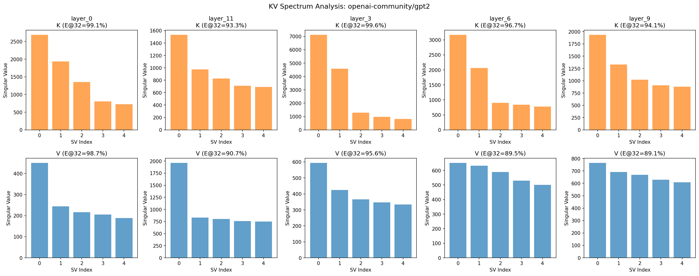
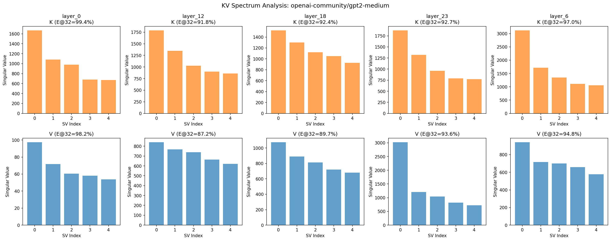
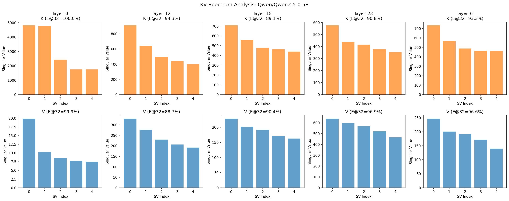

# Cross-Model KV Spectrum Analysis

This document summarizes KV spectral analysis across multiple model architectures,
investigating whether low-rank KV cache compression is viable.

## Key Finding

**Raw K/V activations ARE low-rank** across all tested models (93-97% energy in
top-32 components). This contradicts the v31 finding that residual adapter
operators are near-identity.

The discrepancy reveals an important insight: the residual adapter formulation
`V_eff = V + s*W_out(W_in(V))` learns identity + small corrections, rather than
exploiting the empirically-observed low-rank structure of K/V activations.

## Cross-Model Comparison

| Model | K Energy@32 | V Energy@32 | K Eff.Rank | V Eff.Rank | Assessment |
|-------|-------------|-------------|------------|------------|------------|
| GPT-2 124M | 96.6% | 92.7% | 49.4 | 71.4 | Compressible |
| GPT-2 Medium | 94.6% | 92.7% | 63.6 | 74.2 | Compressible |
| Qwen2.5-0.5B | 93.5% | 94.5% | 58.2 | 57.8 | Compressible |

All models show >90% energy captured in top-32 singular values, suggesting that
PCA-based or direct low-rank projection could achieve significant compression.

## v31 vs v32: Resolving the Contradiction

**v31 Finding:** Residual adapter operator M = I + s*W_out@W_in is near-identity
- Condition number ~1.06-1.09
- Energy in top-32: ~50% (identity-like)
- Effective rank: 64 (full)

**v32 Finding:** Raw K/V activations are low-rank
- Energy in top-32: 93-97%
- Effective rank: 49-74

**Resolution:** The residual formulation forces the learned operator to approximate
identity because:
1. The `+ V` term already preserves full information
2. The adapter only learns small perturbations (~3-4% deviation)
3. Converting this near-identity operator to cache-mode via SVD fails catastrophically

## Implications

1. **Direct low-rank projection may work**: PCA on K/V activations, without the
   residual connection, could compress K/V to rank-32 while retaining 93%+ energy.

2. **The residual adapter paradigm is flawed for compression**: It's designed for
   fine-tuning (small corrections to existing weights), not for learning a
   fundamentally different representation.

3. **MLA may have the right architecture**: Multi-head Latent Attention directly
   projects K/V to a lower-dimensional latent space, avoiding the residual trap.

## Next Steps

1. Test direct PCA compression (no residual) on K/V activations
2. Measure quality impact of truncated PCA at various ranks
3. Compare to MLA's latent compression approach

## Visualization





## Running the Probe

```bash
python scripts/kv_spectrum_probe.py --model openai-community/gpt2 \
    --output kv_spectrum_gpt2.json --plot kv_spectrum_gpt2.png

python scripts/kv_spectrum_probe.py --model Qwen/Qwen2.5-0.5B \
    --layers 0,6,12,18,23 --output kv_spectrum_qwen.json
```
