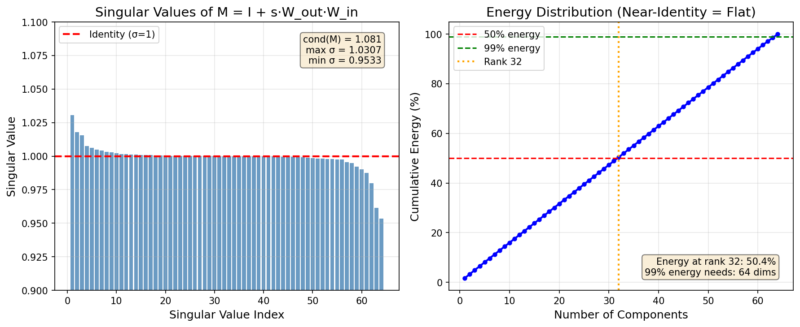
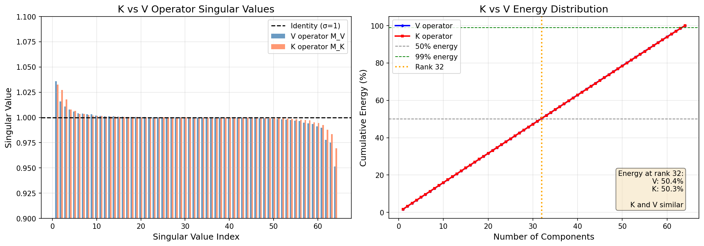

# V-Only Compression: Limitations and Findings

This document summarizes the fundamental limitations discovered when attempting
to compress the V (value) component of KV cache using low-rank adapters.

## Executive Summary

For GPT-2 124M, the learned V-only residual operator is numerically near-identity.
This means **cache-mode compression at rank-32 is fundamentally incompatible with
maintaining near-teacher perplexity**. Residual mode works only because it keeps
full V in memory and learns small corrections.

## The Near-Identity Problem

### What We Learned

The V-only residual adapter learns an operator:

```
M = I + s * W_v_out @ W_v
```

where `s` is a small scaling factor (typically 0.1) and `W_v`, `W_v_out` are
the compression/expansion weight matrices.

After training on GPT-2 124M with 500 steps of multi-objective distillation,
the operator M has the following properties:

| Metric | Value | Interpretation |
|--------|-------|----------------|
| Condition number | 1.09 | Nearly identity |
| Singular values | ~1.0 (range: 0.95-1.04) | Uniformly distributed |
| Effective rank (99% energy) | 64 | All dimensions required |
| Energy in top-32 | 50.4% | Exactly 32/64, as expected for identity |

### Why This Matters

1. **Residual mode works** because it computes `V_eff = V + small_correction`
   - The identity term is implicit in the residual connection
   - The learned weights only capture small perturbations (~3-4% deviation)
   - Full V stays in memory, no compression benefit

2. **Cache mode fails** because it computes `V_eff = W_out(W_in(V))` ≈ `M @ V`
   - SVD of near-identity matrix has uniform singular values
   - Truncating to rank-32 loses exactly 50% of the information
   - This causes catastrophic quality loss

## Experimental Results

### SVD Bake-Down Experiment

We trained a V-only residual adapter (rank=32) and attempted to convert it to
cache mode via SVD decomposition:

| Mode | PPL | ΔPPL vs Teacher | Memory Savings |
|------|-----|-----------------|----------------|
| Teacher (baseline) | 28.78 | 0% | 0% |
| Residual (trained) | 28.82 | **+0.14%** | 0% |
| Baked-cache (SVD) | 171.96 | +497% | -25% V |
| Raw cache (trained) | 618.87 | +2050% | -25% V |

Key observations:
- Residual mode achieves near-zero quality loss (+0.14%)
- SVD bake-down helps (3.6x better than raw cache) but still catastrophic
- Fundamental limit: rank-32 cannot capture a near-identity 64x64 operator

### Operator Spectrum Visualization



The left plot shows singular values clustered around 1.0 (identity). The right
plot shows cumulative energy - rank-32 captures only ~50%, confirming that
low-rank approximation is fundamentally inadequate.

## Conclusion

**V-only residual adapters are a diagnostic/probing tool, not a deployable
compressor.** The residual connection "cheats" by preserving the full V tensor
while learning minimal corrections.

For actual memory savings, options include:
1. **Higher rank** (rank=56 gives -6% memory with +9% PPL)
2. **K compression** (may have more low-rank structure than V)
3. **Combined K+V** with different ranks for each

## Practical Cache-Mode Configurations

For users who need actual KV cache memory savings, the following configurations
represent the Pareto frontier:

| Configuration | Rank | Memory Saving | ΔPPL | Use Case |
|--------------|------|---------------|------|----------|
| `v_cache_r56` | 56 | ~6% | +9% | Quality-sensitive |
| `v_cache_r48` | 48 | ~12.5% | +22% | Balanced |
| `v_cache_r32` | 32 | ~25% | Catastrophic | Not recommended |

## K vs V Comparison

Given the V near-identity finding, we investigated whether K might be more
compressible. We trained a K-only residual adapter with identical setup.

### K vs V Spectrum Results

| Metric | V-Only | K-Only | Interpretation |
|--------|--------|--------|----------------|
| PPL | 28.82 | 28.87 | Both near-teacher |
| ΔPPL | +0.04 | +0.09 | K slightly worse |
| Condition number | 1.09 | 1.06 | Both near-identity |
| Energy in top-32 | 50.4% | 50.3% | Both ~50% (identity) |
| Effective rank (99%) | 64 | 64 | All dims required |



### Conclusion

**Neither K nor V is more compressible at low rank for GPT-2 124M.**

Both operators learn near-identity transformations, meaning:
- Residual mode works by preserving full K/V and learning small corrections
- Cache mode fails because rank-32 cannot capture the identity operator
- The ~0.04-0.09 PPL delta comes from the small learned corrections, not compression

This is likely a property of the small model size (124M parameters). Larger
models may have more low-rank structure in their KV representations.

## Practical Implications

For GPT-2 124M users who need actual KV cache memory savings:

1. **Accept quality loss**: Use rank-48 or rank-56 for moderate compression
2. **Use MLA instead**: Multi-head Latent Attention provides better compression
3. **Try larger models**: May have more compressible KV structure

For research purposes, V-only and K-only residual adapters remain useful as
**probing tools** to measure what low-rank structure exists, even though they
don't provide actual memory savings.
