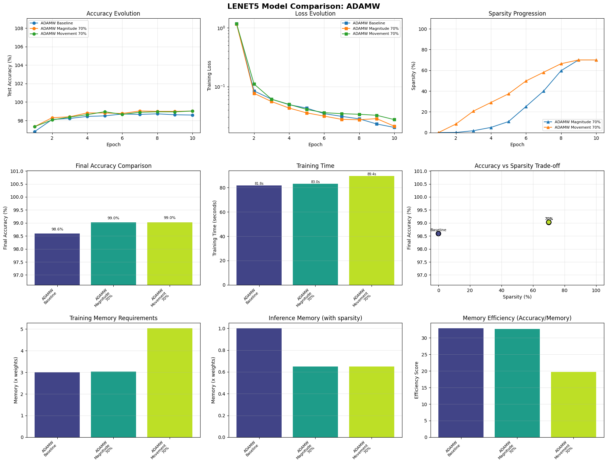
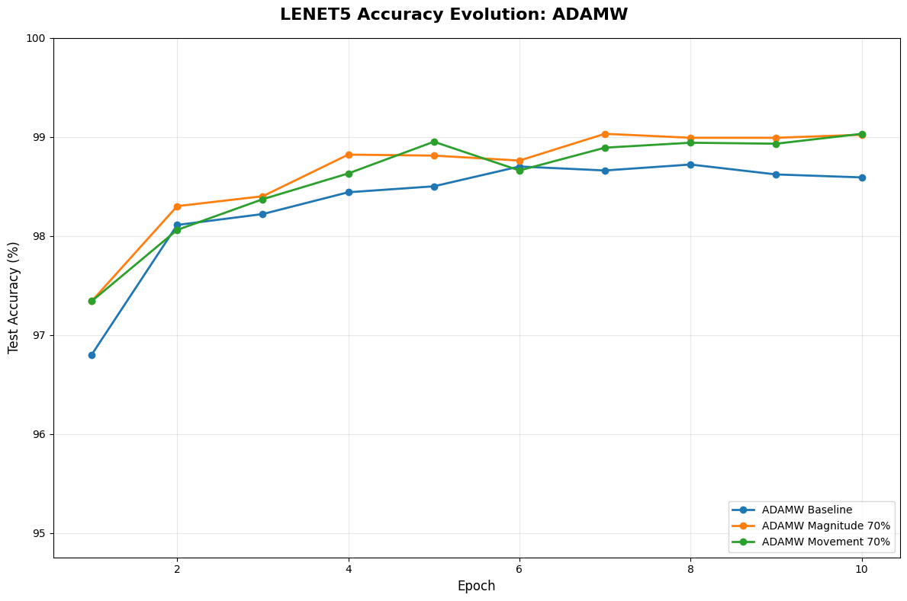
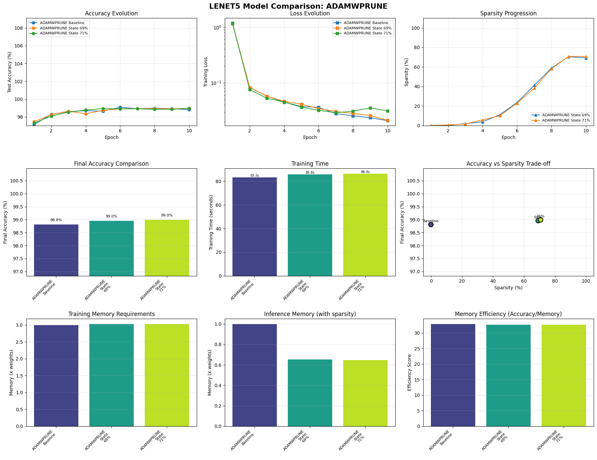
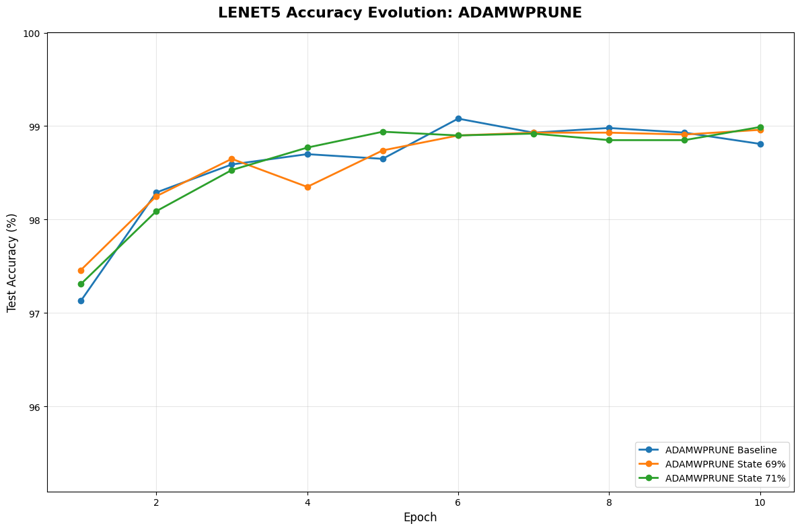

# LeNet-5 Findings

## Model Overview

LeNet-5 is a classic CNN architecture for MNIST digit classification with 61,750 parameters. This small model serves as our initial proof-of-concept for AdamWPrune's state-based pruning approach.

## Memory Overhead Analysis

Traditional movement pruning requires **extra memory** on top of optimizer states:
- **Importance scores**: 1 float per parameter to track weight importance
- **Binary masks**: 1 value per parameter to mark pruned/kept weights
- **Total overhead**: 1-2× model size in additional memory

**AdamWPrune's approach**: Reuses Adam's existing states for pruning decisions:
- `exp_avg` (momentum) → tracks weight importance
- `exp_avg_sq` (variance) → provides stability signals
- Requires only a boolean mask when pruning is enabled (1 byte/param)

### Memory Calculation (61,750 parameters, float32)
- Weights: ~247KB
- AdamW states: ~494KB (exp_avg + exp_avg_sq)
- Movement pruning buffers: ~741KB (scores + initial_weights + masks)
- AdamWPrune boolean mask: ~60KB

**Total memory at non-baseline sparsity levels:**
- **AdamW + movement pruning**: ~247KB + 494KB + 741KB ≈ 1,482KB
- **AdamWPrune**: ~247KB + 494KB + 60KB ≈ 801KB
- **Memory savings**: ~46% reduction in pruning overhead

## Performance Results

### AdamW Optimizer Comparison

*AdamW with magnitude and movement pruning at 70% sparsity*

*Accuracy progression across epochs for AdamW variants*

### AdamWPrune Variant Comparison (bitter0 vs bitter7)

*bitter0 (original state-based) vs bitter7 (variance-based) at 70% sparsity*

*Accuracy progression showing bitter0 and bitter7 variants*

**bitter Variant Results @ 70% Sparsity:**
- **bitter0 (original)**: 98.99% accuracy, 86.4s training time, 8.64s/epoch
- **bitter7 (variance)**: 98.96% accuracy, 85.8s training time, 8.58s/epoch
- **Difference**: Negligible (0.03% accuracy, 0.7% time) - variants perform identically on MNIST

The minimal difference between bitter0 and bitter7 on LeNet-5/MNIST is expected. MNIST is too simple to differentiate pruning importance metrics. bitter7's variance-based approach shows its value on complex models like GPT-2, where it achieves 15.6% better perplexity than magnitude baseline (37.28 vs 44.15 PPL).

## GPU Memory Comparison (Real Measurements)

### Actual GPU Memory Usage

With gputop.py integration, we have real GPU memory measurements for LeNet-5 from previous runs:

*Real GPU memory measurements across all optimizers and pruning configurations*

### Key Findings from Real Measurements

**GPU Memory at 70% Sparsity:**
- SGD + Movement: ~442 MiB
- AdamW + Movement: ~452 MiB
- Adam + Movement: ~456 MiB
- AdamWPrune + State: ~461 MiB

**Why the minimal differences?**
1. **CUDA/PyTorch Overhead Dominates**: The baseline ~440-460 MiB is mostly framework overhead, not model-specific memory
2. **Model Too Small**: LeNet-5's 61K parameters are negligible compared to the framework's baseline memory allocation
3. **Memory Allocation Granularity**: PyTorch allocates memory in chunks, masking small differences
4. **Validation with ResNet-18**: This hypothesis is proven by ResNet-18 results, where the 180× larger model shows clear 7.5% memory savings with AdamWPrune

### Theoretical vs Actual

While theoretical calculations show ~46% reduction in pruning overhead buffers:
- **Theory**: AdamWPrune saves ~681KB vs movement pruning
- **Practice**: Differences are lost in the ~450 MiB CUDA baseline

This perfectly demonstrates why larger models like ResNet-18 are necessary to validate memory efficiency claims.

## Key Findings

1. **Accuracy Maintained**: AdamWPrune achieves comparable accuracy to movement pruning across all sparsity levels
2. **Memory Efficient**: ~46% reduction in pruning overhead by reusing optimizer states
3. **bitter Variants Equivalent on MNIST**: bitter0 and bitter7 show negligible differences (98.99% vs 98.96%) on simple tasks
4. **Scalability Potential**: While LeNet-5 is too small for meaningful GPU memory impact, the approach shows promise for larger models
5. **Simplicity**: No additional hyperparameters or buffers beyond a boolean mask

## Limitations

- LeNet-5's small size (61,750 parameters) makes GPU memory impact negligible
- MNIST is too simple to differentiate pruning importance metrics between bitter variants
- bitter7's variance-based pruning advantages emerge on complex models (GPT-2 shows 15.6% perplexity improvement)

## bitter Variant Analysis Complete

CPU-based testing confirms bitter0 and bitter7 perform identically on LeNet-5/MNIST. Future GPU-based testing on larger models (ResNet-18, ResNet-50) will validate memory efficiency claims and may reveal performance differences between variants on more complex datasets.
