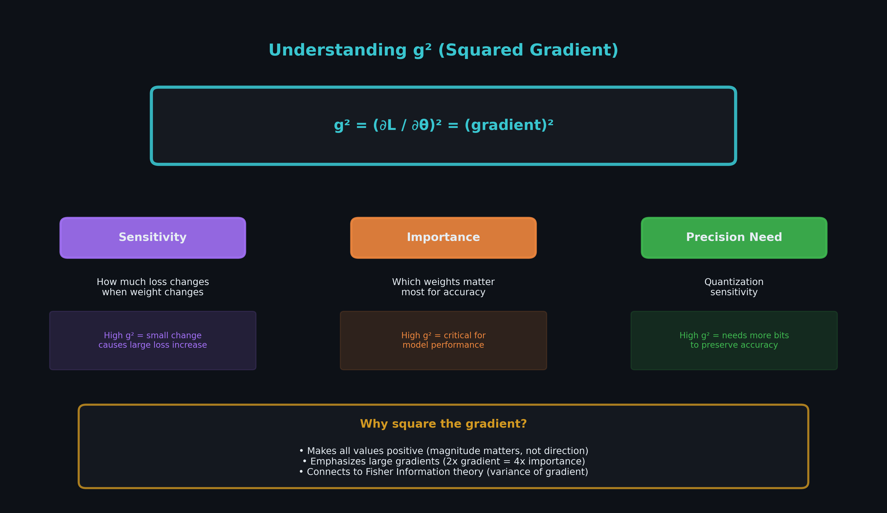
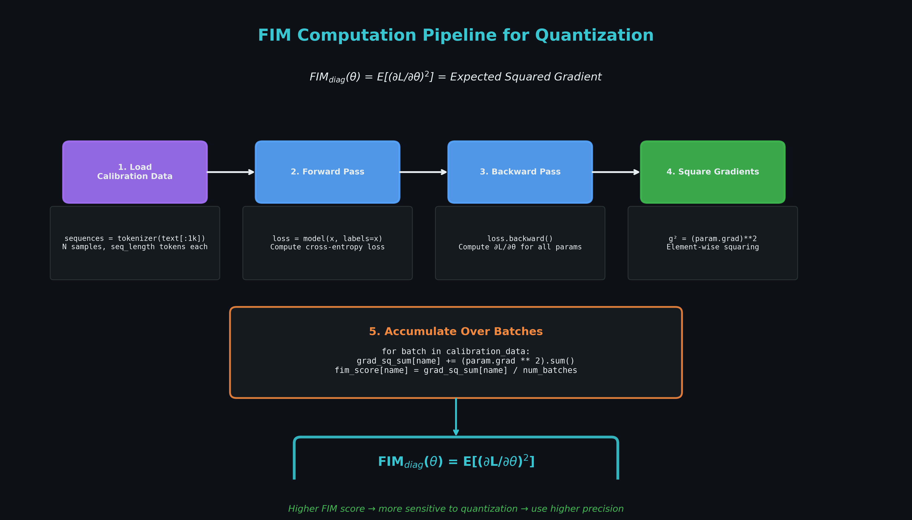
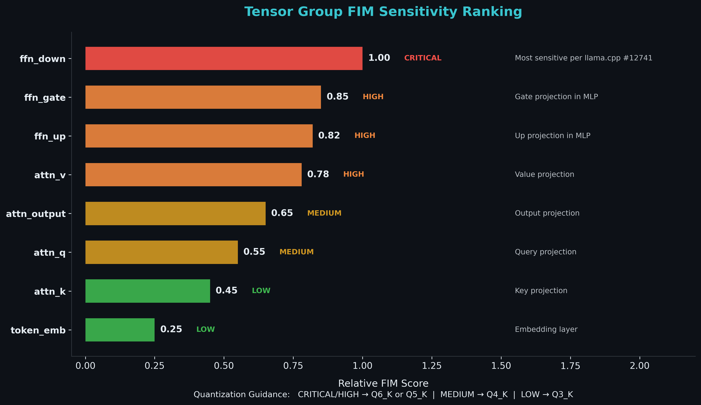
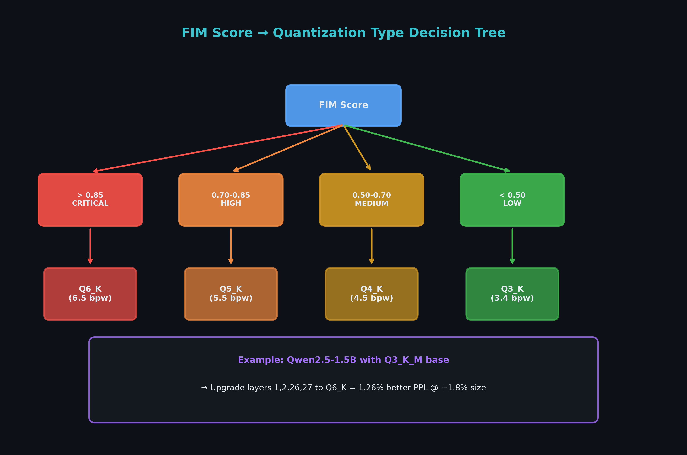
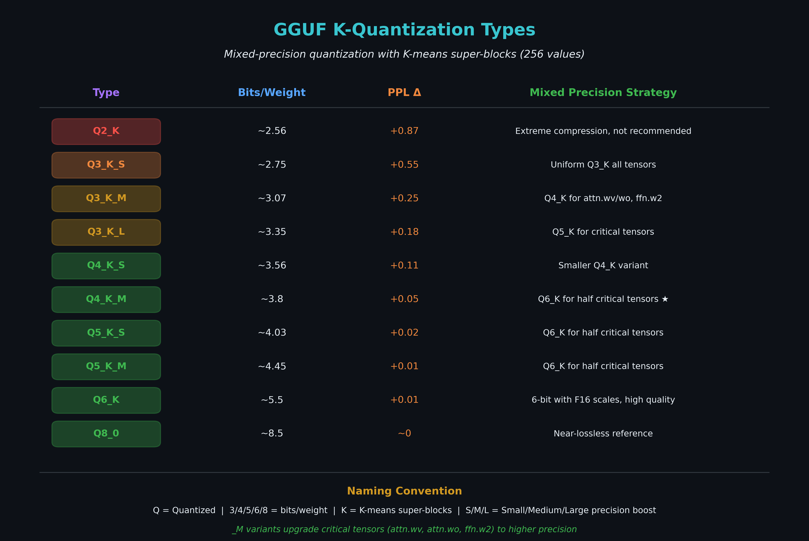
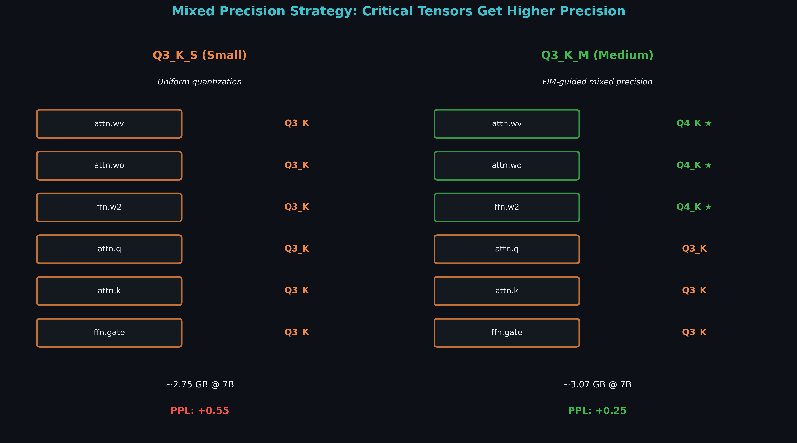

# Mobile Weight Packing: GGUF Analysis and FIM-Guided Quantization

## The Problem: mmap and I/O Patterns

Mobile inference frameworks load models via `mmap()`, mapping files directly
into virtual memory. This avoids copying but makes I/O patterns critical:

```c
// TensorFlow Lite NNAPI delegate uses mmap for weight sharing
mmap(nullptr, size, PROT_READ | PROT_WRITE, MAP_SHARED, fd, 0);
```

During inference:
1. Model file is memory-mapped (no immediate read)
2. Weight accesses trigger page faults → disk reads
3. Sequential access enables OS prefetching (3-7 GB/s on NVMe)
4. Random access defeats prefetching (0.5-1 GB/s)

The 3-7x throughput difference directly impacts first-token latency.

## Finding: GGUF is Already Optimal

We analyzed tensor layout in common formats to understand read patterns.

### GGUF Layout

GGUF arranges tensors sequentially by layer, matching forward-pass order:

```
output.weight → token_embd.weight → blk.0.* → blk.1.* → blk.2.* → ...
```

This provides:
- Sequential I/O during inference (OS prefetches ahead)
- High throughput (3-7 GB/s vs 0.5-1 GB/s random)
- Built-in quantization (Q4_K_M = 3x smaller than F16)

### safetensors Layout

safetensors uses hash/alphabetical ordering, causing random seeks:

```
h.3.attn.c_proj.bias → h.2.mlp.c_fc.bias → h.3.mlp.c_proj.bias → ...
```

This defeats OS prefetching during forward pass.

### Recommendation

For mobile inference, convert to GGUF:

```bash
python llama.cpp/convert-hf-to-gguf.py \
    --model Llama-2-7b \
    --outfile llama2-7b-q4_k_m.gguf \
    --outtype q4_k_m
```

This provides optimal layout AND quantization in one step.

## FIM-Guided Quantization

Since GGUF layout is already optimal, we investigated improving GGUF
quality through FIM-guided mixed-precision quantization.

**Interactive visualization**: [FIM-Guided Quantization Demo](https://mcgrof.github.io/knlp/fim_quantization_visualization.html)
shows how g² identifies sensitive weights and guides precision allocation.

### What is g² (Squared Gradient)?

FIM uses the squared gradient to measure weight importance. The core idea:



The diagonal Fisher Information Matrix approximation:

```
FIM_diag(θ) = E[(∂L/∂θ)²]
```

Weights with high g² values:
- **Sensitivity**: Small changes cause large loss increases
- **Importance**: Critical for model accuracy
- **Precision Need**: Require more bits to preserve accuracy

### FIM Computation Pipeline

The FIM computation runs on calibration data to identify sensitive weights:



```bash
# FIM-guided quantization pipeline
scripts/fim_score.py        # Compute per-layer FIM importance
scripts/plan_quant.py       # Select top-K% layers for upgrade
scripts/emit_llama_quantize_cmd.py  # Generate llama-quantize commands
scripts/run_eval.py         # Evaluate perplexity
```

### Tensor Sensitivity Ranking

Different tensor types show different sensitivity to quantization error:



Key findings:
- **ffn_down** is most critical (referenced in llama.cpp #12741)
- **ffn_gate/ffn_up** and **attn_v** are highly sensitive
- **token_emb** and **attn_k** can tolerate aggressive compression

### FIM Score → Quantization Mapping

Use FIM scores to select appropriate quantization precision:



### GGUF K-Quantization Types

GGUF provides multiple quantization levels with different quality/size tradeoffs:



The `_M` (Medium) variants already apply mixed precision to critical tensors,
which is why FIM-guided improvements are largest for aggressive `_S` variants.

### Uniform vs FIM-Guided Mixed Precision

The key insight: allocate precision budget based on FIM scores:



- **Uniform (Q3_K_S)**: All tensors get Q3_K → smaller but lower quality
- **FIM-guided (Q3_K_M)**: Critical tensors upgraded → 2x better PPL delta

### Results: Qwen2.5-1.5B

FIM identified layers 1, 2, 26, 27 as highest FFN importance (early + late
layers, consistent with known transformer sensitivity patterns):

| Quantization | Size | PPL | vs Naive |
|--------------|------|-----|----------|
| F16 baseline | 2.9 GB | 10.05 | - |
| Q4_K_M naive | 941 MB | 10.39 | - |
| Q3_K_M naive | 786 MB | 12.02 | baseline |
| Q3_K_M + FIM | 800 MB | 11.87 | **-1.26%** |

Upgrading just 4 layers' `ffn_down` tensors from q3_K to q6_K achieves
1.26% better perplexity at only 1.8% size increase.

### Validation: Q4_K_M Already Uses FIM-Optimal Precision

Q4_K_M showed no improvement because llama.cpp already upgrades
FIM-identified layers:

```
Q4_K_M default q6_K layers: 0,1,2,5,8,11,14,17,20,23,24,25,26,27
FIM-identified critical:    1,2,26,27
```

This validates that FIM correctly identifies the same layers llama.cpp
developers found empirically. Both methods converge on early/late layers
as most quantization-sensitive.

### llama.cpp Tensor-Type Overrides

The `--tensor-type` option enables per-tensor precision control:

```bash
llama-quantize \
  --tensor-type "blk.1.ffn_down=q6_K" \
  --tensor-type "blk.2.ffn_down=q6_K" \
  --tensor-type "blk.26.ffn_down=q6_K" \
  --tensor-type "blk.27.ffn_down=q6_K" \
  model-f16.gguf model-q3_k_m-fim.gguf Q3_K_M
```

### When FIM-Guided Quantization Helps

FIM guidance is most valuable for aggressive quantization (Q3, Q2) where
uniform precision causes significant quality loss. By concentrating
precision budget on critical layers:

1. Use lower base quantization (smaller model)
2. Upgrade only critical layers (minimal size increase)
3. Recover quality loss (better accuracy/size tradeoff)

For Q4_K_M, llama.cpp defaults are already near-optimal.

## Summary

| Goal | Solution |
|------|----------|
| Optimal I/O layout | Use GGUF (already sequential) |
| Better quality at Q3/Q2 | FIM-guided precision allocation |
| safetensors required | Convert to GGUF or repack |

GGUF with FIM-guided quantization provides the best mobile inference
path: optimal layout, aggressive compression, and preserved quality
on critical layers.

## Results

Evaluation data in `fim_quant_qwen/`:
- `fim_scores.json` - Per-tensor FIM importance scores
- `quant_plan.json` - Layer upgrade plan
- `eval_results_final.json` - Perplexity measurements

## References

- [llama.cpp GGUF format](https://github.com/ggerganov/llama.cpp)
- [TensorFlow Lite mmap](https://github.com/tensorflow/tensorflow/blob/master/tensorflow/lite/delegates/nnapi/nnapi_delegate.cc)
- [FIM Analysis](FIM.md) - Fisher Information Matrix for compression
