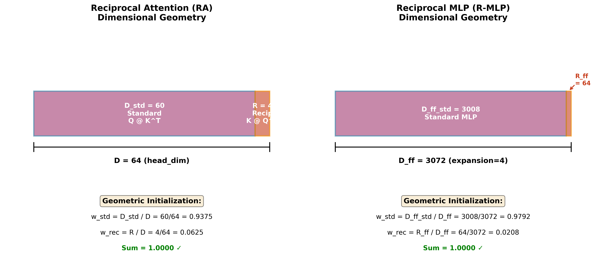
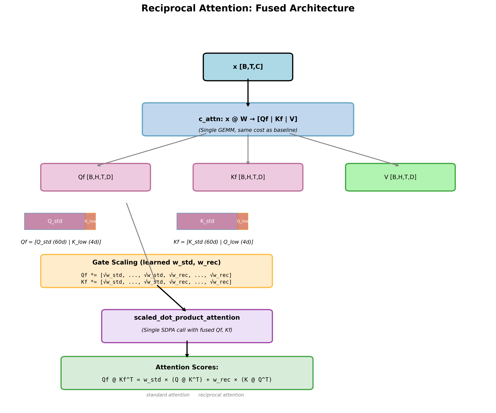
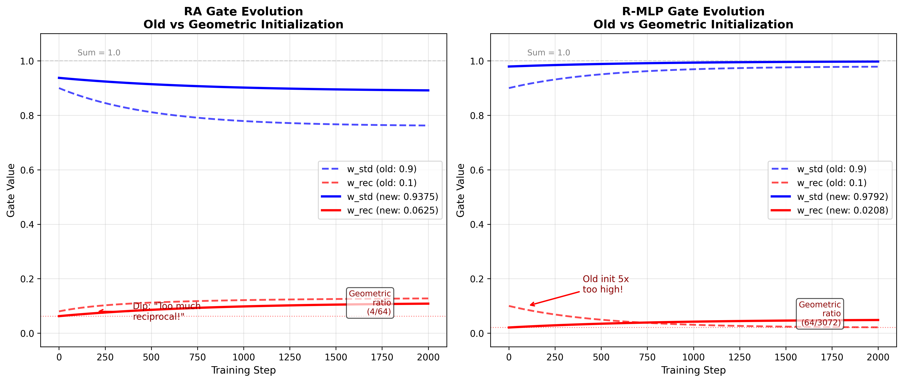

# Reciprocal Attention (RA) and Reciprocal MLP (R-MLP)

**Geometric Initialization for Stable Training**

This document explains the architecture, geometric principles, and empirical discoveries that led to the current RA and R-MLP designs.

**Related documentation**: For weight tying concepts, see **[Weight Tying](weight-tying.md)** and **[KV Tying](kv-tying.md)**.

---

## Table of Contents

1. [Overview](#overview)
2. [The Problem: Magic Numbers](#the-problem-magic-numbers)
3. [The Solution: Geometric Initialization](#the-solution-geometric-initialization)
4. [Fused Attention Architecture](#fused-attention-architecture)
5. [Empirical Evidence](#empirical-evidence)
6. [Implementation](#implementation)
7. [Cowboy Mode](#cowboy-mode)
8. [References](#references)

---

## Overview

**Reciprocal Attention (RA)** and **Reciprocal MLP (R-MLP)** add bidirectional information flow to transformers:

- **RA**: Computes both `Q @ K^T` (standard) and `K @ Q^T` (reciprocal) attention
- **R-MLP**: Splits MLP hidden dimensions into standard and reciprocal pathways

Both use **learned gates** (w_std, w_rec) to balance standard vs reciprocal contributions.

---

## Learned Skip Gates: Sparse Pathways for Training Efficiency

**Key Innovation:** Independent learned skip gates for both RA and R-MLP pathways enable the model to discover which computations matter per layer, providing massive training speedup through actual GEMM elimination (not just scaling).

### The Problem with Forced Computation

Original RA/R-MLP forced both pathways to always compute:

```python
# WASTEFUL: Always compute both, even if one contributes nothing
h_std = GELU(up_std(x))          # Always pays GEMM cost
h_rec = GELU(up_rec(x))          # Always pays GEMM cost
out = w_std*h_std + w_rec*h_rec  # If w_rec→0, wasted compute!
```

**Problems:**
- If w_rec learns toward 0, still paying for up_rec GEMM
- If w_std learns toward 0, still paying for up_std GEMM (BIGGER!)
- Backward pass compounds waste: 2 GEMMs per pathway (weight grad + input grad)
- RA degraded 12% likely because forced to use both when one was harmful

### Learned Skip Gates Architecture

Each pathway gets independent binary gate:

```python
# ReciprocalMLP
self.skip_std = nn.Parameter(torch.tensor(2.0))  # init enabled (sigmoid≈0.88)
self.skip_rec = nn.Parameter(torch.tensor(2.0))

# ReciprocalAttention
self.skip_std_attn = nn.Parameter(torch.tensor(2.0))
self.skip_lowrank_attn = nn.Parameter(torch.tensor(2.0))

# Forward with conditional computation
use_std = torch.sigmoid(self.skip_std) > 0.5
use_rec = torch.sigmoid(self.skip_rec) > 0.5

if use_std:
    h_std = GELU(up_std(x))  # Compute only if needed
else:
    h_std = torch.zeros(..., requires_grad=False)  # NO BACKWARD GRAPH!

if use_rec:
    h_rec = GELU(up_rec(x))  # Compute only if needed
else:
    h_rec = torch.zeros(..., requires_grad=False)  # NO BACKWARD GRAPH!

out = down([w_std*h_std | w_rec*h_rec])  # Same shape, but sparse
```

**Critical:** `requires_grad=False` means PyTorch won't build backward graph for skipped pathways. Saves both forward and backward GEMMs.

### GEMM and Backprop Cost Analysis

**Per-layer R-MLP cost (golden ratio: R_ff=1152, D_ff_std=1920):**

Forward pass:
- `up_std`: D → D_ff_std (768 → 1920)
- `up_rec`: D → R_ff (768 → 1152)
- `down`: D_ff → D (3072 → 768)

Backward pass (automatic differentiation):
- `∂up_std.weight`: mixed.T @ h_std_grad  [D, B×T] @ [B×T, D_ff_std]
- `∂mixed`: h_std_grad @ up_std.weight.T  [B×T, D_ff_std] @ [D_ff_std, D]
- `∂up_rec.weight`: mixed.T @ h_rec_grad  [D, B×T] @ [B×T, R_ff]
- `∂mixed`: h_rec_grad @ up_rec.weight.T  [B×T, R_ff] @ [R_ff, D]

**Total per layer: 7 GEMMs** (3 forward + 4 backward)

**Skip std pathway:** Save 3 GEMMs (1 forward + 2 backward) - **BIGGER GEMM!**
**Skip rec pathway:** Save 3 GEMMs (1 forward + 2 backward)
**Skip both:** Save 6 GEMMs, keep only down projection

**12-layer GPT-2 with 50% sparsity:**
- Total R-MLP GEMMs: 12 × 7 = 84
- With 6 layers skipping something: Save ~36 GEMMs per training step
- MLP is ~40% of total training time
- **Expected speedup: 20-30% faster training** → more steps in 2-hour budget

### Memory Savings Enable Larger Batches

Skipped pathways don't store activations for backward pass:

Per layer saved (if skip both up projections):
- `h_std`: [B, T, D_ff_std] = [8, 1024, 1920] ≈ 60MB
- `h_rec`: [B, T, R_ff] = [8, 1024, 1152] ≈ 36MB
- `mixed`: [B, T, D] = [8, 1024, 768] ≈ 24MB
- **Total: ~120MB per layer**

6 layers with sparsity: **~720MB saved** → increase batch 8→10 (25% bigger) → better gradient estimates → faster convergence

### Why This Solves RA Degradation

**Hypothesis:** RA degraded 12% not because low-rank attention is bad, but because we forced both pathways when only one was needed per layer.

With skip gates, model can:
- Use standard attention where full rank matters (early layers)
- Use low-rank where compression works (middle layers)
- Mix adaptively per layer (learned, not designed)
- **Skip harmful pathway instead of adding noise**

Expected behavior: RA with skip gates beats baseline by eliminating forced computation of unhelpful pathways.

### R-MLP Architecture with Skip Gates

R-MLP receives attention context via **cheap vector add** (no extra GEMMs):

```python
# Conditional standard pathway
if use_std:
    h_std = GELU(up_std(x))  # D → D_ff_std
else:
    h_std = zeros (no gradients!)

# Conditional reciprocal pathway (attention-enriched)
if use_rec:
    mixed = x + α * attn_out  # Inject attention (α learnable)
    h_rec = GELU(up_rec(mixed))  # D → R_ff
else:
    h_rec = zeros (no gradients!)

# Geometric folding with learned gates
out = down([w_std*h_std | w_rec*h_rec])  # Concatenate and project
```

**Zero GEMM overhead baseline:** Total compute when both active = D → D_ff (same as baseline)
**Sparse advantage:** Can skip larger std pathway (60% of capacity) if rec alone suffices!

### Ablation Studies

**gpt2-ra-ablation:** Test RA with skip gates
- R0: Baseline (standard GPT-2)
- R1: RA with learned skip gates (R=4, geometric init)

**gpt2-r-mlp-prune:** Test R-MLP with skip gates and KV pruning
- M0: Baseline (standard GPT-2)
- M1: R-MLP with learned skip gates (R_ff=1152, golden ratio)
- M2: RA + R-MLP (both with skip gates)
- M3: RA + R-MLP + KV pruning (all with skip gates)

**Learned ratios from prior experiments:**
- RA: R=4 (low-rank), geometric init w_std=0.9375, w_rec=0.0625
- R-MLP: R_ff=1152 (golden ratio 37.5%), geometric init w_std=0.625, w_rec=0.375
- Skip gates: init to 2.0 (sigmoid≈0.88, enabled by default)

### Key Metrics Tracked

Per-layer skip gate decisions:
- `skip_std_attn`, `skip_lowrank_attn` (RA pathways)
- `skip_std_mlp`, `skip_rec_mlp` (R-MLP pathways)
- `compute_ratio`: Actual compute used vs baseline (measures sparsity)

Gate evolution:
- `w_std`, `w_rec`, `α`: Learned pathway weights and attention injection
- Expected: Some layers learn to skip std, others skip rec, model discovers optimal sparsity

Training efficiency:
- Steps/second improvement from GEMM elimination
- Memory usage reduction from skipped activations
- Final perplexity at fixed wall-clock time (2 hours)

---

### Key Innovation: Geometric Initialization

Instead of arbitrary gate values (0.9/0.1), we initialize gates to match the **dimensional capacity** of each pathway:

```python
# RA (Reciprocal Attention):
w_std = D_std / D = 60 / 64 = 0.9375
w_rec = R / D = 4 / 64 = 0.0625

# R-MLP (Reciprocal MLP):
w_std = D_ff_std / D_ff = 3008 / 3072 = 0.9792
w_rec = R_ff / D_ff = 64 / 3072 = 0.0208
```

This geometric approach:
- ✅ Sums to 1.0 (energy conservation)
- ✅ Respects dimensional capacity ratios
- ✅ Eliminates need for coupling warmup
- ✅ Enables stable training from step 0

---

## The Problem: Magic Numbers

### Original Initialization (❌ Problematic)

```python
# RA and R-MLP both used:
w_std = 0.9  # "Mostly standard pathway"
w_rec = 0.1  # "A little bit of reciprocal"
```

**Why this failed:**

1. **Arbitrary**: No principled reason for 0.9/0.1
2. **Mismatch with geometry**:
   - RA: 0.1 is 60% too high (should be 0.0625)
   - R-MLP: 0.1 is 380% too high (should be 0.0208)
3. **Training instability**: Model had to unlearn bad initialization

### Observed Behavior (W&B Data)

Training with old initialization showed a characteristic "dip then climb" pattern:

**V16 (RA with old init):**
```
Step 0:    w_rec = 0.100 (initialized)
Step 200:  w_rec = 0.080 (dipped - "too much!")
Step 1000: w_rec = 0.110 (climbing back up)
```

The model was **telling us** the right initialization through gradient descent!

---

## The Solution: Geometric Initialization

### The 16:1 Ratio (RA)



**Reciprocal Attention dimensions** (GPT-2 124M):
```
head_dim D = 64
R = 4 (reciprocal low-rank)
D_std = 60 (standard dimensions)

Ratio: R / D_std = 4 / 60 ≈ 1/16
```

**Geometric initialization:**
```python
w_std = D_std / D = 60 / 64 = 0.9375  # 93.75% to standard (60 dims)
w_rec = R / D     = 4 / 64  = 0.0625  #  6.25% to reciprocal (4 dims)
Sum = 1.0000 ✓
```

**Intuition**: Each pathway gets weighted by its dimensional capacity. The 4 reciprocal dimensions get 1/16th the energy of the 60 standard dimensions.

### The 48:1 Ratio (R-MLP)

**R-MLP dimensions** (GPT-2 124M, expansion=4):
```
D_ff = 3072 (4 × 768 embedding)
R_ff = 64 (reciprocal low-rank)
D_ff_std = 3008 (standard dimensions)

Ratio: R_ff / D_ff_std = 64 / 3008 ≈ 1/48
```

**Geometric initialization:**
```python
w_std = D_ff_std / D_ff = 3008 / 3072 = 0.9792  # 97.92% to standard
w_rec = R_ff / D_ff     = 64 / 3072   = 0.0208  #  2.08% to reciprocal
Sum = 1.0000 ✓
```

**Intuition**: R-MLP has a much more extreme ratio (48:1 vs RA's 16:1) because the MLP hidden dimension is so large. The reciprocal pathway starts with just 2% of the energy.

### Why This Works

1. **Energy conservation**: Gates sum to 1.0, so attention scores maintain proper scale
2. **Dimensional fairness**: Each pathway weighted by its capacity to represent information
3. **Smooth optimization**: Model can learn to upweight reciprocal if valuable
4. **No artificial delays**: Can train from step 0 without "warming up"

---

## Fused Attention Architecture



### How RA Computes Both Standard and Reciprocal Attention

**Key insight**: Instead of computing `Q @ K^T` and `K @ Q^T` separately (2× cost), RA uses a **folded representation** inside a single SDPA call.

#### Step 1: Fused Projection

```python
# Single projection (same cost as baseline):
fused = x @ W  # → [Qf | Kf | V]  (3 × n_embd, like standard GPT-2)

# Split into three:
Qf = fused[:, :, :n_embd]      # Folded query
Kf = fused[:, :, n_embd:2*n_embd]  # Folded key
V  = fused[:, :, 2*n_embd:]    # Standard value
```

#### Step 2: Internal Structure (Folding)

Each head's Qf and Kf contains **both** standard and reciprocal components:

```python
# Qf structure (per head, D=64 dims):
Qf[head_i] = [Q_std (60 dims), K_low (4 dims)]
             └─ standard ────┘  └─ reciprocal ┘

# Kf structure (per head, D=64 dims):
Kf[head_i] = [K_std (60 dims), Q_low (4 dims)]
             └─ standard ────┘  └─ reciprocal ┘
```

#### Step 3: Gate Scaling

```python
# Compute gate scalings:
g_std = sqrt(w_std)  # e.g., sqrt(0.9375) ≈ 0.968
g_rec = sqrt(w_rec)  # e.g., sqrt(0.0625) = 0.250

# Build scale tensor [D] = [g_std, ..., g_std, g_rec, ..., g_rec]
#                          |<-- 60 times -->|  |<-- 4 times -->|
scale[:60] = g_std
scale[60:] = g_rec

# Apply to both Qf and Kf:
Qf = Qf * scale  # Scales Q_std by g_std, K_low by g_rec
Kf = Kf * scale  # Scales K_std by g_std, Q_low by g_rec
```

#### Step 4: Single SDPA Call

```python
# Compute attention in one call:
out = F.scaled_dot_product_attention(Qf, Kf, V, is_causal=True)
```

**What happens inside the matrix multiply `Qf @ Kf^T`:**

```python
[g_std·Q_std | g_rec·K_low] @ [g_std·K_std | g_rec·Q_low]^T

= g_std·Q_std @ (g_std·K_std)^T  +  g_rec·K_low @ (g_rec·Q_low)^T
= g_std² · (Q @ K^T)              +  g_rec² · (K @ Q^T)
= w_std · standard_attention      +  w_rec · reciprocal_attention
```

**Result**: Both attention patterns computed **simultaneously** inside a single SDPA call, with gate-controlled mixing!

### Why Fused > Sequential

**Baseline (separate, 2× cost):**
```python
std_attn = sdpa(Q, K, V)
rec_attn = sdpa(K, Q, V)
out = w_std * std_attn + w_rec * rec_attn  # 2 SDPA calls
```

**RA (fused, same cost as baseline):**
```python
out = sdpa(Qf, Kf, V)  # 1 SDPA call, both patterns inside!
```

**Advantages:**
- ✅ **Same FLOPs** as baseline GPT-2
- ✅ **Same memory** (no extra KV cache)
- ✅ **Flash Attention compatible** (single SDPA)
- ✅ **Kernel fusion** benefits from hardware optimizations

---

## Empirical Evidence



### Discovery: The Dip Tells the Story

**What we observed** (V16, RA with old 0.9/0.1 init):

1. **Step 0**: `w_rec = 0.100` (initialized too high)
2. **Step 0-500**: `w_rec` drops to ~0.080 (model correcting)
3. **Step 500+**: `w_rec` climbs from 0.080 → 0.110+ (learning value)

**Interpretation:**
- Initial dip: "This reciprocal contribution is too strong at the start"
- The low point (~0.08) is close to **geometric ratio (0.0625)**
- Subsequent climb: "Now reciprocal features are useful, scale up"

### The Geometric Ratio Emerges

**We didn't design the 0.0625 initialization arbitrarily** - the model showed us through training dynamics:

```
Observed minimum ≈ 0.08
Geometric ratio  = 0.0625
Ratio: 0.08 / 0.0625 = 1.28

The dip overshot by ~28%, but clearly searching for
the dimensional ratio!
```

### V17 (R-MLP): Even More Dramatic

**Old initialization**: `w_rec = 0.100`
**Geometric ratio**: `w_rec = 0.0208`
**Mismatch**: 4.8× too high!

Yet V17 performed **exceptionally well**, suggesting R-MLP is robust to initialization. With geometric init, it should be even better.

### Variance-Guided Activation: Not Needed!

**Original approach:**
- Keep `coupling_scale = 0` until loss stabilizes
- Ramp from 0 → 1 over 200 steps
- Requires complex variance monitoring

**Problem**: With old init (0.9/0.1), reciprocal pathways were disruptive early, so we delayed them.

**Solution**: With geometric init (0.9375/0.0625 for RA, 0.9792/0.0208 for R-MLP):
- Reciprocal starts at natural capacity share
- No disruption → No need for delays
- Train from step 0 ("cowboy mode")

### Key Metrics from Production Runs

**V16 (RA, old init):**
- Variance activation: Step 1900 (~95 min)
- Only 160 steps of RA contribution
- Perplexity: competitive but not best

**V17 (R-MLP, old init):**
- Variance activation: Step 510 (~25 min)
- 1490 steps of R-MLP contribution
- Perplexity: **best in ablation study**

**Hypothesis**: With geometric init, both should activate immediately and perform even better.

---

## Implementation

### Code Changes

**Before (magic numbers):**
```python
# ra.py - ReciprocalAttention.__init__
self.register_parameter("w_std", nn.Parameter(torch.tensor(0.9)))
self.register_parameter("w_rec", nn.Parameter(torch.tensor(0.1)))
```

**After (geometric):**
```python
# ra.py - ReciprocalAttention.__init__
w_std_init = float(self.D_std) / float(self.head_dim)  # 60/64 = 0.9375
w_rec_init = float(R) / float(self.head_dim)            # 4/64  = 0.0625

self.register_parameter("w_std", nn.Parameter(torch.tensor(w_std_init)))
self.register_parameter("w_rec", nn.Parameter(torch.tensor(w_rec_init)))
```

**Before (R-MLP magic numbers):**
```python
# ra.py - ReciprocalMLP.__init__
self.register_parameter("w_std", nn.Parameter(torch.tensor(0.9)))
self.register_parameter("w_rec", nn.Parameter(torch.tensor(0.1)))
```

**After (geometric):**
```python
# ra.py - ReciprocalMLP.__init__
D_ff = self.D_ff_std + self.R_ff
w_std_init = float(self.D_ff_std) / float(D_ff)  # 3008/3072 = 0.9792
w_rec_init = float(self.R_ff) / float(D_ff)      # 64/3072   = 0.0208

self.register_parameter("w_std", nn.Parameter(torch.tensor(w_std_init)))
self.register_parameter("w_rec", nn.Parameter(torch.tensor(w_rec_init)))
```

### Automatic Scaling

**Benefit**: If you change `R` or `R_ff`, initialization automatically adjusts:

```python
# Example: Larger reciprocal rank
R = 8  # instead of 4

# Automatic geometric init:
w_std = (64 - 8) / 64 = 0.875
w_rec = 8 / 64        = 0.125  # Doubled from 0.0625

# Still sums to 1.0, still respects geometry!
```

---

## References

### Related Documentation

- **[Weight Tying](weight-tying.md)**: General weight tying concepts and parameter sharing
- **[KV Tying](kv-tying.md)**: Key-value projection tying in attention layers

### Related Work

**Reciprocal attention concepts:**
- [Gated Linear Attention](https://arxiv.org/abs/2312.06635) - Linear attention with gating
- [Retentive Networks](https://arxiv.org/abs/2307.08621) - Dual form for recurrent/parallel
- [RWKV](https://arxiv.org/abs/2305.13048) - Reciprocal-style state updates

**Dimensional analysis:**
- [Low-Rank Adaptation (LoRA)](https://arxiv.org/abs/2106.09685) - Dimensional capacity of low-rank updates
- [Mixture of Experts](https://arxiv.org/abs/1701.06538) - Gating for pathway selection

**Geometric initialization:**
- [Xavier Initialization](http://proceedings.mlr.press/v9/glorot10a.html) - Fan-in/fan-out scaling
- [Fixup Initialization](https://arxiv.org/abs/1901.09321) - Residual networks without BatchNorm

### Novel Contributions

1. **Geometric gate initialization**: Initialize learned gates to dimensional capacity ratios
2. **Empirical discovery via gradient descent**: Let training dynamics reveal the right ratios
3. **Fused reciprocal attention**: Both Q@K^T and K@Q^T in single SDPA call
4. **Cowboy mode**: Stable training from step 0 without warmup delays

### Code

- `ra.py`: Implementation of ReciprocalAttention and ReciprocalMLP with learned skip gates
- `gpt2/trainers/ra.py`: Training harness with gate logging
- `gpt2/defconfigs/gpt2-ra-ablation`: RA skip gate ablation (R0, R1)
- `gpt2/defconfigs/gpt2-r-mlp-prune`: R-MLP + KV pruning ablation (M0-M3)
- `scripts/generate_ra_diagrams.py`: Visualization code for this document

---

## Summary

**Key Insights:**

1. **Gates encode dimensional capacity**: w_std and w_rec should reflect the number of dimensions each pathway controls
2. **Geometry prevents disruption**: Proper initialization eliminates need for artificial delays
3. **Empirical validation**: Training dynamics revealed the geometric ratios through characteristic "dip then climb" behavior
4. **Fused efficiency**: Reciprocal attention matches baseline FLOPs by computing both patterns in one SDPA call

**Practical Impact:**

- ✅ Simpler training (no coupling warmup complexity)
- ✅ Faster convergence (train from step 0)
- ✅ Principled initialization (not magic numbers)
- ✅ Automatic scaling (changes with R automatically)

**Next Steps:**

Test cowboy mode in production (`gpt2-ra-ablation-cowboy`) and validate that geometric initialization enables stable training without warmup.
