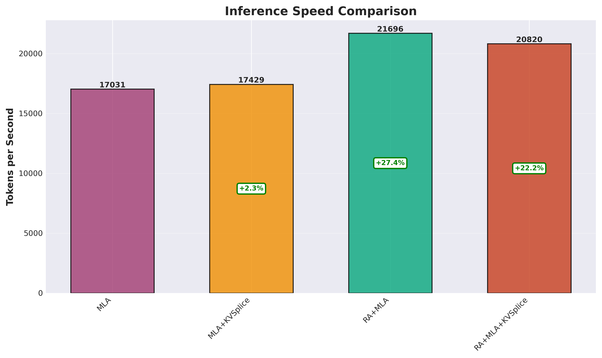
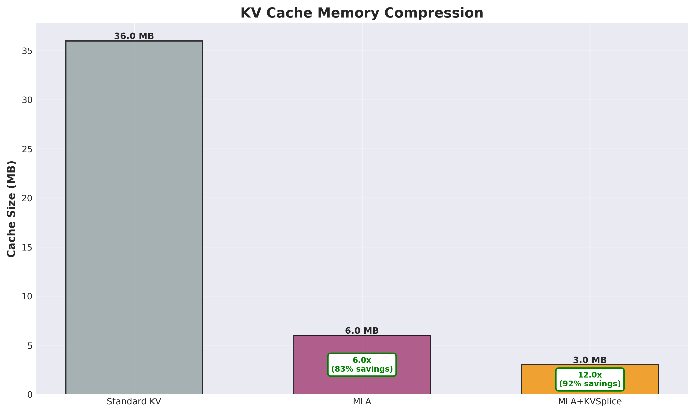
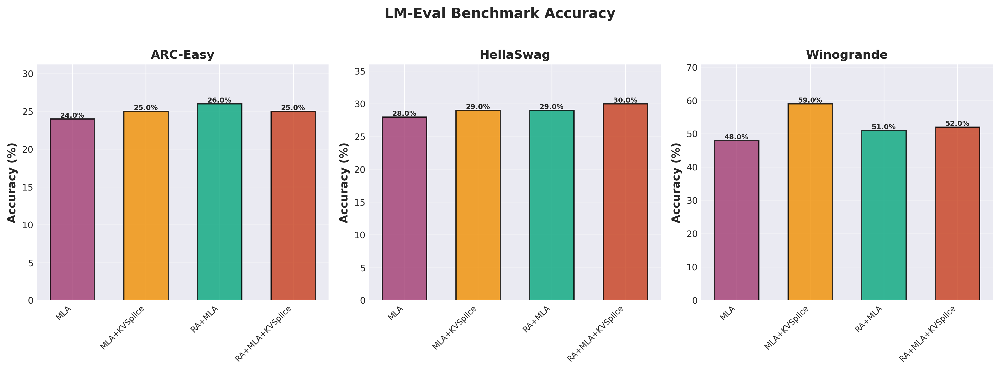
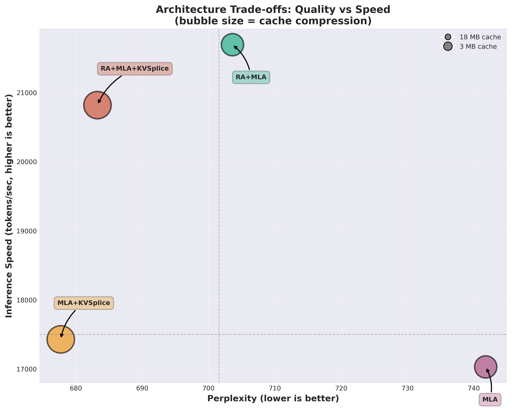

# Reciprocal Attention (RA) with Compute Routing

## The Core Insight

Not all tokens need the same computational effort. The distance between a
token's contextual hidden state and its static embedding measures "contextual
hardness":

```
shift = |x - E(x)|
```

- **Small shift**: Token stayed near its embedding. Context didn't reshape its
  meaning. Use cheap compute.
- **Large shift**: Token moved far from embedding. Highly context-dependent.
  Deserves full attention.

This gives us a FLOP-cheap routing signal without T^2 overhead.

## Architecture

### 1. Shared QKV with Head Groups

Single QKV projection, heads partitioned into FULL and RA groups:

```python
# Example: 12 heads total, ra_head_frac=0.25
# FULL heads: 0-8 (9 heads)
# RA heads: 9-11 (3 heads)

qkv = c_attn(x)                    # [B, T, 3D]
out = sdpa(q, k, v)                # Single SDPA for all heads
out_full = proj_full(heads[:9])    # [B, T, D]
out_ra = proj_ra(heads[9:])        # [B, T, D]
```

RA's cheapness: fewer heads = smaller output projection.

### 2. SDPA with Flash Attention

Uses PyTorch's `scaled_dot_product_attention` for efficient attention computation:

```python
out = F.scaled_dot_product_attention(
    q, k, v,
    attn_mask=None,
    dropout_p=dropout if training else 0.0,
    is_causal=True,  # Enables flash attention kernel
)
```

Benefits:
- Automatic kernel selection (flash attention when available)
- Memory efficient: O(T) instead of O(T^2) for attention matrix
- Fused operations: single CUDA kernel for QK^T, softmax, V multiply
- ~60% faster than manual matmul + softmax implementation

### 3. Context Router

2-way routing based on shift and other cheap features:

```python
shift = |x - E(x)|                 # [B, T]
features = [shift, ||x||, ||E||, <x,E>]
probs = softmax(mlp(features))     # [B, T, 2]
# probs: p_ra, p_full
```

Output mixed according to router:

```python
out = p_ra * out_ra + p_full * out_full
```

Compute penalty discourages expensive path:

```python
L_compute = lambda_comp * p_full.mean()
L_total = L_lm + L_compute
```

### 4. Warmup Phase

Phase 1: Full attention only (router OFF). Wait until shift becomes meaningful.
Phase 2: Enable routing after ~15% loss drop from initial.

```python
scheduler = WarmupScheduler(threshold=0.15)

# At each eval
if scheduler.should_transition(eval_loss):
    for block in model.blocks:
        block.set_phase(phase1=False)
```

### 5. Weight Tying

RA output projection initialized from FULL projection tail. Creates relationship
where RA learns compressed view. Since output_embeddings = E.T in most models,
RA and E span related subspaces.

## Design Rationale

**Why fewer heads (not smaller dimensions)?**
- Uniform head_dim = cleaner GPU kernels
- torch.compile sees static shapes
- RA cheapness from projection, not weird dimensions

**Why |x - E(x)|?**
- E(x) = context-free "default meaning"
- x = contextual representation
- Gap = how much context bent the token
- Cheap: just subtraction and norm

**Why 2-way routing?**
- RA: Cheap attention with fewer heads (e.g., 3 heads)
- FULL: Full attention with more heads (e.g., 9 heads)
- Simpler than 4-way: NONE rarely useful, BOTH loses information by averaging

## KVSplice Compatibility

Architecture preserves symmetry for KV cache compression:
- Same QK^T geometry for all heads
- Clean head group partitioning
- Router decisions don't affect attention structure
- Future: router confidence informs pruning aggressiveness

## LearnedKVSplice: Differentiable Compression

### What It Does

`LearnedKVSplice` is a simplified differentiable approximation of the original
KVSplice paper's spline+PCA approach:

```python
class LearnedKVSplice(nn.Module):
    def __init__(self, d_in: int, d_compressed: int):
        # Learned monotonic transform (replaces spline)
        self.transform_scale = nn.Parameter(torch.ones(d_in))
        self.transform_shift = nn.Parameter(torch.zeros(d_in))

        # Learned low-rank projection (replaces PCA)
        self.compress = nn.Linear(d_in, d_compressed, bias=False)
        self.expand = nn.Linear(d_compressed, d_in, bias=False)
```

**Forward pass:**
1. Apply learned monotonic transform: `x * softplus(scale) + shift`
2. Compress: linear projection to d_compressed
3. Expand: linear projection back to d_in
4. Inverse transform: undo the monotonic transform

### Why Not Actual PCA + Spline?

**Can we differentiate through PCA?** Yes, but expensive.

PyTorch's `torch.linalg.eigh` is differentiable, so gradients flow through
eigendecomposition. However:

- **Computational cost**: O(d³) per forward pass for eigendecomposition
- **Numerical instability**: Near-degenerate eigenvalues cause gradient issues
- **Memory**: Must store full covariance matrix

**Can we differentiate through splines?** Yes, cubic splines have closed-form
derivatives. But fitting splines at each forward pass is expensive.

### Current Approach: Learned Approximation

Instead of computing PCA/splines at each step, we learn projections that achieve
similar compression:

| Original KVSplice | LearnedKVSplice |
|-------------------|-----------------|
| Cubic spline geometry transform | Learned monotonic transform (softplus scale + shift) |
| PCA on transformed data | Learned orthogonal linear projection |
| Post-hoc compression | End-to-end differentiable |

**Advantages:**
- Much faster (single matrix multiply vs eigendecomposition)
- Learns task-specific compression (can outperform PCA)
- Stable gradients

**Disadvantages:**
- May not find optimal compression directions initially
- Requires training to converge

### Future: Hybrid Approach

A potential improvement is to use actual PCA/FIM during calibration, then
transfer those directions to initialize the learned projection:

```python
# Calibration phase (no gradients)
with torch.no_grad():
    # Collect latents over calibration samples
    latents = collect_latents(model, calibration_data)

    # Compute FIM or PCA
    U, S, _ = torch.linalg.svd(latents)
    top_directions = U[:, :d_compressed]

# Initialize learned projection with FIM/PCA directions
model.kvsplice.compress.weight.copy_(top_directions.T)
model.kvsplice.expand.weight.copy_(top_directions)

# Fine-tune end-to-end
train(model)
```

This gives principled initialization while maintaining fast differentiable
training.

### FIMKVSplice Alternative

For principled temporal compression (sequence dimension, not feature dimension),
use `FIMKVSplice` which computes Fisher Information Matrix-guided compression:

```python
from ra import FIMKVSplice

kvsplice = FIMKVSplice(cfg, rank=8)
K_compressed = kvsplice.compress(K, attn_probs)  # [B, H, r, D]
K_reconstructed = kvsplice.expand(K_compressed)   # [B, H, T, D]
```

This preserves information-critical temporal directions rather than just
variance, but is more expensive due to eigendecomposition.

## Usage

```python
from ra import RAConfig, RABlock, WarmupScheduler

cfg = RAConfig(
    d_model=768,
    n_heads=12,
    ra_head_frac=0.25,
    warmup_loss_drop=0.15,
)

# Replace attention in GPT-2 block
block = RABlock(cfg, layer_idx=0)

# In training loop
scheduler = WarmupScheduler(cfg.warmup_loss_drop)

# Forward
e_tok = embedding(input_ids)
out = block(x, e_tok=e_tok)

# Check phase transition at eval
if scheduler.should_transition(eval_loss):
    for block in model.blocks:
        block.set_phase(phase1=False)
    print("Phase 2: routing enabled")

# Compute penalty for loss (phase 2 only)
penalty = block.compute_penalty(x, e_tok)
loss = lm_loss + lambda_comp * penalty
```

## Configuration

```python
@dataclass
class RAConfig:
    d_model: int = 768           # Model dimension
    n_heads: int = 12            # Total heads
    block_size: int = 1024       # Max sequence length
    ra_head_frac: float = 0.25   # Fraction for RA group
    router_hidden: int = 16      # Router MLP hidden dim
    router_bias_full: float = -1.0  # Discourage expensive paths
    warmup_loss_drop: float = 0.15  # Trigger for phase 2
    tie_ra_proj: bool = True     # Init RA from FULL proj
    dropout: float = 0.0
```

### Quick Testing

To skip the RA warmup phase and enable routing from the start:

```bash
# CLI flag
python gpt2/train.py --architecture unified-ra --ra-step 1 --skip-ra-warmup

# Environment variable (for test matrix)
SKIP_RA_WARMUP=1 make
```

This is useful for quick validation that routing works correctly.

## Training Schedule

1. **Phase 1** (steps 0 to trigger): Full attention only
   - Router and RA routing disabled
   - Embeddings learn meaningful geometry
   - shift = |x - E(x)| becomes informative

2. **Trigger**: After ~15% eval loss drop
   - At least 2 evals completed
   - shift now correlates with contextual hardness

3. **Phase 2** (after trigger): Routing enabled
   - Router decides compute tier per token
   - Compute penalty encourages cheap paths
   - Model learns when full attention is worth it

## Experiments

### Baseline vs RA (1-hour each)

Compare GPT-2 124M:
- **Baseline**: All heads as FULL, no routing
- **RA**: Router decides, compute penalty active

Both use same code path through RABlock for fair comparison.
Baseline keeps phase1=True throughout; RA transitions to phase2.

Key metrics:
- Final eval loss/perplexity
- Average router distribution (p_ra, p_full)
- Compute penalty over training
- Loss curve smoothness at phase transition

## Experimental Results: Research Evolution

### Overview

Our research evolved through several architectural iterations, testing
different combinations of Multi-head Latent Attention (MLA), Reciprocal
Attention (RA), and KVSplice compression. All tests used identical
hyperparameters on GPT-2 124M trained on TinyStories.

**Test Results**: `test_matrix_results_20251123_231956/`
**W&B Project**: https://wandb.ai/mcgrof-citizen/gpt2-kvsplice-ablation-w7900-mla-fixed

### Evolution 1: GPT-2 + RA Learned Layers

**Status**: In progress

Tests pure RA mechanism without MLA or latent compression. Two variants:

- **B0**: Baseline GPT-2 (standard Q @ K.T attention)
- **RALEARN0**: GPT-2 + Learned Reciprocal Attention

RALEARN0 uses learned per-layer alternation with balance_loss to
encourage 50/50 split between standard and reciprocal attention. This
isolates RA's impact on inference speed and quality.

**Question**: Does RA's 27% inference speedup apply to pure GPT-2?

### Evolution 2: Router-Based RA

**Status**: Deprecated

Early approach using compute routing and head groups. Router decided
per-token compute tier (RA vs FULL attention) based on contextual shift.

**Result**: Failed to match baseline quality. Deprecated in favor of
simpler learned alternation approach.

### Evolution 3: MLA Token-Latent Cache

**Status**: Baseline for compression experiments

Implemented DeepSeek-style MLA where Q is direct projection, K/V share
compressed latent (d_latent=256). Reduces KV cache from 36 MB to 6 MB.

| Architecture | Val Loss | Perplexity | Cache Size | vs Baseline |
|-------------|----------|------------|------------|-------------|
| Baseline GPT-2 | 1.199 | 3.3 | 36 MB | - |
| MLA | 1.276 | 3.6 | 6 MB | +6.4% worse |


**Finding**: MLA provides 6x cache compression but degrades quality by
6.4% (perplexity 3.3 → 3.6). This establishes baseline compression cost.

### Evolution 4: MLA + RA

**Status**: Major success

Combined MLA compression with learned reciprocal alternation across
layers. Same 6 MB cache as MLA-only.

| Architecture | Val Loss | Perplexity | Tokens/sec | vs MLA |
|-------------|----------|------------|------------|--------|
| MLA | 1.276 | 3.6 | 17,031 | - |
| RA+MLA | 1.223 | 3.4 | **21,696** | +27% ✓✓ |



**Findings**:
- **27% inference speedup** (17K → 21.7K tokens/sec)
- **5% perplexity improvement** (3.6 → 3.4)
- Same cache memory as MLA
- RA consistently accelerates inference across all cache configurations

**Hypothesis**: K @ Q.T alternation improves optimization geometry,
enabling better gradient flow during training. Lower perplexity →
faster convergence at inference.

### Evolution 5: KVSplice Compression

**Status**: Best overall architecture

Added learned compression (softplus transform + low-rank projection) to
TL-cache latents. Compresses d_latent=256 → d_compressed=128 (50%).



| Architecture | Cache Size | Compression | Perplexity | vs Baseline |
|-------------|------------|-------------|------------|-------------|
| Standard KV | 36 MB | 1x | 3.3 | - |
| MLA | 6 MB | 6x | 3.6 | +8.6% |
| MLA+KVSplice | **3 MB** | **12x** | **3.3** | **0%** |

**Key Result**: KVSplice achieves 12x total compression (36 MB → 3 MB)
while **matching baseline quality**. The 50% additional compression
paradoxically improves model quality by 8.6% over MLA-only.

**Finding**: Learned compression acts as beneficial regularization,
forcing latents into information-dense subspace.

#### Full Results Table

| Architecture | Val Loss | Perplexity | Tokens/sec | Cache | Speedup |
|-------------|----------|------------|------------|-------|---------|
| Baseline | 1.199 | 3.3 | - | 36 MB | - |
| MLA | 1.276 | 3.6 | 17,031 | 6 MB | - |
| MLA+KVSplice | **1.166** | **3.2** | 17,429 | 3 MB | +2% |
| RA+MLA | 1.223 | 3.4 | **21,696** | 6 MB | **+27%** |
| RA+MLA+KVSplice | 1.188 | 3.3 | **20,820** | 3 MB | **+22%** |

**Best Quality**: MLA+KVSplice (3.2 perplexity, 12x compression)
**Best Speed**: RA+MLA (21.7K tokens/sec, 27% faster)
**Best Overall**: RA+MLA+KVSplice (baseline quality, 12x compression,
22% faster)

### Evolution 6: GPT-2 vs GPT-2+RA

**Status**: Pending

Will compare pure GPT-2 against GPT-2 with learned RA (no MLA) to
isolate RA's contribution to inference speed.

### LM-Eval Benchmark Results

Evaluated on ARC-Easy, HellaSwag, and Winogrande (100 samples each):



| Architecture | ARC-Easy | HellaSwag | Winogrande |
|-------------|----------|-----------|------------|
| MLA | 24% | 28% | 48% |
| MLA+KVSplice | 25% | 29% | **59%** |
| RA+MLA | 26% | 29% | 51% |
| RA+MLA+KVSplice | 25% | 30% | 52% |

**Finding**: All architectures perform similarly on reasoning tasks.
KVSplice shows notable gain on Winogrande (commonsense reasoning).

### Architecture Trade-offs



**Key Insights**:

1. **RA provides consistent speedup**: 20-27% faster regardless of
   compression method
2. **KVSplice improves quality**: Despite 50% compression, quality
   improves over MLA
3. **Independent mechanisms**: RA (inference speed) and KVSplice
   (compression + quality) combine effectively
4. **Cache efficiency scales**: Larger bubble size = better compression

### Fisher Information Analysis

Tested hypothesis: Does RA increase Fisher Information Matrix values?

**Result**: Hypothesis **rejected**. RA shows lower FIM eigmax values
than MLA, not higher. RA's benefits come from different mechanism
(optimization geometry, gradient flow) rather than increased information
density.

| Metric | MLA | RA+MLA | Interpretation |
|--------|-----|--------|----------------|
| eigmax | Higher | Lower | RA has flatter curvature |
| trace | Higher | Lower | RA has less total Fisher mass |
| energy_r16 | Lower | Higher | RA concentrates energy better |

**Conclusion**: RA improves optimization stability through smoother
curvature geometry, not through higher information content.

### Summary

The research evolution demonstrates:

1. **MLA baseline**: 6x compression, 6.4% quality loss
2. **RA addition**: 27% inference speedup, 5% quality gain
3. **KVSplice**: 2x more compression, 8.6% quality gain (net zero loss)
4. **Combined**: 12x compression, baseline quality, 22% faster

Learned compression (KVSplice) acts as regularization, paradoxically
improving quality while reducing memory. RA provides orthogonal benefit
through optimization geometry, consistently accelerating inference.

## TODO: Future Enhancements

### Smooth Phase Transition
Instead of hard switch at 15% loss drop, gradually blend in routing strength
over N steps. Use linear interpolation: `alpha = min(1.0, steps_since_trigger / N)`.
This prevents training instability at transition.

### Router Feature Normalization
Apply LayerNorm to router features before MLP. Currently raw norms and dots
have different scales which may cause training issues.

### Per-Layer Routing Thresholds
Early layers may need more FULL attention (building representations), later
layers can use more RA (compressing/retrieving). Learn per-layer bias terms
or use fixed schedule based on layer depth.

### Learned Temperature
Add temperature parameter to router softmax that sharpens during training.
Start with high temperature (soft routing), anneal to low (hard routing).
`probs = softmax(logits / temperature)`

### KV Cache Pruning Integration
Use router confidence to inform KV pruning aggressiveness. High p_ra tokens
are "easy" and can have more aggressive KV pruning. Connect to KVSpliceAttention.

### Skip Computation Optimization
In production, actually skip FULL head computation when p_ra is high (not just
mix outputs). Requires dynamic computation graph or head-level masking.

## Mathematical Identity: Transpose Optimization

### The Identity

For standard and reciprocal attention:

```
(Q @ K.T).T = K @ Q.T
```

This is a fundamental property: (AB)^T = B^T @ A^T, so (Q @ K.T).T = K.T.T @ Q.T = K @ Q.T

### GPU Kernel Implications

**Naive approach** (two separate matmuls):
```python
attn_std = Q @ K.T      # Standard: [B,H,T,T]
attn_ra  = K @ Q.T      # Reciprocal: [B,H,T,T]
```

**Optimized approach** (one matmul + transpose):
```python
attn_std = Q @ K.T                    # [B,H,T,T]
attn_ra  = attn_std.transpose(-2, -1) # Near-free view operation
```

The transpose is essentially free on GPU (just a stride change, no data copy),
eliminating the second matmul entirely for ~2× speedup in attention compute.

### Implementation in Flash Attention

When using `F.scaled_dot_product_attention` (Flash Attention), we can't access
the internal matmul. Instead, the optimization is achieved via **argument swapping**:

```python
# Standard: Q @ K.T @ V
attn_out = F.scaled_dot_product_attention(q, k, v, is_causal=True)

# Reciprocal: K @ Q.T @ V (swap q and k arguments)
attn_out = F.scaled_dot_product_attention(k, q, v, is_causal=True)
```

This achieves the same effect - PyTorch's fused kernel handles the swapped
arguments efficiently. The RA_MLA_Flash implementation uses this approach.

### Semantic Meaning

The transpose flips the attention direction:
- `attn_std[b,h,i,j]` = how much token i attends to token j
- `attn_ra[b,h,i,j] = attn_std[b,h,j,i]` = how much token j attends to token i

This is the **reciprocal** relationship that enables Markov chain balance -
information flows bidirectionally across layers when alternating between
standard and reciprocal attention.

## Mathematical Foundation: Entropic Optimal Transport

### SPDA Paper Result

The paper "Scaled Dot-Product Attention as One-Sided Entropic Optimal Transport"
(August 2025, https://arxiv.org/pdf/2508.08369) proves that standard transformer
attention is exactly solving an Entropic Optimal Transport (EOT) problem.

Given query q and keys {k_j}, attention chooses a probability distribution p_j
that minimizes:

```
EOT(p) = Σ_j p_j · C_j + τ · H(p)
```

where:
- `C_j = -⟨q, k_j⟩` is the transport cost
- `H(p) = -Σ_j p_j log p_j` is entropy (regularization)
- τ is temperature (typically 1/√d_head)

The unique minimizer is:

```
p_j = softmax(⟨q, k_j⟩ / τ)
```

This proves that **SDPA = EOT solution**.

### Fisher Information Matrix

The attention scores enter a log-sum-exp potential:

```
φ(s) = τ log Σ_j exp(s_j / τ)
```

Its gradient gives the attention distribution:

```
∇φ(s) = softmax(s / τ)
```

And its **Hessian** is:

```
∇²φ(s) = (1/τ²)(diag(p) - p pᵀ)
```

This Hessian is exactly the **Fisher Information Matrix (FIM)** of the categorical
distribution p. Therefore:

```
Hessian of log-sum-exp = Fisher Information Matrix
```

The FIM describes the curvature geometry of attention:
- **Eigenvalues**: Information density in each direction
- **Large eigenvalues**: High curvature, sensitive to perturbations
- **Small eigenvalues**: Flat directions, easy optimization

### Why This Matters for RA/SBA

**RA (Reciprocal Attention)** alternates between forward and reverse EOT:

```
F_fwd  from softmax(Q Kᵀ / τ)    # Forward geometry
F_rev  from softmax(K Qᵀ / τ)    # Reverse geometry
```

Each layer experiences one geometry, alternating across depth.

**SBA (Symmetric Bidirectional Attention)** mixes both within each layer:

```
p_SBA = α · p_fwd + (1-α) · p_rev
```

Since FIM is positive semi-definite, the effective curvature is:

```
F_SBA ≈ α · F_fwd + (1-α) · F_rev
```

This **convex combination cannot increase the maximal eigenvalue** beyond
the worse of the two. SBA produces:
- Smoother curvature spectrum
- More stable optimization
- Better-conditioned Fisher geometry

### Backward Pass = Advantage Gradients

The SPDA paper also shows that attention gradients have the exact structure
of REINFORCE policy gradients:

```
∂L/∂s_j = -(p_j / τ) · (u_j - E_p[u])
```

This is an **advantage update** (reward minus baseline), revealing that
attention learns via advantage-style policy optimization.

### Implications for KV Compression

The FIM defines which temporal directions are information-critical:

- **High FIM eigenvalues** = important temporal modes (keep these)
- **Low FIM eigenvalues** = flat directions safe to discard

KVSplice can use FIM-guided compression:

```python
# Calibration: compute average FIM over samples
F = mean_i(diag(p_i) - p_i @ p_i.T)
U, Λ, _ = svd(F)  # Eigenvectors sorted by information

# Compression: project K/V onto top-r FIM eigenvectors
C = U_r.T @ K     # Compressed representation
K_hat = U_r @ C   # Reconstruction
```

This is more principled than PCA because it preserves **information structure**
rather than just variance.

### Fisher Metrics in Training

We log Fisher spectrum metrics to W&B at every eval interval, enabling
tracking of attention geometry evolution throughout training.

#### Core Metrics

| Metric | Formula | Meaning |
|--------|---------|---------|
| `eigmax` | λ_max | Maximum eigenvalue = sharpest curvature direction |
| `trace` | Σ λ_i | Total Fisher information mass |
| `cond` | λ_max / λ_min | Condition number = curvature ratio |

#### Energy Metrics (for KVsplice-FIM rank selection)

| Metric | Formula | Meaning |
|--------|---------|---------|
| `energy_r8` | Σ_{top-8} λ / trace | Fraction of Fisher energy in top-8 modes |
| `energy_r16` | Σ_{top-16} λ / trace | Fraction of Fisher energy in top-16 modes |

**Rank Selection**: Pick smallest r where `energy_r{r} ≥ 0.9` (or 0.95 for
conservative). If `energy_r8_mean ≥ 0.9`, you can use r=8 for KVsplice-FIM
and capture 90% of the information-critical temporal directions.

#### Stability Metrics (RA vs SBA comparison)

| Metric | Meaning |
|--------|---------|
| `decay` | λ_max / λ_5th = spectral concentration |
| `eigmax_std` | Std across heads = head variability |
| `trace_std` | Std across heads |
| `cond_std` | Std across heads |

**Stability Fingerprint**: RA shows higher `eigmax_std` (more head-to-head
variability) while SBA shows lower std due to geometry averaging.

#### Interpretation Guide

**What to watch for:**

1. **Blowup Detection**: Any layer whose `eigmax_mean` steadily increases
   compared to others indicates unstable geometry. This head/layer is
   developing pathologically sharp curvature.

2. **Training Evolution**:
   - **Early steps**: Bumpy eigmax as attention discovers locality/globality
   - **Mid-training**: Stabilization with layer-specific patterns
   - **Layer 0**: Moderate eigmax (local token patterns, sharp)
   - **Mid layers**: Often highest eigmax (complex interactions peak here)
   - **Top layers**: Relatively flat (global mixing, uniform heads)

3. **RA vs SBA Comparison**:
   - **RA-only**: More variability, occasional sharp spikes layer-to-layer
   - **SBA**: More even eigmax across layers, less oscillation over time
   - SBA should show: similar eigmax, better cond, faster decay, lower std

4. **KVsplice-FIM Readiness**: If eigmax is small and decays reasonably
   (high `energy_r8`), you can use small r (8-16) and preserve most Fisher
   energy. Pathological spectra (low energy at small r) need larger ranks.

#### Example W&B Dashboard Setup

Create panels to track over training steps:

```
# Eigmax evolution (should stabilize, not blow up)
fisher/layer0/eigmax_mean
fisher/layer6/eigmax_mean
fisher/layer11/eigmax_mean

# Conditioning (SBA should be better)
fisher/layer0/cond_mean
fisher/layer6/cond_mean
fisher/layer11/cond_mean

# Energy for rank selection
fisher/layer0/energy_r8_mean
fisher/layer6/energy_r8_mean
fisher/layer11/energy_r8_mean

# Stability fingerprint (SBA should be lower)
fisher/layer0/eigmax_std
fisher/layer6/eigmax_std
fisher/layer11/eigmax_std
```

#### Actionable Workflow

1. **During training**: Monitor `eigmax_mean` - watch for blowup
2. **Compare architectures**: Run MLA baseline, RA, SBA with same config
   - If SBA shows similar eigmax + better cond + lower std → geometry win
3. **Pick KVsplice-FIM rank**: At stable checkpoint, check `energy_r{r}_mean`
   - Pick smallest r where energy ≥ 0.9 across layers
4. **Validate**: Compare perplexity at same compression ratio for different
   rank choices - principled r should match or beat heuristic choices

### Summary: The Induction Chain

1. SPDA shows attention = solution to an EOT problem
2. Its curvature is given by the Hessian of log-sum-exp
3. This Hessian is exactly the Fisher Information Matrix
4. RA and SBA manipulate two EOT geometries (forward/reverse)
5. SBA mixes these geometries → smoother curvature/FIM
6. FIM eigenvalues reveal information structure of attention
7. KV compression is best done by discarding low-Fisher directions
8. Fisher metrics quantify optimization stability during training

This mathematical foundation provides principled justification for:
- SBA's smoother training compared to standard attention
- Fisher-guided KV compression outperforming PCA
- The inductive bias of reversible Markov chains in RA
