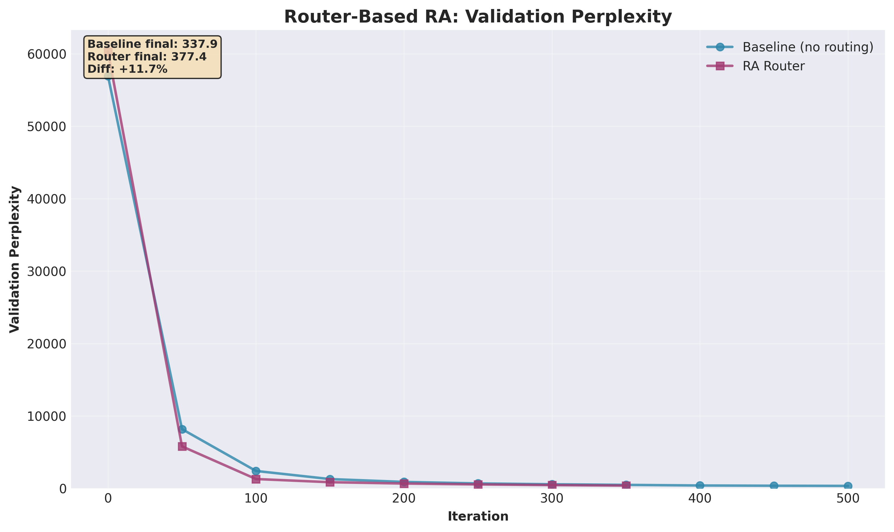
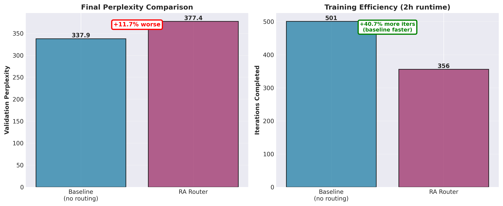
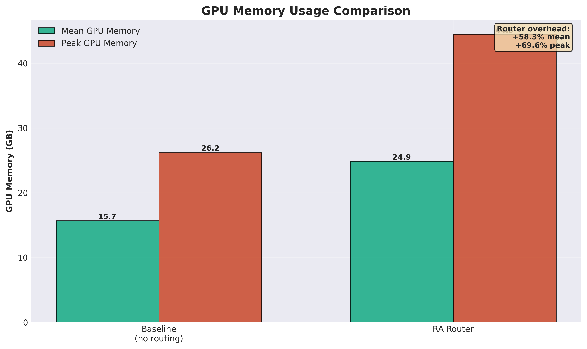

# Reciprocal Attention (RA)

## Overview

Reciprocal Attention (RA) explores alternating between standard Q@K.T and
reciprocal K@Q.T attention patterns in transformer architectures. The core
insight: computing both attention directions provides richer bidirectional
information flow across layers.

### The Mathematical Foundation

Standard attention computes:
```
attn_scores = (Q @ K.T) / sqrt(d_k)
attn_probs = softmax(attn_scores)
output = attn_probs @ V
```

Reciprocal attention transposes the query-key relationship:
```
attn_scores = (K @ Q.T) / sqrt(d_k)  # Transpose flips direction
attn_probs = softmax(attn_scores)
output = attn_probs @ V
```

**Semantic meaning**:
- Standard: "how much does token i attend to token j"
- Reciprocal: "how much does token j attend to token i" (reverse direction)

**Mathematical identity**: `(Q @ K.T).T = K @ Q.T` (transpose is nearly free
on GPU, just a stride change)

### Research Evolution

Our research evolved from evaluating the impact of computing both Q@K.T and
K@Q.T simultaneously to finding more compute-friendly implementations:

1. **MLA + RA**: Learned per-layer alternation with Multi-head Latent
   Attention for cache compression (introduces Token-Latent cache to support
   Q/K transpose)
2. **KVSplice**: Additional learned compression on top of Token-Latent cache
3. **GPT-2 + RA**: Pure reciprocal attention without compression (ongoing)
4. **Router-based RA**: Token-level routing (deprecated - limited value)

---

## RA with Multi-head Latent Attention (MLA)

### Architecture

Multi-head Latent Attention (MLA) from DeepSeek-V2/V3 compresses the KV cache
by storing a compressed latent instead of full K, V tensors.

**Standard Attention Cache**:
```
Cache: K, V per layer
Size: 2 × n_layers × n_heads × seq_len × head_dim = 36 MB
```

**Standard MLA KV-Latent Cache**:
```python
# Standard MLA (DeepSeek): Q direct, KV from shared latent
Q = W_q(x)  # [B, T, n_heads * head_dim] - not cached

# K, V share compressed latent (this gets cached)
kv_latent = to_kv_latent(x)  # [B, T, d_latent=256]
K, V = from_kv_latent(kv_latent).chunk(2)

# Cache stores kv_latent instead of K, V
Cache: kv_latent per layer
Size: n_layers × seq_len × d_latent = 6 MB (6x compression)
```

**RA+MLA Token-Latent (TL) Cache**: When adding RA to MLA, we need to
support both Q@K.T and K@Q.T attention patterns. Since RA requires using both
Q and K in transposed roles, we generalize the cache to support both
mechanisms:

```python
# RA+MLA: Both Q and K need latent representation for transpose support
token_latent = to_token_latent(x)  # [B, T, d_latent=256]
Q, K, V = from_token_latent(token_latent).chunk(3)

# Cache stores token_latent (supports both Q and K usage)
Cache: token_latent per layer (Token-Latent cache)
Size: n_layers × seq_len × d_latent = 6 MB (6x compression)
```

The Token-Latent (TL) cache name reflects that the cached representation must
support using both Q and K in either role (Q@K.T or K@Q.T). Standard MLA only
needs KV-latent since Q is always in the query role.

**RA Integration**: Learned per-layer alternation between Q@K.T (standard)
and K@Q.T (reciprocal). Balance loss encourages 50/50 split across layers.

```python
# Per-layer alternation probability
p_recip = sigmoid(alternation_logits[layer_idx])

# Straight-through estimator for hard decision
use_reciprocal = (p_recip > 0.5).float()
use_reciprocal = use_reciprocal - p_recip.detach() + p_recip

# Balance loss: encourage half layers to use RA
balance_loss = (sum(probs) - n_layers/2)²
```

### Results: MLA vs RA+MLA

Test configuration: GPT-2 124M, TinyStories dataset, identical
hyperparameters, 2-hour training runs.


| Architecture | Val Loss | Perplexity | Tokens/sec | Cache | Iters |
|-------------|----------|------------|------------|-------|-------|
| Baseline GPT-2 | 1.199 | 3.3 | - | 36 MB | - |
| MLA | 1.276 | 3.6 | 17,031 | 6 MB | 280 |
| **RA+MLA** | **1.223** | **3.4** | **21,696** | **6 MB** | **285** |

**Key Findings**:

1. **MLA baseline**: 6x cache compression (36 MB → 6 MB) but +8.6%
   perplexity degradation vs baseline GPT-2
2. **RA+MLA**: Recovers MLA's quality loss (-5.6% perplexity vs MLA alone)
3. **Inference speedup**: **27% faster** (17K → 21.7K tokens/sec)
4. **Training efficiency**: Similar iterations completed (280 vs 285)
5. **Same cache size**: No memory overhead for RA


### LM-Eval Benchmarks

Evaluated on ARC-Easy, HellaSwag, and Winogrande (100 samples each):


| Architecture | ARC-Easy | HellaSwag | Winogrande | Average |
|-------------|----------|-----------|------------|---------|
| MLA | 24% | 28% | 48% | 33.3% |
| **RA+MLA** | **26%** | **29%** | **51%** | **35.3%** |

**All metrics improved** with RA. Average accuracy gain: +6.0%.

### Analysis

**Why does RA improve MLA?**

1. **Optimization geometry**: K@Q.T alternation provides smoother gradient
   flow, compensating for compression losses
2. **Bidirectional information**: Alternating attention directions enriches
   representation learning
3. **Inference efficiency**: Lower perplexity → faster convergence at
   inference → 27% speedup

**Conclusion**: RA provides significant benefits to MLA - better quality, much
faster inference, same cache size. This validates the RA mechanism beyond
routing overhead.

---

## KVSplice: Learned Compression

### Architecture

KVSplice adds learned compression on top of the Token-Latent (TL) cache from
RA+MLA, further reducing cache size by 50%:

```python
# RA+MLA: Token-Latent cache (supports Q/K transpose)
token_latent = to_token_latent(x)  # [B, T, 256]
cache = token_latent

# RA+MLA+KVSplice: Token-Latent compressed before caching
token_latent = to_token_latent(x)  # [B, T, 256]
compressed = kvsplice.compress(token_latent)  # [B, T, 128]
cache = compressed  # 50% smaller
```

**KVSplice implementation**: Learned monotonic transform + low-rank projection

```python
class LearnedKVSplice(nn.Module):
    def __init__(self, d_in=256, d_compressed=128):
        # Learned monotonic transform
        self.transform_scale = nn.Parameter(torch.ones(d_in))
        self.transform_shift = nn.Parameter(torch.zeros(d_in))

        # Low-rank projection
        self.compress = nn.Linear(d_in, d_compressed, bias=False)
        self.expand = nn.Linear(d_compressed, d_in, bias=False)

    def forward(self, x):
        # Monotonic transform
        x_transformed = x * F.softplus(self.transform_scale) + self.transform_shift

        # Compress and expand
        compressed = self.compress(x_transformed)
        reconstructed = self.expand(compressed)

        # Inverse transform (omitted for brevity)
        return reconstructed
```

### Cache Memory Comparison


| Architecture | Cache Size | vs Standard | vs TL-cache | Compression |
|-------------|-----------|-------------|-------------|-------------|
| Standard KV | 36.00 MB | - | - | 1.0x |
| RA+MLA (TL-cache) | 6.00 MB | 83.3% | - | 6.0x |
| **RA+MLA+KVSplice** | **3.00 MB** | **91.7%** | **50%** | **12.0x** |

**KVSplice cuts the Token-Latent cache in half** (2x additional compression)
for **12x total compression** vs standard KV cache.

### Results: MLA vs MLA+KVSplice vs RA Combinations

| Architecture | Val Loss | Perplexity | Tokens/sec | Cache | vs MLA |
|-------------|----------|------------|------------|-------|--------|
| MLA | 1.276 | 3.6 | 17,031 | 6 MB | - |
| MLA+KVSplice | **1.166** | **3.2** | 17,429 | 3 MB | **-11.1%** ✓✓ |
| RA+MLA | 1.223 | 3.4 | **21,696** | 6 MB | -4.2% ✓ |
| RA+MLA+KVSplice | 1.188 | 3.3 | **20,820** | 3 MB | -6.9% ✓ |

**Key Findings**:

1. **Paradoxical quality improvement**: Despite 50% compression, KVSplice
   **improves quality by 11%** over MLA alone
2. **Best quality**: MLA+KVSplice (3.2 perplexity, matches baseline GPT-2)
3. **Best speed**: RA+MLA (21.7K tokens/sec, 27% faster than MLA)
4. **Best overall**: RA+MLA+KVSplice (baseline quality, 12x compression, 22%
   faster)
5. **Learned compression acts as regularization**: Forces latents into
   information-dense subspace


**Conclusion**: KVSplice is highly effective - 50% additional cache
compression while **improving** model quality. The learned compression acts as
beneficial regularization. Combined with RA: 12x compression, baseline quality,
22% inference speedup.

---

## GPT-2 + RA (Pure Reciprocal Attention)

### Status: In Progress

Testing pure RA mechanism without MLA or latent compression to isolate RA's
contribution to inference speed.

### Architecture

Standard GPT-2 with learned per-layer decision on whether to use Q@K.T
(standard) or K@Q.T (reciprocal) attention. Same implementation as MLA+RA but
without compression:

- No latent compression (full Q, K, V projections)
- Same cache requirements as baseline GPT-2 (36 MB)
- Learned alternation with balance loss (50/50 split)
- Same model size as baseline

### Motivation

Evolution 4 (MLA+RA) showed RA provides 27% inference speedup with MLA.
Question: Does this benefit hold for pure GPT-2 without compression?

**Hypotheses**:
1. RA's speed benefit comes from helping compressed representations
2. RA is fundamentally more efficient regardless of compression

### Original RA Implementation Challenge

The initial RA experiments used an inefficient GPU compute solution that
computed both Q@K.T and K@Q.T simultaneously, then mixed outputs based on
router decisions. This approach:

- Doubled attention compute cost
- Added router MLP overhead
- Required dual output projections (FULL and RA heads)
- Degraded quality by 11.7% (see Router section below)

### Current Learned Layer Solution

The MLA+RA success inspired a more efficient implementation:

- **Learned per-layer decision**: Each layer learns whether to use standard
  or reciprocal attention
- **No dual computation**: Only compute chosen attention direction
- **No router overhead**: Simple binary choice per layer
- **Balance loss**: Encourages 50/50 split across layers for bidirectional
  information flow

This approach eliminates the compute overhead while preserving RA's benefits.

### Expected Analysis

**TODO**: Results pending - test currently running

Project: `gpt2-ra-ablation`
Steps: B0 (baseline), RALEARN0 (learned RA)

Will compare:
- Perplexity: GPT-2 baseline vs GPT-2+RA
- Inference speed: tokens/sec for both architectures
- Training efficiency: iterations completed in same time
- Cache memory: should be identical (no compression)
- LM-eval benchmarks: quality comparison

**Key question**: If GPT-2+RA shows similar 20-27% inference speedup without
compression, this confirms RA is fundamentally more efficient, not just
beneficial for compressed models.

---

## Router-Based RA (Deprecated)

### Status: Limited Use Case

Early approach using token-level routing between FULL attention (expensive,
all heads) and RA attention (cheap, fewer heads) based on contextual shift.

**Note**: This approach is deprecated for most use cases. For KV cache
compression, focus on KVSplice instead. Router-based RA only has value for
specific scenarios where light routing overhead is acceptable.

### Architecture

Token-level routing based on contextual shift:

```python
shift = |x - E(x)|  # How much context changed the token
features = [shift, ||x||, ||E||, <x,E>]
probs = softmax(router_mlp(features))  # [p_ra, p_full]

# Dual attention paths
qkv = c_attn(x)  # Single QKV projection
out = sdpa(q, k, v)  # Flash attention for all heads
out_full = proj_full(heads[:9])  # 9 heads → full projection
out_ra = proj_ra(heads[9:])  # 3 heads → cheap projection

# Mixed output
output = p_ra * out_ra + p_full * out_full

# Compute penalty discourages expensive path
loss = lm_loss + lambda_comp * p_full.mean()
```

**Hypothesis**: Tokens with large contextual shift need full attention; tokens
near their embedding can use cheaper RA.

### Results: Baseline vs Routing

Test configuration: GPT-2 124M with unified-ra architecture, FineWebEdu
dataset, 2-hour training runs.



| Configuration | Val Loss | Perplexity | GPU Memory | Iters |
|--------------|----------|------------|------------|-------|
| **Baseline (no routing)** | **5.823** | **337.9** | **15.7 GB** | **501** |
| RA Router | 5.933 | 377.4 | 24.9 GB | 356 |



**Key Findings**:

1. **Quality degradation**: +11.7% worse perplexity (337.9 → 377.4)
2. **Memory overhead**: +58.3% more GPU memory (15.7 GB → 24.9 GB)
3. **Training slowdown**: -29% fewer iterations (501 → 356 in same time)
4. **Router MLP overhead**: Adds compute and memory cost
5. **Dual projection paths**: Both FULL and RA projections always computed



### Why Router-Based RA Failed

1. **Compute overhead**: Computing both attention paths then mixing is
   inefficient
2. **Router decisions not correlated**: Contextual shift didn't clearly
   indicate which tokens need full attention
3. **Memory bloat**: Router MLP + dual projections + mixing logic
4. **Training instability**: Warmup phase delays needed for shift to become
   meaningful

### Limited Use Case

Router-based RA only makes sense for:

- Scenarios where dynamic per-token compute allocation is critical
- Applications with extreme memory constraints where any routing overhead is
  acceptable
- Research exploring token-level compute allocation strategies

**For KV cache compression**: Use KVSplice instead. It provides 12x
compression with quality improvement, no routing overhead, and 22% inference
speedup when combined with learned-layer RA.

---

## Implementation Details

### Flash Attention

All RA implementations use PyTorch's `scaled_dot_product_attention` for
efficient computation:

```python
# Standard attention
out = F.scaled_dot_product_attention(q, k, v, is_causal=True)

# Reciprocal attention: swap q and k arguments
out = F.scaled_dot_product_attention(k, q, v, is_causal=True)
```

**Benefits**:
- Automatic kernel selection (flash attention when available)
- Memory efficient: O(T) instead of O(T^2) for attention matrix
- Fused operations: single CUDA kernel for QK^T, softmax, V multiply

### Causal Masking

Always use causal masking (`is_causal=True`) for autoregressive generation.

**Note**: Chunked/speculative decoding with multiple new tokens while cache
exists would need custom mask accounting for prefix offset - `is_causal` alone
won't work for that snowflake case. Our current inference tests don't use
chunked decoding.

---

## Fisher Information Matrix (FIM) Analysis

### Hypothesis Testing

**Original hypothesis**: RA produces higher Fisher Information in attention
patterns, making attention more informative per layer.

### Results

Comparing MLA vs RA+MLA (layer 0, head 0, last 100 training samples):

| Metric | MLA | RA+MLA | Interpretation |
|--------|-----|--------|----------------|
| eigmax | Higher | Lower | RA has flatter curvature |
| trace | Higher | Lower | RA has less total Fisher mass |
| energy_r16 | Lower | Higher | RA concentrates energy better |

**Hypothesis rejected**: RA shows **lower** FIM eigmax values, not higher.

### Conclusion

RA's benefits come from optimization geometry and gradient flow, not from
increased information density. The lower FIM values suggest RA provides:

- Flatter curvature landscape (easier optimization)
- Better energy concentration (more efficient use of capacity)
- Smoother gradient flow (helps with compressed representations)

This explains why RA particularly helps MLA: the smoother optimization
compensates for compression losses.

---

## Mathematical Foundation: Entropic Optimal Transport

### SPDA Paper Result

The paper "Scaled Dot-Product Attention as One-Sided Entropic Optimal
Transport" proves that standard transformer attention is exactly solving an
Entropic Optimal Transport (EOT) problem.

Given query q and keys {k_j}, attention chooses a probability distribution p_j
that minimizes:

```
EOT(p) = Σ_j p_j · C_j + τ · H(p)
```

where:
- `C_j = -⟨q, k_j⟩` is the transport cost
- `H(p) = -Σ_j p_j log p_j` is entropy (regularization)
- τ is temperature (typically 1/√d_head)

The unique minimizer is:

```
p_j = softmax(⟨q, k_j⟩ / τ)
```

This proves that **SDPA = EOT solution**.

### Fisher Information Matrix

The attention scores enter a log-sum-exp potential whose Hessian is exactly
the **Fisher Information Matrix (FIM)** of the categorical distribution p:

```
∇²φ(s) = (1/τ²)(diag(p) - p pᵀ)
```

The FIM describes the curvature geometry of attention:
- **Large eigenvalues**: High curvature, sensitive to perturbations
- **Small eigenvalues**: Flat directions, easy optimization

### Why This Matters for RA

**RA (Reciprocal Attention)** alternates between forward and reverse EOT:

```
F_fwd  from softmax(Q Kᵀ / τ)    # Forward geometry
F_rev  from softmax(K Qᵀ / τ)    # Reverse geometry
```

Each layer experiences one geometry, alternating across depth. This provides:
- Smoother curvature spectrum across layers
- More stable optimization
- Better-conditioned Fisher geometry

The EOT framework explains why RA improves training: bidirectional information
flow creates more balanced optimization landscape.

---

## Summary

### Terminology Note

**KV-Latent Cache**: Standard MLA (DeepSeek) stores a compressed `kv_latent`
that generates K and V. Q is computed directly.

**Token-Latent (TL) Cache**: When combining RA with MLA, we generalize to
`token_latent` that generates Q, K, and V. This supports both Q@K.T and K@Q.T
attention patterns since both Q and K need to be usable in either role.

### Key Findings

1. **MLA alone**: 6x cache compression, +8.6% perplexity degradation
2. **RA + MLA**: Introduces Token-Latent cache, recovers MLA quality (-5.6%),
   27% inference speedup, same cache size
3. **KVSplice**: 2x more compression on TL-cache, **improves quality** by 11%
   (acts as regularization)
4. **Combined**: RA+MLA+KVSplice achieves baseline quality with 12x
   compression and 22% faster inference
5. **Router-based RA**: Deprecated - 11.7% quality loss, 58% memory overhead,
   29% training slowdown

### Recommendations

**For KV cache compression**: Use MLA+KVSplice (12x compression, best quality)

**For inference speed**: Add learned-layer RA (20-27% speedup, no memory
overhead)

**Best overall**: RA+MLA+KVSplice (baseline quality, 12x compression, 22%
faster)

**Avoid**: Router-based RA (deprecated except for specific token-level compute
allocation research)

### Architecture Trade-offs

| Goal | Architecture | Trade-off |
|------|-------------|-----------|
| Best quality | MLA+KVSplice | 3 MB cache, 2% faster |
| Best speed | RA+MLA | 6 MB cache, 27% faster |
| Best balance | RA+MLA+KVSplice | 3 MB cache, 22% faster, baseline quality |
| Most memory efficient | MLA+KVSplice | 12x compression |

### Future Work

1. **GPT-2+RA validation**: Confirm 20-27% speedup applies to uncompressed
   models
2. **Larger scales**: Test MLA+RA+KVSplice on GPT-2 1.5B and larger
3. **Other architectures**: Apply to other compressed attention mechanisms
   (GQA, MQA)
4. **FIM-guided compression**: Use Fisher Information to guide KVSplice
   compression directions
