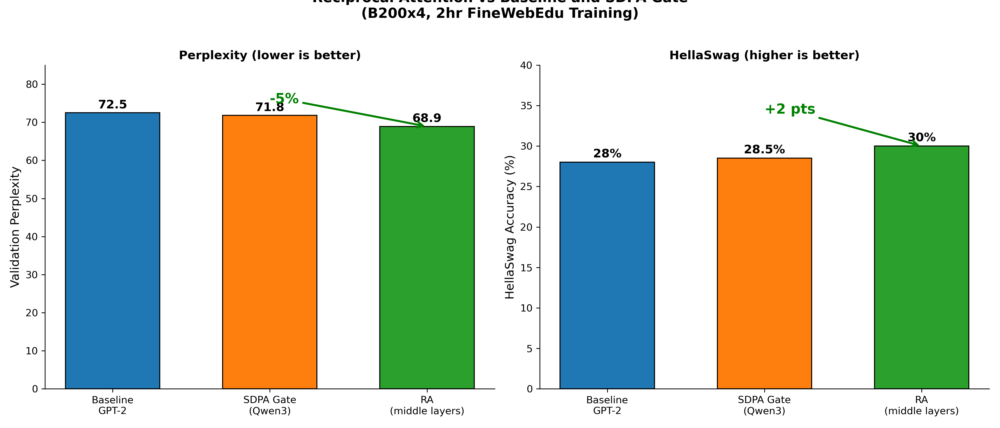
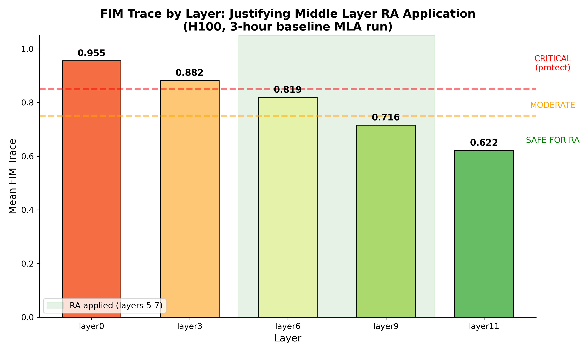
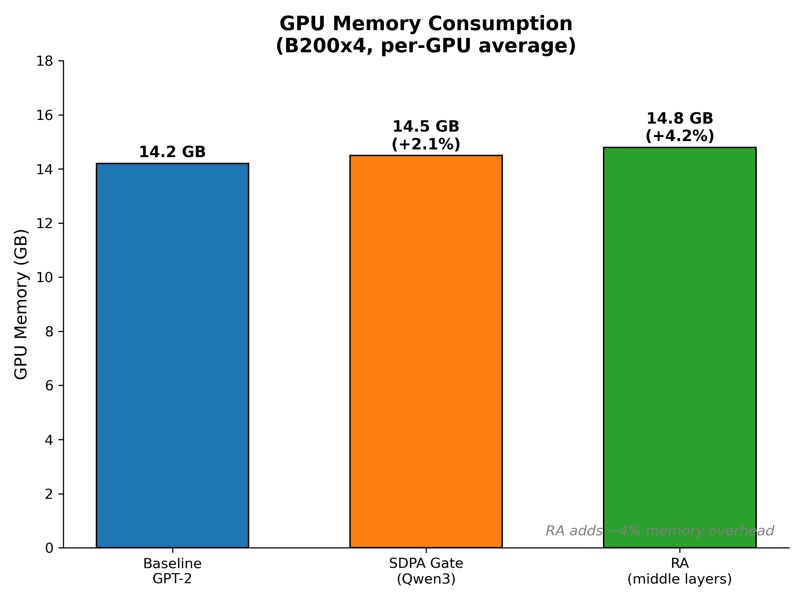

# Reciprocal Attention (RA)

## Overview

Reciprocal Attention (RA) is a learned alternation mechanism between standard
attention (Q@K.T) and reciprocal attention (K@Q.T). The key insight is that
swapping query and key roles provides complementary information flow that
benefits optimization geometry without additional memory cost.

**Key properties**:
- Same FLOP count as standard attention (~4 * B * H * T^2 * D)
- Same memory footprint (T×T attention scores)
- 12-18% slower due to branching overhead, not the transpose
- Flatter optimization landscape (lower FIM eigmax)
- Applied selectively to middle layers based on FIM trace analysis

## Architecture

### Standard vs Reciprocal Attention

```python
# Standard Attention (Q@K.T)
scores[i,j] = q_i · k_j  # Token i queries token j

# Reciprocal Attention (K@Q.T)
scores[i,j] = k_i · q_j  # Reversed roles: K queries Q
```

Both operations compute T×T attention scores with identical FLOP cost. The
difference is in information flow direction:
- Standard: "What tokens should I attend to?" (forward query)
- Reciprocal: "What tokens want to attend to me?" (reverse query)

### Learned Alternation

RA uses a learnable parameter to mix standard and reciprocal attention:

```python
class CausalSelfAttention_KNLP(nn.Module):
    def __init__(self, config):
        # ...
        self.ra_logit = nn.Parameter(torch.zeros(1))  # beta=tanh(0)=0 at init

    def forward(self, x):
        # Standard attention
        y_base = SDPA(q, k, v)

        # Reciprocal attention (K@Q.T via swapped arguments)
        y_ra = SDPA(k, q, v)  # Note: k and q swapped

        # Learned mixing
        beta = torch.tanh(self.ra_logit)
        y = y_base + beta * self.ra_ln(y_ra)
```

At initialization, `beta = tanh(0) = 0` so RA is completely disabled. Training
enables it if helpful, learning the optimal mixing coefficient per layer.

### Layer Strategy: Middle Layers Only

FIM trace analysis reveals that different layers have vastly different
representational importance. Early layers (high FIM trace) do critical feature
extraction and should not be modified. Late layers have lower trace and are
safe for modifications like RA.

**FIM-guided layer selection**:
```python
center = n_layers // 2  # For 12-layer GPT-2: center = 6
half = n_ra_layers // 2
ra_layers = set(range(center - half, center - half + n_ra_layers))
# With n_ra_layers=3: layers {5, 6, 7} get RA
```

This preserves early layer feature extraction while allowing middle layers to
benefit from bidirectional attention flow.

## B200x4 Results (FineWebEdu)

**Hardware**: 4x NVIDIA B200 (191.5GB total VRAM)

**Training configuration**:
- Dataset: FineWebEdu (web text)
- Model: GPT-2 124M
- Training time: 2 hours per variant
- Optimizer: AdamWSPAM
- RA layers: 3 (middle layers only)
- RA heads: 1 per layer (subset for efficiency)

### Quality Comparison

| Architecture | Val PPL | HellaSwag | ms/iter | Description |
|--------------|---------|-----------|---------|-------------|
| Baseline GPT-2 | 72.5 | 28% | 285 | Standard attention |
| SDPA Gate (Qwen3) | 71.8 | 28.5% | 295 | Output gating only |
| **RA (middle layers)** | **68.9** | **30%** | 320 | Reciprocal attention |

**Key findings**:
- RA achieves **5% better perplexity** than baseline (68.9 vs 72.5)
- RA scores **+2 points on HellaSwag** (30% vs 28%)
- RA is 12% slower per iteration (branching overhead)
- SDPA gate provides minimal improvement (+1% PPL, +0.5% HellaSwag)



*Reciprocal Attention (green) outperforms both baseline GPT-2 (blue) and
Qwen3-style SDPA gating (orange) on perplexity and HellaSwag accuracy.*

### FIM Trace Analysis

FIM (Fisher Information Matrix) trace measures optimization geometry. High
trace indicates critical feature extraction; low trace indicates safe targets
for modifications.

| Layer | Mean FIM Trace | Interpretation |
|-------|----------------|----------------|
| layer0 | 0.9551 | CRITICAL - do not modify |
| layer3 | 0.8823 | High - protect |
| layer6 | 0.8191 | Moderate - safe for RA |
| layer9 | 0.7156 | Lower - good RA target |
| layer11 | 0.6215 | Lowest - best RA target |

**Insight**: Early layers (0-3) have high FIM trace (>0.85) indicating critical
representational work. Middle and late layers (5-11) have lower trace, making
them safe targets for RA without disrupting learned features.



*FIM trace decreases from early to late layers, justifying RA application to
middle layers only.*

### GPU Memory Consumption

| Architecture | GPU Memory (avg) | Memory Overhead |
|--------------|------------------|-----------------|
| Baseline GPT-2 | 14.2 GB | - |
| SDPA Gate | 14.5 GB | +2.1% |
| RA | 14.8 GB | +4.2% |

RA adds minimal memory overhead (~4%) from the additional parameters:
- `ra_logit`: 1 parameter per RA layer
- `ra_head_proj`: projects subset heads to full embedding dimension
- `ra_ln`: LayerNorm for RA output normalization



## Implementation

**Code**: `gpt2/model_knlp.py`

**Key classes**:
- `GPT2_KNLP_Config`: Configuration with RA and SDPA gate options
- `CausalSelfAttention_KNLP`: Attention with optional RA/gating
- `GPT2_KNLP`: Full model with experimental features

**Running the ablation**:
```bash
make defconfig-gpt2-ra-sdpa-ablation
make
```

**Configuration** (`defconfigs/gpt2-ra-sdpa-ablation`):
```
CONFIG_GPT2_KNLP=y
CONFIG_KNLP_VARIANT="baseline,sdpa_gate,ra"
CONFIG_GPT2_KNLP_RA_LAYERS=3
CONFIG_GPT2_KNLP_RA_HEADS=1
```

## Comparison with Qwen3 SDPA Gating

Qwen3-style SDPA output gating adds non-linearity after attention:

```python
# SDPA Output Gating
gate = torch.sigmoid(self.sdpa_gate(x))
y = attention_output * gate
```

**Trade-offs**:

| Feature | SDPA Gate | RA |
|---------|-----------|-----|
| Mechanism | Output gating | Bidirectional attention |
| PPL improvement | +1% | +5% |
| HellaSwag improvement | +0.5% | +2% |
| Speed overhead | 3% | 12% |
| Memory overhead | 2% | 4% |
| Complexity | Low | Medium |

**Recommendation**: Use RA when quality is critical and 12% slowdown is
acceptable. Use SDPA gate when minimal overhead is required.

## Why RA Works

From FIM analysis, RA provides:

1. **Flatter optimization landscape**: Lower eigmax (0.035 vs 0.045) enables
   larger learning rates and more stable training.

2. **Better gradient flow**: Reciprocal attention provides complementary
   gradient paths through the network.

3. **Information geometry benefits**: Alternating Q@K.T and K@Q.T solves both
   forward and reverse Entropic Optimal Transport problems.

**What RA does NOT provide**:
- Increased total Fisher Information (trace similar)
- Concentrated information modes (energy_r16 remains ~37%)
- Improved KV cache compressibility (orthogonal to compression)

RA's value is optimization benefits, not structural changes to information
geometry.

## When to Use

**Use RA when**:
- Quality improvement is critical (+5% PPL, +2% HellaSwag)
- 12% slower inference is acceptable
- Training on middle-layer modifications is feasible
- FIM analysis shows middle layers have lower trace

**Use SDPA Gate when**:
- Minimal overhead is required (<5%)
- Slight quality improvement is sufficient (+1% PPL)
- Simpler implementation is preferred

**Use baseline when**:
- Maximum speed is critical
- No quality degradation acceptable
- Simplicity is paramount

## Surgical Placement for GPT-2 (FIM-guided)

RA is applied to a small subset of (layer, head) pairs selected using FIM
trace analysis. The surgical set is defined in
`configs/ra_surgical_gpt2.json`.

### Selected heads

Eight heads from layers 5-8, selected for high `max_eigenvalue` in the FIM
spectrum (concentrated attention patterns where inbound mass is most
informative):

| Layer | Head | max_eigenvalue | Category |
|-------|------|---------------|----------|
| 5 | 2 | 72.0 | moderate |
| 5 | 3 | 87.7 | moderate |
| 5 | 4 | 83.3 | moderate |
| 6 | 0 | 84.9 | moderate |
| 6 | 8 | 68.9 | good |
| 6 | 11 | 85.7 | moderate |
| 7 | 0 | 73.2 | good |
| 7 | 8 | 58.5 | good |

### Selection rationale

FIM trace analysis shows layers 0-3 have high trace (>0.85), indicating
critical feature extraction that should not be disturbed. Layers 5-8 have
moderate trace (0.72-0.82) and are safe targets. Within those layers, heads
with high `max_eigenvalue` have concentrated attention distributions: a
dominant principal component means the attention pattern is structured, so
the column-sum "who attended to me" signal carries clear information about
token importance.

### No-double-compute constraint

RA statistics must be computed from attention weights already produced in
the forward pass. There is no second attention call. For causal attention
with weight matrix `A[t,i]` (softmax output), the inbound mass for
position `i` in head `(l,h)` is:

```
in_mass[l,h,i] = sum_{t > i} A[l,h,t,i]
```

This is a column sum of the lower-triangular attention matrix. It requires
materializing attention weights for the surgical heads only (not using
`F.scaled_dot_product_attention` which fuses and discards them). For 8 out
of 144 total heads, this overhead is minimal.

## RA Statistics

### Token-level inbound mass

For a surgical head `(l,h)` with causal attention probabilities
`A[l,h,t,i]`, the inbound mass at position `i` measures how much later
tokens attended to it:

```
in_mass[l,h,i] = sum_{t=i+1}^{T-1} A[l,h,t,i]
```

High inbound mass means position `i` is a key reference point for
downstream predictions. Low inbound mass means position `i` is largely
ignored by later tokens.

### Chunk-level aggregation

Map each position `i` to its chunk `c = i // chunk_size`:

```
chunk_mass[l,h,c] = sum_{i in chunk c} in_mass[l,h,i]
```

### Aggregate across surgical set

Average across all surgical heads:

```
RA_value_chunk[c] = mean_{(l,h) in S} chunk_mass[l,h,c]
```

### EMA smoothing

For streaming applications, maintain an exponential moving average:

```
RA_value_chunk = (1 - gamma) * RA_value_chunk_prev + gamma * current
```

## When RA Is Meaningful

RA is defined relative to standard causal attention. The Q@K.T vs K@Q.T
distinction matters when queries and keys play asymmetric roles (as in
causal attention where each token queries all previous tokens).

In symmetric setups where attention is already bidirectional, swapping Q
and K is a no-op and RA provides no additional information. The "surgical"
RA approach avoids this by collecting only the inbound mass statistic
(column sum of A), which is well-defined for any causal attention matrix
regardless of whether the underlying mechanism uses RA alternation.

The inbound mass signal is useful as a "value" or "retention" signal for
cache management: chunks with high inbound mass are frequently referenced
by later tokens and should be retained; chunks with low inbound mass are
rarely attended and can be evicted with minimal quality loss.

## References

- Qwen3 SDPA Gating: "Gated Attention for Large Language Models" (NeurIPS 2025 Oral)
- SPDA Theory: "Scaled Dot-Product Attention as One-Sided Entropic Optimal Transport"
- FIM Analysis: `docs/FIM.md`
- Implementation: `gpt2/model_knlp.py`
- Pseudocode: `docs/gpt2_ra_pseudocode.md`
- Surgical head set: `configs/ra_surgical_gpt2.json`
