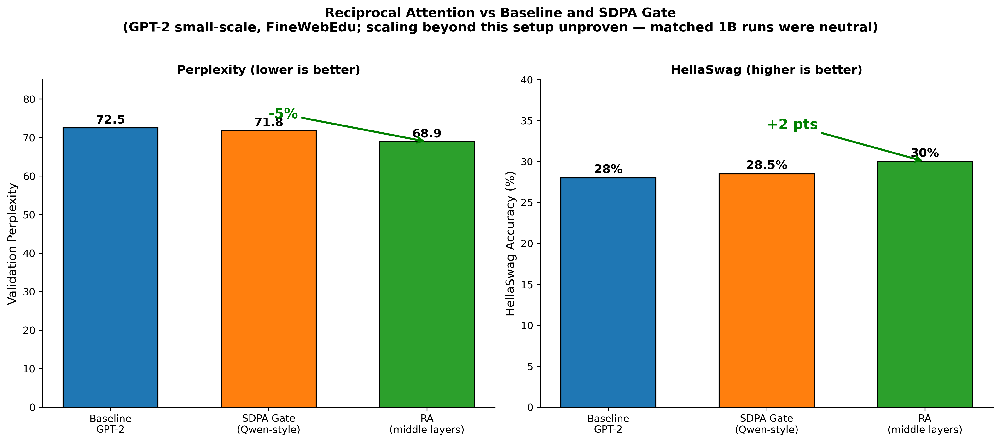

# Reciprocal Attention (RA)

Reciprocal Attention is an experimental attention modification that
mixes the standard attention routing `softmax(Q@K.T)` with the swapped
routing `softmax(K@Q.T)` on a selected subset of heads. This document
describes the mechanism, the implementations that exist in this repo,
and the empirical record. The per-experiment evidence classification
lives in [ra-evidence.md](ra-evidence.md).

## Current status

**Closed (2026-08).** A matched GPT-2 small-scale FineWebEdu
experiment produced a clear positive result (below); matched 1B runs
were neutral within noise, an 8B screen was invalidated by
methodology, and a short 32B run used uniform placement and is
non-diagnostic. A final measurement-first program (credit audit,
frozen-model gate test, and a preregistered three-seed matched
training matrix) found real but sign-cancelling, high-rank
reciprocal credit structure that no RA variant — including the
original learned-beta implementation — converted into a training
advantage over paired baselines. The line is closed; the full record
and the mechanistic explanation are in
[ra-evidence.md](ra-evidence.md).

## Validated small-scale result

The trusted RA result is the GPT-2 small (~124M) FineWebEdu comparison
against a Qwen-style SDPA output-gate control, from the era when runs
were tracked in Weights & Biases (project `gpt2-ra-sdpa-ablation`):

| Architecture | Val PPL | HellaSwag | Description |
|--------------|---------|-----------|-------------|
| Baseline GPT-2 | 72.5 | 28% | Standard attention |
| SDPA Gate (Qwen-style) | 71.8 | 28.5% | Output gating only |
| **RA (middle layers)** | **68.9** | **30%** | Reciprocal attention |

In this exact configuration RA improved perplexity by ~5% and HellaSwag
by 2 points, and beat the gate control on both metrics.



*GPT-2 small-scale FineWebEdu comparison. Scaling beyond this setup is
unproven; see the scaling section below.*

## Scaling limitations

This result is scoped to that GPT-2 configuration. What happened when
the levers were scaled:

| Scale | What was run | Outcome |
|---|---|---|
| 30M | TinyStories, 3 seeds, full RA and "!"-gated RA | small consistent gain (~0.46% PPL); gating RA to <0.4% of positions matched full RA |
| 124M | FIM-trace arm, 3 seeds | best seed −1.87%; multi-seed mean −0.47%, within the ~1% noise floor |
| 150M | one matched 1-hour RA-8 run | −9.4% PPL (239.66 → 217.06), single seed, artifact set incomplete, not reproduced at 1B |
| 1B | four matched single-seed variants (two selectors, 8/28 heads) | all within ±1σ of zero (σ ≈ 1%) — neutral |
| 8B | cache-transform screen | invalidated (see below) |
| 32B | uniform fixed-head placement | non-diagnostic (no validated selector) |

The correct one-line summary: **the small-scale result stands; favorable
scaling remains unproven.** Details and per-run limitations are in
[ra-evidence.md](ra-evidence.md).

## Mechanism

Standard multi-head attention computes, per head:

```python
# Standard attention
y_std = softmax(Q @ K.T / sqrt(d)) @ V
```

Reciprocal attention swaps the roles of Q and K:

```python
# Reciprocal routing (K and Q swapped)
y_rec = softmax(K @ Q.T / sqrt(d)) @ V
```

The raw score matrices `Q@K.T` and `K@Q.T` are transposes of each
other, but softmax normalizes over different axes (over keys per query
vs over queries per key), so the two attention matrices encode
different routing. RA mixes the two on selected heads. Note this is
alternate *causal* routing — both branches respect the causal mask;
no future-token information is involved.

The mixed head output computes an additional attention branch for the
selected heads, so RA is not FLOP-neutral: selected heads cost roughly
one extra attention computation, and historical runs measured a 12-18%
per-iteration slowdown at GPT-2 scale.

### Learned mixing (learned beta)

```python
class CausalSelfAttention_KNLP(nn.Module):
    def __init__(self, config):
        # ...
        self.ra_logit = nn.Parameter(torch.zeros(1))  # beta = tanh(0) = 0

    def forward(self, x):
        y_base = SDPA(q, k, v)
        y_ra = SDPA(k, q, v)          # swapped arguments
        beta = torch.tanh(self.ra_logit)
        y = y_base + beta * self.ra_ln(y_ra)
```

At initialization `beta = 0`, so RA starts disabled and training can
enable it. This is the variant in `gpt2/model_knlp.py` and the one used
in the validated GPT-2 comparison and the 30M TinyStories runs.

### Fixed mixing (fixed alpha)

The matched 150M/1B harness (`fim/reciprocal_attention/`) instead used
fixed scalars: `y = alpha_std * y_std + alpha_rec * ra_ln(y_rec)` with
`alpha_std = 0.9375`, `alpha_rec = 0.0625`. There is no learned
coefficient in that harness.

## Placement strategy history

Only a subset of heads gets the reciprocal branch; choosing that subset
is the central engineering question, and several selectors were tried:

- **Middle-layer heuristic** (GPT-2 validated run): RA on a few middle
  layers, one or a few heads per layer.
- **FIM-trace layer band + per-head metric** (150M/1B lanes): rank
  layers by per-layer Fisher-information trace, pick a middle band,
  then rank heads within it. At 150M the per-layer traces spanned ~15x
  and the band was meaningful. At 1B the spread collapsed to ~1.5x
  across 22 layers, so the filter stopped discriminating — every 1B
  result effectively ran without a layer filter.
- **`inbound_mass_var`**: measures attention-sink concentration, not
  standard-vs-reciprocal complementarity; results selected with it are
  non-diagnostic for RA placement.
- **`exact_eigmax`**: invalid. The batch-mean post-softmax attention
  matrix is row-stochastic, so its largest eigenvalue is exactly 1 for
  every head (Perron-Frobenius); rankings from it were random
  tie-breaking.
- **`fisher_eigmax`**: non-degenerate; measures sharpness/structure of
  the *standard* attention distribution, which is not the property RA
  needs (complementarity between the two views).
- **`synthetic_q_jsd`**: non-degenerate and input-conditional, but also
  a standard-view property.
- **View-divergence (proposed, untested)**: score heads by how much
  their standard and reciprocal attention views disagree per input.
  This is the first candidate metric that directly targets the
  complementarity hypothesis. It has not been implemented or run.

## What was invalidated

- The **8B cache-transform screen** (wrong intervention, mislabeled
  selection axis, mutable-cache token agreement, and a reported PPL
  that never consumed the transformed cache). Its harness was removed
  from the repo; no number from it may be cited.
- The **`exact_eigmax` selector** (row-stochastic eigenvalue
  degeneracy, above).
- An earlier public-page comparison (baseline 282.1 / gate 223.7 / RA
  50.5 PPL) that could not be traced to retained artifacts; those
  numbers were removed from all pages.

## What remains uncertain

- Whether any selector can express an RA benefit at 1B+; four matched
  single-seed 1B points were neutral, but multi-seed runs were never
  done there.
- Whether the 150M −9.4% single-seed result would reproduce; its
  artifacts are incomplete.
- Why the trained fixed-alpha GPT-2 arm showed a slightly *negative*
  branch contribution in an on/off ablation (+0.0030 nats when on)
  while the learned-beta GPT-2 comparison was positive — different
  campaigns, different mechanisms, both records kept.
- Mechanistic stories ("optimization geometry", "gradient flow") are
  HYPOTHESIS — none was directly established by these experiments.

## Matched 150M lane

A standalone matched harness
(`fim/reciprocal_attention/llama150m_matched.py`) runs baseline and
RA-8 under the same SDPA-family path, no `torch.compile`, explicit
backend-parity logging, and 1-hour wall-clock stops:

| Arm      | Final PPL | Steps  | Backend          | Parity |
|----------|-----------|--------|------------------|--------|
| Baseline | 239.66    | 26 432 | FLASH_ATTENTION  | true   |
| RA-8     | 217.06    | 25 702 | FLASH_ATTENTION  | true   |

Single seed. The retained artifact set is incomplete (summary JSON
only), so this number cannot be independently revalidated today and was
not reproduced at 1B. Entry point:
`scripts/run_llama150m_matched.sh`; audit:
[LLAMA150M_AUDIT.md](../fim/reciprocal_attention/LLAMA150M_AUDIT.md).

## Matched 1B lane

The same harness scaled to a TinyLlama-style 1.1B (22 layers, 32 heads,
GQA 8:1), 1-hour matched runs on 4xH100, effective batch 128. Four
matched single-seed data points exist:

| Selector | Heads | Mean per-step Δ vs baseline | σ |
|---|---|---|---|
| FIM-trace | 28 | −0.80% | 1.00% |
| synthetic-query JSD | 28 | +0.45% | 1.28% |
| FIM-trace + Fisher-eigmax | 8 | +0.49% | 0.91% |
| FIM-trace + Fisher-eigmax | 28 | +0.52% | 0.92% |

All are statistically indistinguishable from baseline at single-seed
resolution. Raising the head count from 8 to 28 did not change the
picture. Audit:
[LLAMA1B_AUDIT.md](../fim/reciprocal_attention/LLAMA1B_AUDIT.md).

## Reproduction artifacts

- Implementation: `gpt2/model_knlp.py` (learned beta),
  `fim/reciprocal_attention/llama150m_matched.py` (fixed alpha,
  matched lanes)
- Runners: `scripts/run_llama150m_matched.sh`,
  `scripts/run_llama1b_matched.sh`,
  `scripts/run_llama1b_full_pipeline.sh`
- Surgical selections: `configs/ra_surgical_gpt2.json`,
  `configs/ra_surgical_llama150m*.json`,
  `configs/ra_surgical_llama1b*.json`
- Evidence ledger: [ra-evidence.md](ra-evidence.md)
- Plot script for the validated GPT-2 comparison:
  `scripts/plot_ra_comparison.py`

## Why the line is closed

The 2026-08 program satisfied the reopening conditions once (a new
credit-spectrum framing with preregistered beta-trajectory
predictions and logging), ran it end to end, and closed the line on
its own stop rules: the reciprocal credit is real but high-rank and
sign-cancelling; frozen mode gates can read it on a frozen model;
nothing in the family — original implementation, scalar delta,
spectral gates at the measured rank, or capacity controls — beats a
paired baseline under matched three-seed training. Details and the
per-stage verdicts: [ra-evidence.md](ra-evidence.md). Any future
work would need a genuinely new framing; selector, rank, and gating
variations are exhausted under preregistered stop rules.

## References

- Qwen gated attention: "Gated Attention for Large Language Models"
  (arXiv:2505.06708)
- Scaled dot-product attention as one-sided entropic optimal transport
  (background for the Q/K asymmetry framing)
- FIM metrics: [FIM.md](FIM.md)
