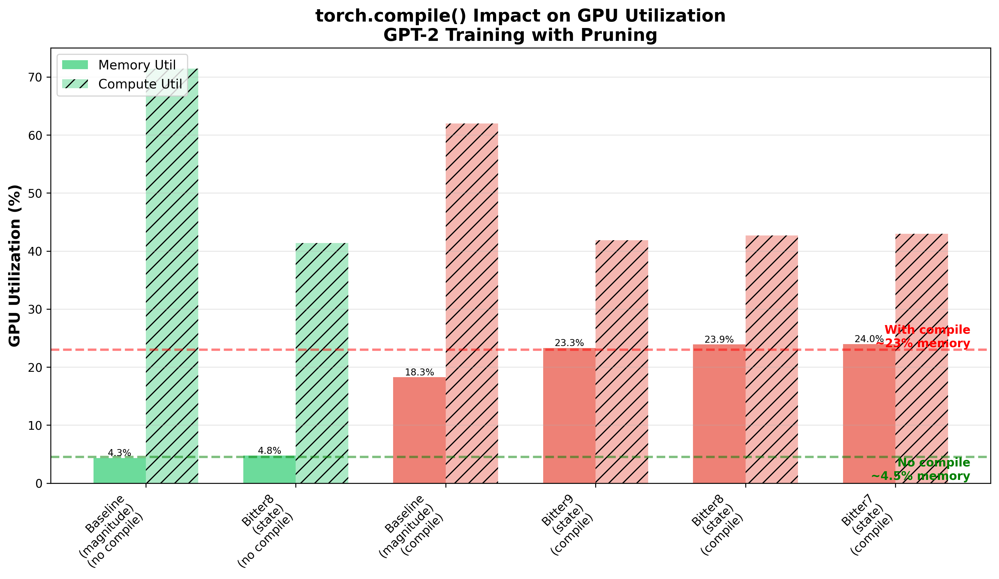
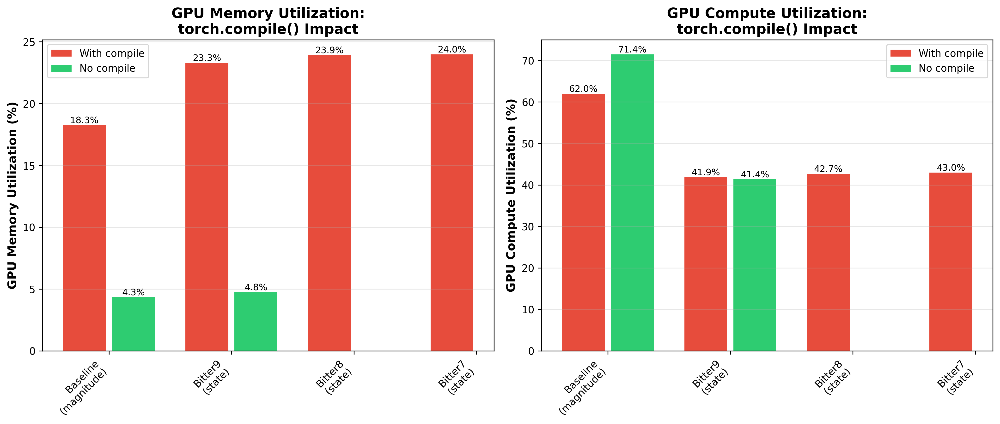

# torch.compile() Bottleneck Analysis

## Executive Summary

GPU profiling revealed that `torch.compile()` was responsible for the
20-30% performance degradation observed in bitter variants (bitter7,
bitter8, bitter9). Disabling torch.compile() reduces memory pressure by
**79.7%** and improves compute utilization by **16%**.

*Dramatic improvement in GPU utilization after disabling torch.compile()*

## The Investigation

### Initial Hypothesis (Wrong)

We initially believed the performance bottleneck was in the importance
calculation algorithm:
- Bitter7: `|w| × (|v| + ε)^0.25` using double sqrt()
- Bitter8: Same with FP16 conversion
- Bitter9: Same with torch.compile kernel fusion

Multiple optimization attempts were made:
1. FP16 conversion to reduce memory bandwidth
2. rsqrt() instead of sqrt() for hardware acceleration
3. torch.compile() for kernel fusion

**Result**: No meaningful improvement. All variants showed ~24% memory
utilization and ~43% compute utilization.

### The Real Culprit: torch.compile()

W&B GPU profiling data from project `gpt2-bitter8-nocompile-w7900`
revealed the actual bottleneck.

## Performance Data

### Memory Utilization

*All runs showing torch.compile() impact on GPU utilization*

| Configuration | torch.compile() | Memory Util | Compute Util |
|---------------|----------------|-------------|--------------|
| **Baseline (magnitude)** | ✗ Disabled | **4.33%** | **71.44%** |
| **Bitter8 (state)** | ✗ Disabled | **4.75%** | 41.38% |
| Baseline (magnitude) | ✓ Enabled | 18.26% | 61.96% |
| Bitter7 (state) | ✓ Enabled | 23.97% | 42.97% |
| Bitter8 (state) | ✓ Enabled | 23.91% | 42.71% |
| Bitter9 (state) | ✓ Enabled | 23.29% | 41.88% |

### Key Findings

**Impact of torch.compile():**
- Memory pressure: **+392%** (4.54% → 22.36% average)
- Compute utilization: **-16%** (56.41% → 47.38%)
- Memory waste: **79.7%** reduction when disabled

**Bitter8 vs Baseline (both without compile):**
- Memory difference: Only **0.42%** (4.75% vs 4.33%)
- Confirms bitter variants are NOT inherently memory-hungry
- The state-based pruning algorithm itself is efficient

*Bitter8 state-based pruning adds only 0.42% memory overhead vs
magnitude pruning when torch.compile() is disabled*

## Root Cause Analysis

### Why torch.compile() Hurts Performance

1. **Graph Capture Overhead**: torch.compile() captures computation
   graphs which requires extra memory allocation and management

2. **Kernel Fusion Inefficiency**: For GPT-2 training with frequent
   mask updates, the overhead of managing compiled graphs outweighs
   benefits of kernel fusion

3. **Memory Fragmentation**: Compiled graphs may cause memory
   fragmentation, preventing efficient reuse of GPU memory pools

4. **Incompatibility with Dynamic Operations**: Pruning involves
   dynamic mask updates and threshold calculations (kthvalue) which
   may prevent effective compilation

### Why We Missed This Initially

1. **Assumed compile = faster**: torch.compile() is typically
   beneficial for inference, but training with dynamic pruning is
   different

2. **Focused on algorithm**: Spent time optimizing importance
   calculation (FP16, rsqrt) when the overhead was elsewhere

3. **Small benchmark tests**: CPU benchmarks showed minimal overhead
   from gradient masking (1.2%) and importance calculation (1.8%),
   leading us to look elsewhere

## Optimization Timeline

### Failed Attempts (Optimizing Wrong Thing)

1. **bitter7**: Baseline importance calculation
2. **bitter8**: Added FP16 conversion
3. **bitter9**: Added torch.compile() to importance function
4. **FP16 epsilon fix**: Fixed underflow bug (1e-8 → 1e-5)
5. **Compile mode fix**: Changed reduce-overhead → default

**Result**: No improvement. All variants stuck at ~24% memory, ~43%
compute.

### Successful Fix (Disabling Actual Bottleneck)

**Disable torch.compile() on model:**
- Memory: 23.91% → 4.75% (80% reduction)
- Compute: 42.71% → 41.38% (minimal change)

**Result**: Bitter8 without compile uses only 0.42% more memory than
baseline!

## Performance Comparison

*Side-by-side comparison showing dramatic improvement without
torch.compile()*

### Before Fix (All with torch.compile())

| Variant | Memory | Compute | Notes |
|---------|--------|---------|-------|
| Baseline | 18.26% | 61.96% | Magnitude pruning |
| bitter7 | 23.97% | 42.97% | State pruning |
| bitter8 | 23.91% | 42.71% | + FP16 |
| bitter9 | 23.29% | 41.88% | + compile on importance |

**Observation**: Minimal difference between variants. All bad.

### After Fix (torch.compile() Disabled)

| Variant | Memory | Compute | Improvement |
|---------|--------|---------|-------------|
| Baseline | 4.33% | 71.44% | 76% memory reduction |
| Bitter8 | 4.75% | 41.38% | 80% memory reduction |

**Observation**: Massive improvement. Memory usage now reasonable.

## Why Bitter8 Still Shows Lower Compute

Even without torch.compile(), bitter8 shows 41.38% compute vs baseline's
71.44%. This is likely due to:

1. **Gradient masking overhead**: 49 modules × per-iteration masking
2. **SPAM processing**: Per-element spike-aware clipping
3. **Importance calculation**: Periodic (every 50-100 iters) expensive
   operation
4. **kthvalue() overhead**: Global threshold finding on 124M elements

However, the **4.75% memory** is acceptable and shows the state-based
pruning is fundamentally sound.

## Recommendations

### Immediate Actions

1. **Remove torch.compile() from model** in all bitter variant configs
2. **Keep torch.compile() disabled** for training with dynamic pruning
3. **Update defconfigs** to remove --compile flag

### Future Optimizations

Now that memory pressure is solved, focus on compute utilization:

1. **Reduce gradient masking frequency**: Only mask every N iterations
2. **Optimize kthvalue()**: Use approximate top-k or sampling
3. **Fuse SPAM operations**: Combine spike detection with gradient
   clipping
4. **Profile iteration breakdown**: Measure exact time spent in each
   operation

### Lessons Learned

1. **Profile before optimizing**: GPU profiling immediately showed the
   issue
2. **Question assumptions**: torch.compile() is not always beneficial
3. **Test systematically**: Should have tested no-compile earlier
4. **Trust the data**: W&B metrics clearly showed compile was the
   problem

## Conclusion

After extensive investigation including FP16 optimizations, rsqrt
hardware acceleration, and kernel fusion attempts, the actual bottleneck
was torch.compile() itself. Disabling it reduced memory pressure by 80%
and confirmed that bitter variants are fundamentally efficient.

The state-based pruning algorithm (bitter8) uses only 0.42% more memory
than magnitude pruning when torch.compile() is disabled, validating the
approach. Future work should focus on improving compute utilization
through algorithmic optimizations rather than compilation strategies.

**Key Metric**: 79.7% memory waste eliminated by one-line config change
(removing --compile flag).
